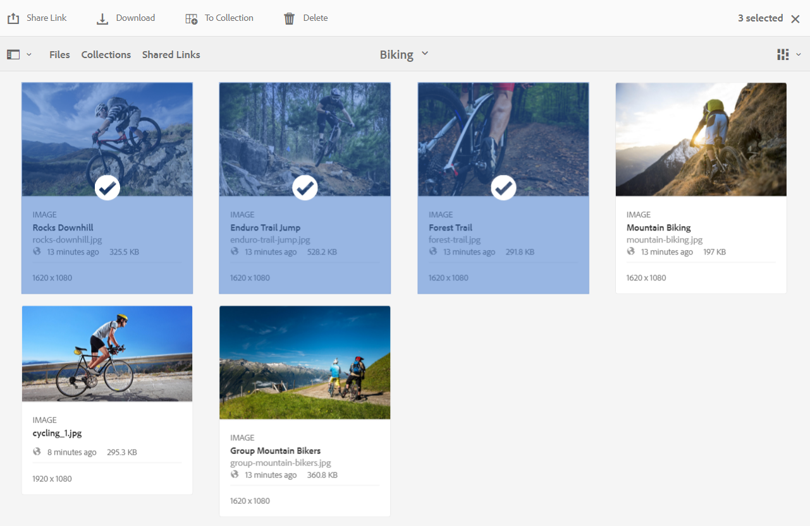
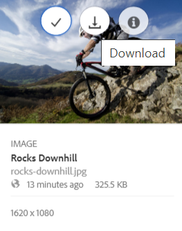
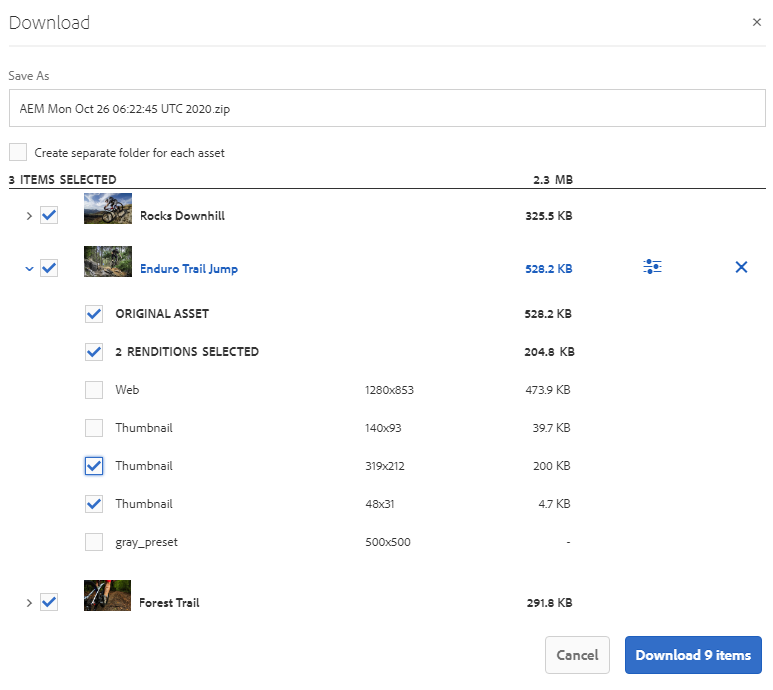
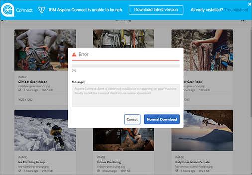
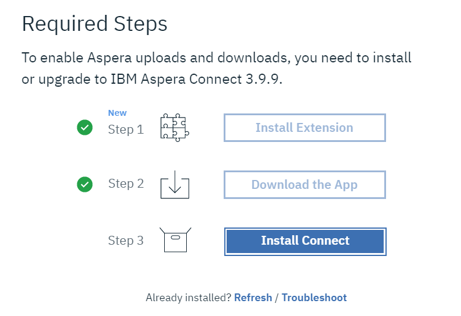
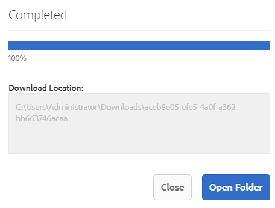
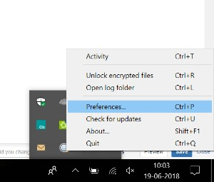
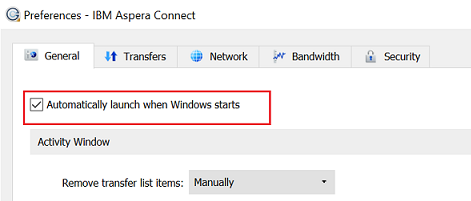

# Speed up the Brand Portal downloads {#guide-to-accelerate-downloads-from-brand-portal}

Adobe Experience Manager Assets Brand Portal allows enhancing the download performance of large asset files by integrating with IBM Aspera Connect, which is an install-on-demand application. The application uses proprietary technology to remove TCP overheads and helps improve transfer speed of the asset files. This integration ensures enhanced download experience.

>[!NOTE]
>
>Download speed varies for users as it depends upon factors such as network bandwidth, server latency, and geographical location of clients.

The **[!UICONTROL Fast Download]** configuration is by default enabled, which significantly reduces the time taken to download the desired asset files from Brand Portal.

## Prerequisites to accelerate file download {#prerequisites-to-accelerate-file-download}

To download the files faster, ensure the following:

* Navigate to **[!UICONTROL Tools]** > **[!UICONTROL Download]** and verify that the **[!UICONTROL Fast Download]** configuration is enabled in **[!UICONTROL Download Settings]**.
* Ensure that port 33001 (both TCP and UDP) is open on the firewall. For more information on the prerequisites, see [IBM Aspera Connect Client documentation](https://downloads.asperasoft.com/en/documentation/8).
* **Install IBM Aspera Connect 3.9.9** in your browser's extension using administrator privileges (`https://www.ibm.com/docs/en/aspera-connect/3.9.9`).
* For platform support of Aspera transfer client, see [IBM Aspera Connect platform support matrix](https://www.asperasoft.com/company/support/transfer-clients/).

>[!NOTE]
>
>There is a known issue with IBM Aspera Connect. Fast download does not work with IBM Aspera Connect version 3.10 and above.

## Download domains {#download-domains}

Following are the download domains for different geographies:

| Region Code |Domain |
|---|---|
| NA OR1 |downloads-na1.brand-portal.adobe.com |
| NA VA5 |downloads-na2.brand-portal.adobe.com |
| EMEA LON5 |downloads-emea1.brand-portal.adobe.com |
| APAC SIN2 |downloads-apac1.brand-portal.adobe.com |

## Sample download performance using file accelerator {#expected-download-performance-using-file-accelerator}

The following table shows download performance for 2 GB file using Aspera Connect file download accelerator:

*The observed results do vary due to factors such as network bandwidth, server latency, and client location, considering Brand Portal server is at Oregon (United States).*

| Client location           | Latency between client and server (milliseconds) | Speed with Aspera Connect File Transfer Accelerator (MBps) | Time taken to download 2 GB file with  Aspera File Transfer Accelerator (seconds) |
|---------------------------|-----------------------------------|---------------------------------------------|-------------------------------------------------------------------------|
| U.S. West (N. California) | 18                   | 36                                      | 57                                                              |
| U.S. West (Oregon)        | 42                    | 36                                     | 57                                                               |
| U.S. East (N. Virginia)   | 85                    | 35                                      | 58                                                              |
| APAC (Tokyo)              | 124                   | 36                                      | 57                                                               |
| Noida (India)                    | 275                   | 13.36                                   | 153                                                              |
| Sydney                    | 175                   | 29                                      | 70                                                               |
| London                    | 179                   | 35                                      | 58                                                               |
| Singapore                 | 196                  | 34                                      | 60                                                               |

## Download workflow using file accelerator {#download-workflow-using-file-accelerator}

To download assets faster from Brand Portal:

1. Log in to your Brand Portal tenant. By default, the **[!UICONTROL Files]** view opens which contains all the published assets and folders.  

   Do one of the following:

   * Select the assets or folders you want to download. From the toolbar at the top, click the **[!UICONTROL Download]** icon.

     

   * To download specific asset renditions of an asset, hover the pointer over the asset and click the **[!UICONTROL Download]** icon available in the quick action thumbnails.

     

1. The **[!UICONTROL Download]** dialog listing all the selected assets opens. 

   To preserve the Brand Portal folder hierarchy while downloading assets, select the **[!UICONTROL Create separate folder for each asset]** check box. 

   The download button reflects the count of the selected items. Once you are done with applying the rules, click **[!UICONTROL Download items]**. To know more on how to apply rules, see [download assets](../using/brand-portal-download-assets.md#download-assets).

   

1. By default the **[!UICONTROL Fast Download]** setting is enabled in the **[!UICONTROL Download Settings]**. Therefore, a confirmation box appears to download assets using IBM Aspera Connect. 

   If you are downloading the assets for the first time and do not have IBM Aspera Connect installed in your browser or the existing version is out-of-date,  it prompts you to install the Aspera download accelerator (`https://www.ibm.com/docs/en/aspera-connect/3.9.9`).

   

1. **Install Aspera Connect Client**

   To install IBM Aspera Connect client setup, run the setup from  .msi  file of IBM Aspera Connect client application and follow the installation wizard.

   

1. Once the client is successfully installed, refresh the browser page and initiate the download steps again.

1. To continue using **[!UICONTROL Fast Download]**, click **[!UICONTROL Allow]**. All the selected renditions are downloaded in a zip folder using IBM Aspera Connect. 

   On successful completion of the download, a dialog box shows the location where assets are downloaded onto the user's system.

   

   If you do not want to use IBM Aspera Connect, click **[!UICONTROL Deny]**. If **[!UICONTROL Fast Download]** is denied or fails, the system populates an Error message. Click the **[!UICONTROL Normal Download]** button to continue downloading the assets. 

>[!NOTE]
>
>If the **[!UICONTROL Fast Download]** setting is turned-off by the administrator, the selected renditions are directly downloaded in a zip folder without using IBM Aspera Connect. 

<!-- 
On successful completion of the download, a dialog box shows the location where assets are downloaded onto the user's system. If there is a failure, it shows error.

   >[!NOTE]
   >
   >There is a known limitation in Aspera Connect client application that no prompt to select download location appears if **[!UICONTROL Always ask me where to save downloaded files]** is enabled under the tab **[!UICONTROL Transfers]** within **[!UICONTROL Preferences]**. Before any download begins, provide the location in the text box **[!UICONTROL Save downloaded files to]**.

1. Log in to Brand Portal using a supported browser.
1. Browse and select the folders or assets you want to download. From the toolbar at the top, click the **[!UICONTROL Download]** icon. the **[!UICONTROL Download]** dialog appears with the **[!UICONTROL Asset(s)]** and **[!UICONTROL Enable download acceleration]** check boxes selected by default. 

   

   >[!NOTE]
   >
   >The functionality to send email notification with the link to download assets is presently not supported while faster downloads are enabled.

   

1. Click **[!UICONTROL Download]**.

   To speed up the download experience on your Brand Portal tenant account, you need to have Aspera Connect client application installed in your browser's extension.

1. **Download Aspera Connect Client**

   If Aspera Connect client is not installed on your system or the existing Aspera Connect client is out of date, a prompt is displayed on the browser page from where you can download the system-specific Aspera Connect client by selecting **[!UICONTROL Download Latest Version]**.

   

   To download the latest version of Aspera Connect from [https://downloads.asperasoft.com/connect2/](https://downloads.asperasoft.com/connect2/), select **[!UICONTROL Download Now]** and follow the instructions.

1. **Install Aspera Connect Client**

   To install IBM Aspera Connect client setup, run the setup from  .msi  file of IBM Aspera Connect client application and follow the installation wizard.

1. Once the client is successfully installed, refresh the browser page and initiate the download steps again.

   When using Aspera Connect for the first time, the browser prompts to open the link using **[!UICONTROL IBM Aspera Connect]**. To skip this dialog in future, enable **[!UICONTROL Remember my choice for FASP links]**.

   >[!NOTE]
   >
   >This message is different on the different browsers.

1. A dialog box confirms whether to proceed the transfer or not. Select **[!UICONTROL Allow]** to begin.
To skip this dialog in future, enable **[!UICONTROL Use my choice for all connections with this host]**.
Download begins. A dialog box shows the progress of the download. Use the dialog box to **[!UICONTROL pause]**, **[!UICONTROL resume]**, or **[!UICONTROL cancel]** the download.
Aspera Connect application provides an Activity Window on the system where user can view and manage all transfer sessions. For more information, refer [Aspera Connect Client documentation](https://downloads.asperasoft.com/en/documentation/8).

On successful completion of the download, a dialog box shows the location where assets are downloaded onto the user's system. If there is a failure, it shows error.

   >[!NOTE]
   >
   >There is a known limitation in Aspera Connect client application that no prompt to select download location appears if **[!UICONTROL Always ask me where to save downloaded files]** is enabled under the tab **[!UICONTROL Transfers]** within **[!UICONTROL Preferences]**. Before any download begins, provide the location in the text box **[!UICONTROL Save downloaded files to]**.
-->

## Using file accelerator on Microsoft Edge browser {#using-file-accelerator-on-microsoft-edge-browser}

Microsoft Edge runs in Enhanced Protected Mode (EPM) preventing communication with the Aspera Connect server, while on same private network or with a Trusted Site. Therefore, a pop- up shows up every time a connection with the server is being established.

To use accelerated download functionality on Microsoft Edge, remove the Brand Portal site from the trusted site list.

1. Open the Control Panel (**[!UICONTROL Window key + X]**, then select **[!UICONTROL Control Panel]**).
1. Go to **[!UICONTROL Network and Internet]** > **[!UICONTROL Internet Options]**. Click the **[!UICONTROL Security]** tab.
1. Click the **[!UICONTROL Trusted sites zone]**, then click **[!UICONTROL Sites]**.
1. Remove Brand Portal site from the list.

## Aspera Connect client Preferences {#aspera-connect-client-preferences}

There are a few useful preferences which can be set in IBM Aspera Connect Client preference by right clicking the icon and selecting **[!UICONTROL Preferences]**.

You can set the default download location.

Also, the Aspera Connect client can be marked to automatically start on system startup so that the connect client is running and available for the download to begin faster.

 

## Troubleshoot issues with download acceleration {#troubleshoot-issues-with-download-acceleration}

If download acceleration is not working for you, follow these steps to troubleshoot:

1. Check that ports are not blocked, by visiting [https://test-connect.asperasoft.com](https://test-connect.asperasoft.com/) from your machine.

   If ports are not OK, then reach out to your network team and ensure that Ports 33001 (both TCP & UDP) are not blocked in the firewall.

1. If the ports are OK, then check if your network is not slow, by measuring the available bandwidth using [https://www.speedtest.net/](https://www.speedtest.net/).

   If the bandwidth is a few (1-10 Mbps) or in Kbps, then use Aspera Preferences and try to limit the bandwidth equal to the available bandwidth.

1. To confirm whether the downloads from Aspera demo server are working, use [https://demo.asperasoft.com/aspera/user](https://demo.asperasoft.com/aspera/user).  
   (login:  asperaweb , password:  demoaspera )

1. If none of the above troubleshooting steps work, deselect the option Enable Download Acceleration and use the normal download.
