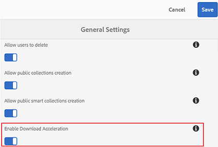
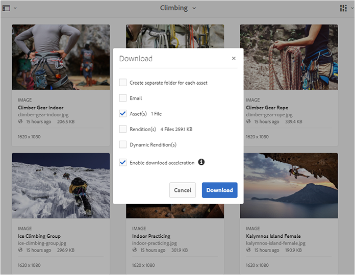
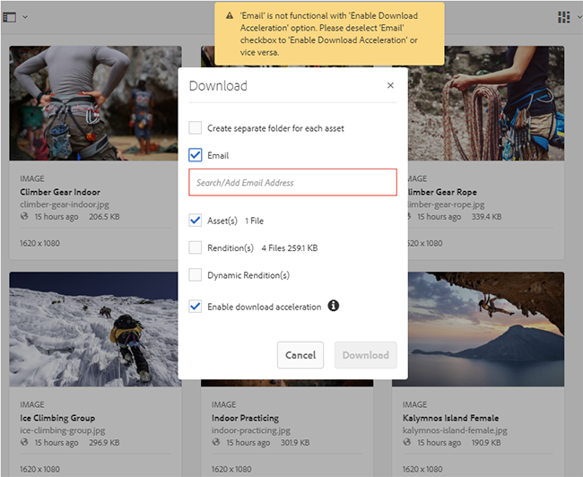
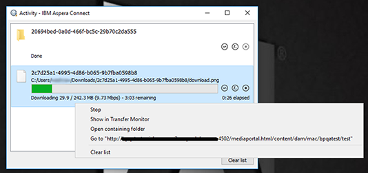
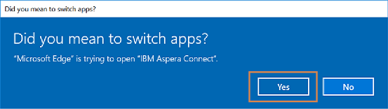
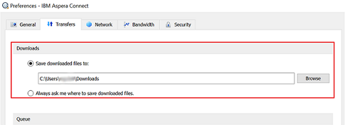

# Guide to Accelerate Downloads from Brand Portal{#guide-to-accelerate-downloads-from-brand-portal}

Brand Portal supports accelerated download of large asset files by integrating with IBM Aspera Connect, which is an install-on-demand application. The application uses proprietary technology to remove TCP overheads and helps improve transfer speed for files, thus ensuring enhanced download experience. Users distributed across geographies, experiencing high latency, can also benefit from this capability.

>[!NOTE]
>
>IBM Aspera Connect enables speedy download of large asset files from Brand Portal and shared links, but download speed may vary depending on factors such as network bandwidth, server latency, and geographical location of clients.

To configure specific tenants for accelerated file download, administrators **Enable Download Acceleration **(which is disabled by default)** **from **General Settings **in the administrative tools panel.

If enabled, Brand Portal users can significantly reduce the time taken to download the desired asset files from Brand Portal or through Shared link by installing the Aspera Connect client.

 

## Prerequisites to accelerate file download {#prerequisites-to-accelerate-file-download}

To be able to use the faster file download functionality, make sure:

* Ports 33001 (both TCP & UDP) are opened in the firewall by administrators. For more information on the prerequisites to using IBM Aspera Connect, see [Aspera Connect Client documentation](https://downloads.asperasoft.com/en/documentation/8).

  Following are the download domains for different geographies:

  | Region |Domain |
  |---|---|
  | NA OR1 |downloads-na1.brand-portal.adobe.com |
  | NA VA5 |downloads-na2.brand-portal.adobe.com |
  | EMEA LON5 |downloads-emea1.brand-portal.adobe.com |
  | APAC SIN2 |downloads-apac1.brand-portal.adobe.com |

* Administrator privileges are used to download IBM Aspera Connect installer package, as you cannot install Aspera Connect under the Guest account.

### System and browser requirements {#system-and-browser-requirements}

System and browser requirements for Aspera Connect 3.8.0 are as follows:

<table border="1" cellpadding="1" cellspacing="0" width="100%"> 
 <tbody> 
  <tr> 
   <td>OS</td> 
   <td>OS Version</td> 
   <td colspan="2">Browser</td> 
   <td>Required Libraries</td> 
  </tr> 
  <tr> 
   <td rowspan="5">Windows</td> 
   <td rowspan="5">
Windows 7, 8, 10
 
Windows Server 2008, R2, 2012 R2, 2016
 
 
 
 
 </td> 
   <td>Chrome</td> 
   <td>64-66</td> 
   <td rowspan="5"> </td> 
  </tr> 
  <tr> 
   <td>Firefox</td> 
   <td>57-60</td> 
  </tr> 
  <tr> 
   <td>Firefox ESR</td> 
   <td>52</td> 
  </tr> 
  <tr> 
   <td>Internet Explorer</td> 
   <td>11</td> 
  </tr> 
  <tr> 
   <td>Microsoft Edge</td> 
   <td>39-42 </td> 
  </tr> 
  <tr> 
   <td rowspan="4" style="text-align: left;">MacOS</td> 
   <td rowspan="4">
10.11 - 10.13
 
 
 
 
 </td> 
   <td>Chrome</td> 
   <td>64-66</td> 
   <td rowspan="4"> </td> 
  </tr> 
  <tr> 
   <td>Firefox</td> 
   <td>57-60</td> 
  </tr> 
  <tr> 
   <td>Firefox ESR</td> 
   <td>52</td> 
  </tr> 
  <tr> 
   <td>Safari</td> 
   <td>11</td> 
  </tr> 
  <tr> 
   <td rowspan="3">Linux (64-bit)</td> 
   <td rowspan="3">
RHEL 6 - 7
 
CentOS 6 - 7
 
Debian 7 - 9
 
SLES 11 - 12
 
Fedora 26 - 27
 
OpenSUSE 42.3
 
Ubuntu 14 - 17
 </td> 
   <td>Chrome</td> 
   <td>64-66</td> 
   <td rowspan="3">
OpenSSL 1.0.2g or higher
 
Mesa EGL
 
glib2 2.28 or higher
 
 
 </td> 
  </tr> 
  <tr> 
   <td>Firefox</td> 
   <td>57-60</td> 
  </tr> 
  <tr> 
   <td>Firefox ESR</td> 
   <td>52</td> 
  </tr> 
 </tbody> 
</table>

For platform support matrixes of different versions of Aspera transfer client, see [Aspera Connect platform support matrix](https://www.asperasoft.com/company/support/transfer-clients/).

## Expected download performance using file accelerator {#expected-download-performance-using-file-accelerator}

The expected download performance for 2 GB file using Aspera Connect file download accelerator at different client locations is as follows, considering Brand Portal server at Oregon in the United States:

<table border="1" cellpadding="1" cellspacing="0" width="100%"> 
 <tbody> 
  <tr> 
   <td valign="top" width="156">
<strong>Client Location</strong>
 </td> 
   <td valign="top" width="103"><strong>Latency between Client and Server</strong></td> 
   <td valign="top" width="149">
<strong> 
      <g class="gr_ gr_36 gr-alert gr_gramm gr_inline_cards gr_run_anim Grammar only-ins replaceWithoutSep" data-gr-id="36" id="36">
        Speed 
      </g> with Aspera File Transfer Accelerator</strong>
 </td> 
   <td><strong>Time 
     <g class="gr_ gr_89 gr-alert gr_gramm gr_inline_cards gr_run_anim Grammar multiReplace" data-gr-id="89" id="89">
       taken 
     </g> to download 2 GB file with Aspera File Transfer Accelerator</strong></td> 
  </tr> 
  <tr> 
   <td valign="top" width="156">
U.S. West (N. California)
 </td> 
   <td valign="top" width="103">18 milliseconds </td> 
   <td valign="top" width="149">
36 MB/s
 </td> 
   <td>57 seconds</td> 
  </tr> 
  <tr> 
   <td valign="top" width="156">
U.S. West (Oregon)
 </td> 
   <td valign="top" width="103">42 milliseconds</td> 
   <td valign="top" width="149">
36 MB/s
 </td> 
   <td>57 seconds</td> 
  </tr> 
  <tr> 
   <td valign="top" width="156">
U.S. East (N. Virginia)
 </td> 
   <td valign="top" width="103">85 milliseconds</td> 
   <td valign="top" width="149">
35 MB/s
 </td> 
   <td>58 seconds</td> 
  </tr> 
  <tr> 
   <td valign="top" width="156">
APAC (Tokyo)
 </td> 
   <td valign="top" width="103">124 milliseconds</td> 
   <td valign="top" width="149">
36 MB/s
 </td> 
   <td>57 seconds</td> 
  </tr> 
  <tr> 
   <td valign="top" width="156">
Noida
 </td> 
   <td valign="top" width="103">275 milliseconds</td> 
   <td valign="top" width="149">
13.36 MB/s
 </td> 
   <td>153 seconds</td> 
  </tr> 
  <tr> 
   <td valign="top" width="156">
Sydney
 </td> 
   <td valign="top" width="103">175 milliseconds </td> 
   <td valign="top" width="149">
29 MB/s
 </td> 
   <td>70 seconds</td> 
  </tr> 
  <tr> 
   <td valign="top" width="156">
London
 </td> 
   <td valign="top" width="103">179 milliseconds</td> 
   <td valign="top" width="149">
35 MB/s
 </td> 
   <td>58 seconds</td> 
  </tr> 
  <tr> 
   <td valign="top" width="156">
Singapore
 </td> 
   <td valign="top" width="103">196 milliseconds</td> 
   <td valign="top" width="149">
34 MB/s
 </td> 
   <td>60 seconds</td> 
  </tr> 
 </tbody> 
</table>

>[!NOTE]
>
>Cited data are as per the tests conducted in  lab  and are only indicative. Observed results vary due to factors such as network bandwidth, server latency, and client location.

## Download workflow using file accelerator {#download-workflow-using-file-accelerator}

To download assets faster from Brand Portal:

1. Log in to Brand Portal through a preferred browser.
1. Browse and select the desired asset file, folder, or collection to download. Tap/ click download option.

   Download dialog appears with **Enable download acceleration **option selected.

   

   >[!NOTE]
   >
   >The functionality to send **e**mail notification with the link to download assets is presently not supported while faster downloads are enabled.

   

1. Tap/ click **Download**.

   To speed up the download experience on your Brand Portal tenant account, you need to have Aspera Connect client application installed on your system.

1. **Download Aspera Connect Client**

   If Aspera Connect client is not installed on your system or the existing installed Aspera Connect client is out of date, a prompt is displayed on browser page from where you can download the system-specific Aspera Connect client by selecting **Download Latest Version**.

   

   To download the latest version of Aspera Connect from [https://downloads.asperasoft.com/connect2/](https://downloads.asperasoft.com/connect2/), select **Download Now **and follow the instructions.

1. **Install Aspera Connect Client.**

   To install IBM Aspera Connect client setup, run the setup from  .msi  file of IBM Aspera Connect client application and follow the installation wizard.

1. Once the client is successfully installed, either refresh the browser page and initiate the download steps again or select **Restart **in asset **Download **dialog box (Step #2).

   When using Aspera Connect for the first time, the browser prompts to open the link using **IBM Aspera Connect**. To skip this dialog in future, enable **Remember my choice for FASP links**.

   >[!NOTE]
   >
   >This message is different on the different browsers.

1. A dialog box confirms whether to proceed the transfer or not. Select **Allow **to begin.  
   To skip this dialog in future, enable **Use my choice for all connections with this host**.

   Download begins. A dialog box shows the progress of the download. Use the dialog box to **pause**, **resume**, or **cancel** the download.

   Aspera Connect application provides an Activity Window on the system where user can view and manage all transfer sessions. For more information, refer [Aspera Connect Client documentation](https://downloads.asperasoft.com/en/documentation/8).

   

   On successful completion of the download, a dialog box shows the location where assets are downloaded to user's system. If there is a failure, it shows error.

   >[!NOTE]
   >
   >There is a known limitation in Aspera Connect client application that no prompt to select download location appears if **Always ask me where to save downloaded files** is enabled under the tab **Transfers **within **Preferences**. Before any download begins, provide the location in the text box **Save downloaded files to**.

## Using file accelerator on Microsoft Edge browser {#using-file-accelerator-on-microsoft-edge-browser}

Microsoft Edge runs in Enhanced Protected Mode (EPM) preventing communication with the Aspera Connect server, while on same private network or with a Trusted Site. Therefore, a pop- up shows up every time a connection with the server is being established.

To use accelerated download functionality on Microsoft Edge, remove the Brand Portal site from the trusted site list.

1. Open the Control Panel (press **Window key + X**, then select **Control Panel**).
1. Go to **Network and Internet &gt; Internet Options**. Click the **Security **tab.
1. Click the **Trusted sites zone**, then click **Sites**.
1. Remove Brand Portal site from the list.

## Aspera Connect client Preferences {#aspera-connect-client-preferences}

There are a few useful preferences which can be set in IBM Aspera Connect Client preference by right clicking the icon and selecting **Preferences**.

You can set the default download location.

Also, the Aspera Connect client can be marked to automatically start on system startup so that the connect client is running and available for the download to begin faster.

 

## Troubleshoot issues with download acceleration {#troubleshoot-issues-with-download-acceleration}

If download acceleration is not working for you, follow these steps to troubleshoot:

1. Check that ports are not blocked, by visiting [https://test-connect.asperasoft.com](https://test-connect.asperasoft.com/) from your machine.

   If ports are not OK, then reach out to your network team and ensure that Ports 33001 (both TCP & UDP) are not blocked in the firewall.

1. If the ports are OK then check if your network is not slow, by measuring the available bandwidth using [http://www.speedtest.net/](http://www.speedtest.net/).

   If the bandwidth is a few (1-10 Mbps) or in Kbps, then use Aspera Preferences and try to limit the bandwidth equal to the available bandwidth.

1. To confirm whether the downloads from Aspera demo server are working, use [https://demo.asperasoft.com/aspera/user](https://demo.asperasoft.com/aspera/user).  
   (login:  asperaweb , password:  demoaspera )
1. If none of the above troubleshooting steps work, deselect the option Enable Download Acceleration and use the normal download.

