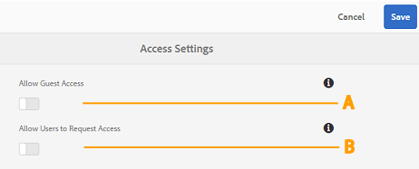

# Administer user access on Brand Portal{#administer-user-access-on-brand-portal}

AEM Assets Brand Portal 6.4.2 onwards authorizes administrators to configure guest access and enable users to request access on Brand Portal of their organization. These configurations have been provided as **Access Settings **configurations on the administrative panel. Both the settings are disabled by default.

**A** Configuration to allow guest access on Brand Portal using **Guest Access?** link on the Brand Portal welcome screen. (Default is disabled)

**B** Configuration to allow users to request access to Brand Portal using **Need access?** link on the Brand Portal welcome screen. (Default is disabled)

## Allow Guest Access {#allow-guest-access}

To allow guest access on Brand Portal, so that users need not log in to access public assets, administrators need to:

1. Select the AEM logo to access administrative tools, from the toolbar at the top.
1. From the administrative tools panel, select **Access **to open **Access Settings **page.
1. Enable the [UICONTROL Allow Guest Access] configuration.
1. [!UICONTROL Save] the changes.
1. Logout to let the changes take effect.

## Allow Users to Request Access {#allow-users-to-request-access}

Administrators can allow the organization users to request access to Brand Portal from the welcome screen. However, administrators need to enable the [!UICONTROL Allow Users to Request Access] configuration so that request access link appears on the welcome screen.

To allow organization users to request access on Brand Portal, administrators need to:

1. Select the AEM logo to access administrative tools, from the toolbar at the top.
1. From the administrative tools panel, select [!UICONTROL Access] to open [!UICONTROL Access Settings] page.
1. Enable the [!UICONTROL Allow Users to Request Access] configuration.
1. [!UICONTROL Save] the changes.
1. Logout to let the changes take effect.

