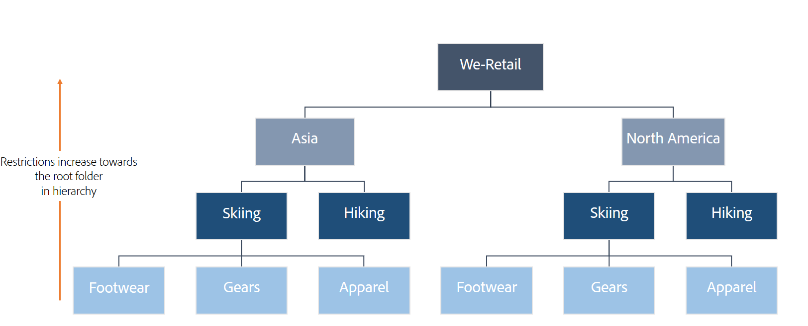

# User permissions on Brand Portal: troubleshooting and best practices {#user-permissions-on-brand-portal-troubleshooting-and-best-practices}

Read on to understand user permissions and best practices in Brand Portal.

## What are product profiles and when are they created on Brand Portal? {#productprofiles}

After your organization is provisioned in Brand Portal, the administrator can manage users and user groups (Product Profiles) through [Admin Console](https://adminconsole.adobe.com/enterprise/overview). The Brand Portal reads product profiles, created in Admin Console, as groups. These are used to segregate users in Brand Portal.

Product profile configurations created in Admin Console get synced to Brand Portal system every 8 hours, and are visible in Tools &gt; Users &gt; Groups.

 

## Why there is discrepancy between users in Admin Console and Brand Portal? {#why-there-is-discrepancy-between-users-in-admin-console-and-brand-portal}

**User and Group listing sync every 8 hours**

The Users and Product Profiles (as Groups) configurations created in Adobe Admin Console (Adobe Cloud) are synced to the Brand Portal instance through **UserGroupSyncJob**,** **which runs every 8 hours in the following intervals (local time):

* 8:00 hours
* 16:00 hours 
* 24:00 hours

The production servers are in the following time zones:

* EMEA - BST (British Summer Time)
* APAC - PDT 
* NA - PDT

**User listing in Brand Portal updates on user login**

User node for a valid user (who has access to AEM Brand Portal product in Admin Console) is created in Brand Portal repository when the user logs in through the portal url. Until a user logs in to the Brand Portal, the portal doesn't have any information about the user.

It is, therefore, possible that "N" users are listed in Admin Console, but only "N-m" users are listed in Brand Portal. It is because "m" users have not logged in to the Brand Portal even once.

**User listing in Brand Portal lists only the current active users**

Users who have logged in to Brand Portal at least once but are later removed from all the product profiles in Admin Console, are marked deactivated in Brand Portal. Such users are not listed in Brand Portal users list.

For example, "N" users are listed in Admin Console, and "m" out of the "N" users have logged into Brand Portal at least once. There is a possibility that less than "m" users are listed in Brand portal user listing.

## How to on-board users with federated login? {#how-to-on-board-users-with-federated-login}

Administrators can configure federated ID which uses an organization's SSO and identity management for authentication. In such a case, Admin Console authenticates users using organization's [identity management system](https://helpx.adobe.com/enterprise/using/set-up-identity.html) and doesn't require to register/enroll every user for AdobeID. To enable single sign-on Brand Portal, see [Enabling Single Sign-On with SAML](https://helpx.adobe.com/sign/help/SAML_Configuration.html#3).

## When is Adobe ID used to access Brand Portal? {#when-is-adobe-id-used-to-access-brand-portal}

If organizations want that their users use Adobe's authentication, then they can use AdobeID to allow them access to Brand Portal. In such a scenario, every user to whom the organization's administrator wants to give access should have a valid AdobeID. The administrator can then add the users to any one of the [product profiles created in Admin Console](../using/bp-usage-workflows.md#productprofiles) so that they can access Brand Portal using AdobeID.

## Is it mandatory for users to belong to some product profile to access Brand Portal? {#is-it-mandatory-for-users-to-belong-to-some-product-profile-to-access-brand-portal}

Users need to belong to at least one of the product profiles (Group in Brand Portal) to access Brand Portal, except the following:

1. If the administrator adds a user with a** System Administrator** privilege, then this user need not be added to any product profile. System Administrator gets the administrative rights on all the products of the organization.
1. If the administrator adds a user with **Product Administrator of Brand Portal **product, then this user need not to belong to any product profiles to access Brand Portal.

## How to deactivate users from Brand Portal? {#how-to-deactivate-users-from-brand-portal}

1. If a user is removed from all the product profiles i.e. his access is revoked from the product in  admin  console, this use is marked inactive when any one of  these  event   is triggered first

    1. the user tries to  login  to Brand Portal
    1. The userGroupsSyncJob runs

1. Inactive users though  remains  in the system but are not listed on users listing in Brand Portal. The same is true for all user personas admins and non-admins.

    1. If a system administrator doesn't have the administrator privilege in   adminconsole ,  and doesn't have a product profile associated also, then he is marked inactive.
    1. A product administrator doesn't have product administrator rights in admin console anymore and  doesnt  have a product profile associated, then he is marked inactive.
    1. any other user if doesn't have any product profile assigned to him then he is marked inactive in  brand  portal.

1. Inactive Users can't  login  to Brand Portal and see a request access page when they try to  login . Using this page, they can submit an access request. this access request shoots an email and a pulse notification to all the administrators of that organization.

1. To activate the user, administrator of the organization needs to do any one of the following

    1. assign him system administrator rights in  admin  console
    1. assign him product administrator right for product AEM Brand Portal in  adminconsole 
    1. assign him to one or more product profiles.

1. whenever the user logins to  Brand  portal, the user gets activated again. Once  activeuser  starts to receive all emails and pulse notifications according to his current user persona.

1. User count: shown on top of this page is the total number of active users in Brand Portal. so it excludes the users who have not yet logged in to  brand  portal at least once or are not active. the list below the count displays details of these users.

## What is the effective role of users having membership in different groups? {#what-is-the-effective-role-of-users-having-membership-in-different-groups}

1. In AEM Brand Portal a User can hold one of the following roles at a time

    1. admin :  all the capabilities 
    1. editor :  no admin tools
    1. viewer :  no sharing capability

1. The effective Role of a user is listed on  Tools → Users→ users tab.  Similarly  a group also has one of the 2 roles Editor or Viewer.

1. Role  is specific to AEM Brand Portal and doesn't have anything to do with  adminconsole . so Role is the upper layer of the persona a user has in  admin  console. 

1. Role  is applicable to non-admin users only. All admins (system or product) have all capabilities available in  Brand  portal.

1. A user gets his role from the group he belongs  to,  If a user is  member  of multiple groups he holds the highest role he has in any of those groups.

    1. Example1: user1 has editor role in group1 and has viewer role in group2 so user1's effective role will be  editor .
    1. Example2: user1 has viewer role in group1 and has viewer role in group2 so user1's effective role will be  viewer .

1. Changing User's Role: If a User has viewer role, admin can change its role to  editor . But if the user has editor role admin can't always change its role to  viewer .

1. If a user is  editor  in any one of the groups, admin can't change its role to  viewerwithout  changing the group role to  viewer .

1. User Role change is immediately effective and doesn't depend on the userGroupSyncJob to run.

User Roles in collection settings: whenever a user shares a collection further, the effective role of the user always applies and not the role you mention while sharing the collection.

## How to restrict access of a user group to a folder? {#how-to-restrict-access-of-a-user-group-to-a-folder}

Assets published to Brand Portal are accessible to administrators by default. The Administrators then selectively share these assets (folders) with other users (or group of users).  

>[!NOTE]
>
>Users (or user groups) having access rights to a parent folder get the same access rights to all the child folders within that nested folder hierarchy.

There is no way to restrict users' access on a child folder, whose parent folder is exposed to the same user. In AEM, the [ACLs](https://helpx.adobe.com/experience-manager/6-5/sites/administering/using/security.html#PermissionsinAEM) allow adding restrictions on parent folders and not the child folders.

For example, we have a folder hierarchy **We-Retail &gt; Asia &gt; Skiing &gt; Gears**. The administrator if shares the folder **Asia **with a user group, but doesn't share the child folders **Skiing **or **Gears**. Then the user group has the same access rights on the folders **Skiing **and **Gears **as on the folder** Asia**. It is so, because Skiing is the child folder of the shared parent folder **Asia **and Gears is the child folder of **Skiing**.

**To add restrictions**

It is advised that on AEM Author instance, you create a folder structure such that the assets which are to be exposed to the maximum number of non-admin users are in the child folders. Whereas, the assets to be restricted from non-admins are kept in the root folder.

In the above example, the assets in the folders **Footwear**, **Gears** and **Apparel** are exposed to the maximum number of non-admin users. While the assets in folders up in the hiearchy, towards the root folder, are the least exposed.

## How are restrictions to download original renditions calculated? {#how-are-restrictions-to-download-original-renditions-calculated}

1. Original Download Restriction on Group: If the  admin ,  restricts any group to download original rendition then irrespective of the user's role (editor or viewer) all users belonging to that group won't have access to original renditions of the images.
1. Original download restriction is applied  on  group level for non-admin users and not on  folder  basis.

    1. Example1: admin shares folder1 and folder2 with group1. group1 has restricted access to download originals. Now consider 3 users , user1, user2, user3 all belonging to group1 , the behavior for images in both the folders will be like

        1. user1 : viewer role: can't download original renditions of images in any of the folder. 
        1. user2: editor role: can't download original renditions of images in any of the folder. 
        1. user3: admin : can download original renditions of images in any of the folder, since he is admin.

>[!MORE_LIKE_THIS]
>
>* [Troubleshoot issues in parallel publishing](https://chl-author.corp.adobe.com/content/help/en/experience-manager/brand-portal/using/troubleshoot-parallel-publishing.html)
>* [Usage workflows, troubleshooting, and best practices in Brand Portal](../using/usage-workflows--troubleshooting--and-best-practices-in-brand-po.md)
