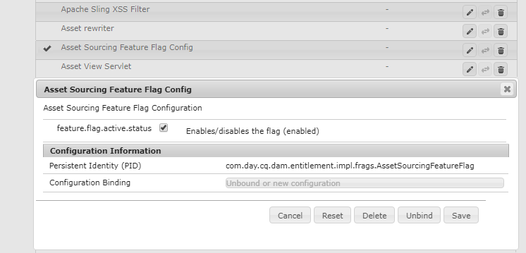
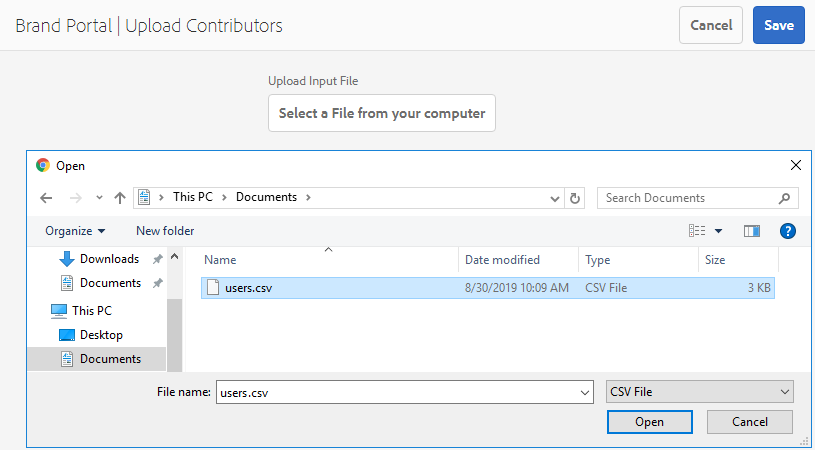

# Asset Sourcing overview {#overview-asset-sourcing-in-bp}

**Asset Sourcing** allows the AEM users (administrators/non-admin users) to create new folders with an additional **Asset Contribution** property, ensuring the new folder created open to asset submission by the Brand Portal users. This automatically triggers a workflow which creates two additional sub folders, called **SHARED** and **NEW**, within the newly created **Contribution** folder. The AEM administrator then defines the requirement by uploading a brief about the types of assets that should be added to the contribution folder, as well as a set of baseline assets, to the **SHARED** folder to ensure BP users have the reference information they need. The administrator can then grant active Brand Portal users access to the contribution folder before publishing the newly created **Contribution** folder to Brand Portal. Once the user is finished adding content in the **NEW** folder, they can publish the contribution folder back to the AEM author environment. Please note that it may take a few minutes to complete the import and reflect the newly published content within AEM Assets.

Additionally, all existing functionality remains unchanged. Brand Portal users can view, search, and download assets from the contribution folder as well as from the other permitted folders. And administrators can further share the contribution folder, modify properties and add assets to collections.

>[!VIDEO](https://video.tv.adobe.com/v/29365/?quality=12)

## Prerequisites {#prerequisites}

* AEM Assets as a Cloud Service instance, AEM Assets 6.5.2 or above.
* Ensure that your AEM Assets instance is configured with Brand Portal. See, [Configure AEM Assets with Brand Portal](../using/configure-aem-assets-with-brand-portal.md).

<!--
* Ensure that your Brand Portal tenant is configured with one AEM Assets author instance.
-->

>[!NOTE]
>
>The Asset Sourcing feature is by default enabled on AEM Assets as a Cloud Service, AEM Assets 6.5.9 and above. 
>
>The existing configurations will continue to work on the earlier versions.

>[!NOTE]
>
>There is a known issue in AEM Assets 6.5.4. Brand Portal users are not be able to publish contribution folder's assets to AEM Assets on upgrading to Adobe Developer Console. 
>
>The issue is fixed in AEM 6.5.5. You can upgrade your AEM Assets instance to the latest service pack AEM 6.5.5 and [upgrade your configurations](https://experienceleague.adobe.com/docs/experience-manager-65/assets/brandportal/configure-aem-assets-with-brand-portal.html#upgrade-integration-65) on Adobe Developer Console.

<!--

>For immediate fix on AEM 6.5.4, it is recommended to [download the hotfix](https://www.adobeaemcloud.com/content/marketplace/marketplaceProxy.html?packagePath=/content/companies/public/adobe/packages/cq650/hotfix/cq-6.5.0-hotfix-33041) and install on your author instance.
-->

<!--
## Configure Asset Sourcing {#configure-asset-sourcing}

**Asset Sourcing** is configured from within the AEM Assets author instance. The administrators can enable the Asset Sourcing feature flag configuration from the **AEM Web Console Configuration** and upload the active Brand Portal users list in **AEM Assets**.

>[!NOTE]
>
>Asset Sourcing is by default enabled on AEM Assets as a Cloud Service. The AEM administrator can directly upload the active Brand Portal users to allow them access to the Asset Sourcing feature.

>[!NOTE]
>
>Before you begin with the configuration, ensure that your AEM Assets instance is configured with Brand Portal. See, [Configure AEM Assets with Brand Portal](../using/configure-aem-assets-with-brand-portal.md). 

The following video demonstrates, how to configure Asset Sourcing on your AEM Assets author instance:

>[!VIDEO](https://video.tv.adobe.com/v/29771)
-->

<!--
### Enable Asset Sourcing {#enable-asset-sourcing}

AEM administrators can enable the Asset Sourcing feature flag from within the AEM Web Console Configuration (a.k.a Configuration Manager).

>[!NOTE]
>
>This step is not applicable for AEM Assets as a Cloud Service.

**To enable Asset Sourcing:**
1. Log in to your AEM Assets author instance and open Configuration Manager. 
Default URL: http:// localhost:4502/system/console/configMgr.
1. Search using the keyword **Asset Sourcing** to locate **[!UICONTROL Asset Sourcing Feature Flag Config]**.
1. Click **[!UICONTROL Asset Sourcing Feature Flag Config]** to open the configuration window.
1. Select the **[!UICONTROL feature.flag.active.status]** check box.
1. Click **[!UICONTROL Save]**.

-->

### Upload Brand Portal users list {#upload-bp-user-list}

AEM administrators can upload the Brand Portal user configuration (.csv) file containing the active Brand Portal user list in AEM Assets to allow them access to the Asset Sourcing feature. 

A contribution folder can only be shared with the active Brand Portal users defined in the user list. The administrator can also add new users in the configuration file and upload the modified user list.

>[!NOTE]
>
>Ensure that your AEM Assets instance is configured with Brand Portal. See, [Configure AEM Assets with Brand Portal](../using/configure-aem-assets-with-brand-portal.md). 

>[!NOTE]
>
>The format of the CSV file is same as supported in Admin Console for bulk user import. Email, first name, and last name are mandatory. 

The administrators can add new users in AEM Admin Console, see [Manage Users](brand-portal-adding-users.md) for detailed information. After adding users in Admin Console, these users can be added to the Brand Portal user configuration file and then assigned permission to access the contribution folder.

**To upload Brand Portal users list:**

1. Log in to your AEM Assets instance. 
1. From the **Tools**  panel, navigate to **[!UICONTROL Assets]** > **[!UICONTROL Brand Portal Users]**.

1. Brand Portal Upload Contributors window opens.
Browse from your local machine and upload **configuration (.csv) file** containing the active Brand Portal users list.
1. Click **[!UICONTROL Save]**.

   

Administrators can provide access to specific users from this user list while configuring a contribution folder. Only the users that are assigned to a contribution folder will have access to the contribution folder and publish assets from Brand Portal to AEM Assets.   

## See also {#reference-articles}

* [Configure and publish contribution folder to Brand Portal](brand-portal-publish-contribution-folder-to-brand-portal.md)

* [Publish contribution folder to AEM Assets](brand-portal-publish-contribution-folder-to-aem-assets.md)
