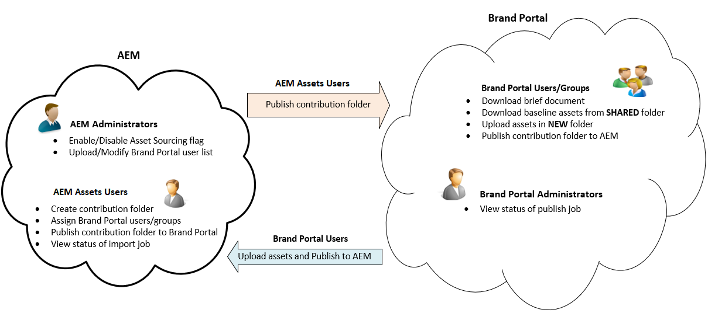

# Asset Sourcing overview {#overview-asset-sourcing-in-bp}

**Asset Sourcing** allows AEM users (administrators/non-admin users) to create new folders with an additional **Asset Contribution** property, ensuring the new folder created open to asset submission by Brand Portal users. This automatically triggers a workflow which creates two additional sub folders, called **SHARED** and **NEW**, within the newly created **Contribution** folder. The AEM Administrator then defines the requirement by uploading a brief about the types of assets that should be added to the contribution folder, as well as a set of baseline assets, to the **SHARED** folder to ensure BP users have the reference information they need. The administrator can then grant active Brand Portal users access to the contribution folder before publishing the newly created **Contribution** folder to Brand Portal. Once the user is finished adding content in the **NEW** folder, they can publish the contribution folder back to the AEM author environment. Please note that it may take a few minutes to complete the import and reflect the newly published content within AEM Assets.

Additionally, all existing functionality remains unchanged. Brand Portal users can view, search, and download assets from the contribution folder as well as from the other permitted folders. And administrators can further share the contribution folder, modify properties and add assets to collections.

>[!VIDEO](https://video.tv.adobe.com/v/29365/?quality=12)

>[!NOTE]
>
>Asset Sourcing in Brand Portal is supported on AEM 6.5.2.0 and above.
>
>The feature is not supported in the earlier versions - AEM 6.3 and AEM 6.4.
>
>Contact Adobe support to upgrade your AEM instance to the latest supported AEM version.

>[!NOTE]
>
>If you are an AEM 6.5.4 user, Asset Sourcing feature will continue to work on the "legacy OAuth integration". 
>
>But, Brand Portal users are not able to publish contribution folder assets to AEM Assets on upgrading to Adobe I/O on AEM 6.5.4. 
>
>This issue will be fixed in the next service pack AEM 6.5.5. 
>
>For immediate fix on AEM 6.5.4, it is recommended to [download the hotfix](https://www.adobeaemcloud.com/content/marketplace/marketplaceProxy.html?packagePath=/content/companies/public/adobe/packages/cq650/hotfix/cq-6.5.0-hotfix-33041) and install on your author instance.
>

## Prerequisites {#prerequisites}

* AEM 6.5.0.2 or above.
* Ensure that your AEM Assets instance is configured with Brand Portal. See, [Configure AEM Assets with Brand Portal](../using/configure-aem-assets-with-brand-portal.md).

## See also {#reference-articles}

**For administrators**

* [Configure Asset Sourcing in AEM](brand-portal-configure-asset-sourcing.md)
* [Upload Brand Portal users list](brand-portal-configure-asset-sourcing.md)
* [Configure contribution folder](brand-portal-contribution-folder.md)
* [Upload baseline assets to contribution folder](brand-portal-upload-baseline-assets.md)
* [Publish contribution folder to Brand Portal](brand-portal-publish-contribution-folder-to-brand-portal.md)

**For Brand Portal users**

* [Download asset requirements](brand-portal-download-asset-requirements.md)
* [Upload new assets to contribution folder](brand-portal-upload-assets-to-contribution-folder.md)
* [Publish contribution folder to AEM Assets](brand-portal-publish-contribution-folder-to-aem-assets.md)
