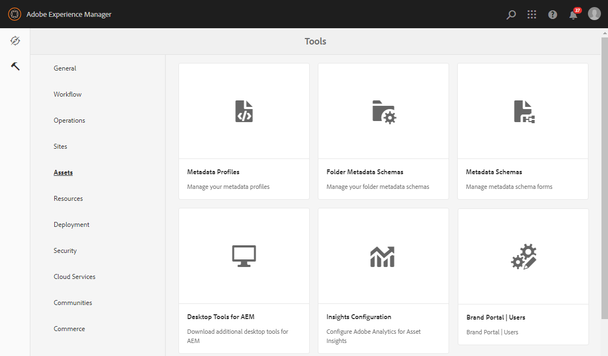

# Configure Asset Sourcing {#configure-asset-sourcing}

AEM administrators can configure **Asset Sourcing** from within the AEM author instance. The administrator enables the Asset Sourcing feature flag configuration from **AEM Web Console Configuration** and uploads the active Brand Portal users list in **AEM Assets**.

>[!NOTE]
>
>Before you begin with the configuration, ensure that your AEM Assets instance is integrated with Brand Portal. See, [Configure AEM Assets with Brand Portal](../using/configure-aem-assets-with-brand-portal.md). 

The following video demonstrates, how to Configure Asset Sourcing on your AEM author instance:

>[!VIDEO](https://video.tv.adobe.com/v/29771)

## Enable Asset Sourcing {#enable-asset-sourcing}

AEM administrators can enable Asset Sourcing from within the AEM Web Console Configuration (a.k.a Configuration Manager).

**To enable Asset Sourcing:**
1. Login to your AEM author instance and open Configuration Manager
Default URL: http:// localhost:4502/system/console/configMgr
1. Search using the keyword **Asset Sourcing** to locate **[!UICONTROL Asset Sourcing Feature Flag Config]**
1. Click **[!UICONTROL Asset Sourcing Feature Flag Config]** to open the configuration window
1. Enable checkbox **[!UICONTROL feature.flag.active.status]**
1. Click **[!UICONTROL Save]**.

## Upload Brand Portal users list {#upload-bp-user-list}

AEM administrators can upload the Brand Portal user configuration (.csv) file containing active Brand Portal user list in AEM Assets. A contribution folder can only be shared with the active Brand Portal users defined in the user list. Administrator can also add new users in the configuration file and upload the modified user list.

>[!NOTE]
>
>The format of the CSV file is same as what is supported by Admin Console for bulk user import. Email, first name, and last name are mandatory. 

Administrator can add new users in AEM Admin Console, see [Manage Users](brand-portal-adding-users.md) for detailed information. After adding users in Admin Console, these users can be added to the Brand Portal user configuration file and then assigned permission to access the contribution folder.

**To upload Brand Portal users list:**
1. Login to your AEM author instance
Default URL: http:// localhost:4502/aem/start.html
1. From **Tools**  panel, navigate to **[!UICONTROL Assets > Brand Portal Users]**

1. Brand Portal Upload Contributors window opens.
Browse from your local machine and upload **configuration (.csv) file** containing the active Brand Portal users list.
1. Click **[!UICONTROL Save]**.

Administrators can provide access to specific users/groups from this user list while configuring the contribution folder.

For more information, see [Configure contribution folder](brand-portal-contribution-folder.md).
