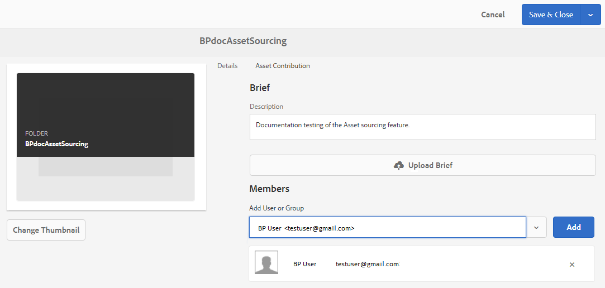

# Configure contribution folder properties {#configure-contribution-folder-properties}

AEM administrator performs the following activities while configuring the properties of a contribution folder.

* **Add description**: Provide a high-level description of the contribution folder.
* **Upload brief**:  Upload Asset Requirement document containing asset related information.
* **Add contributors**: Add Brand Portal users or groups to grant them access to the contribution folder.

Asset requirement refers to the details provided by administrators to help contributors (Brand Portal users) understand the need and requirements of the contribution folder. Administrator uploads an asset requirement document which contains a brief about the type of assets that should be added to the contribution folder and asset related information, for example, purpose, type of images, max size, etc.

Administrator can then grant Brand Portal users/groups access to the contribution folder before publishing the newly created Contribution folder to Brand Portal.

**To configure contribution folder properties:**
1. Login to your AEM author instance
Default URL: http:// localhost:4502/aem/start.html
1. Navigate to **[!UICONTROL Assets > Files]** and locate the contribution folder.
1. Select contribution folder and click **[!UICONTROL Properties]** . Folder properties window opens.

1. Navigate to **[!UICONTROL Asset Contribution]** tab.
1. Enter high-level **[!UICONTROL Description]** of the contribution folder.
1. Click **[!UICONTROL Upload Brief]**  to browse from your local machine and upload an **Asset Requirement Document**.
1. In **[!UICONTROL Add User or Group]**, search and **[!UICONTROL Add]** Brand Portal users or groups with whom you want to share the contribution folder.
These Brand Portal users/groups will have permission to access the contribution folder and upload content from their Brand Portal interface without needing access to the AEM author instance.
1. Click **[!UICONTROL Save]**.

>[!NOTE] 
>
>The search results are based on the Brand Portal user list configured in AEM Assets. Make sure you have the updated Brand Portal user list. See, [Upload Brand Portal user list](brand-portal-configure-asset-sourcing.md).