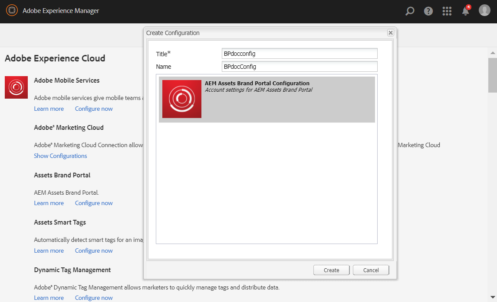
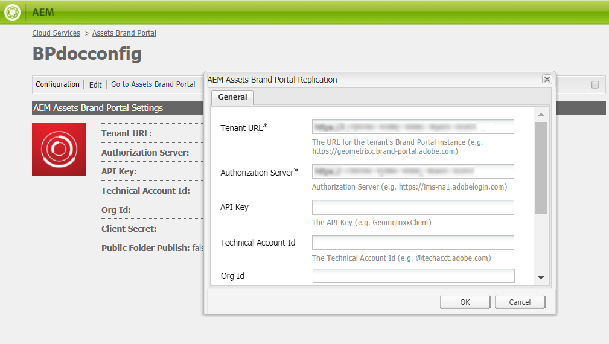
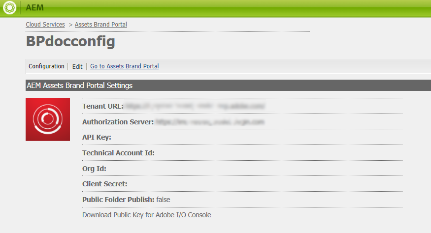
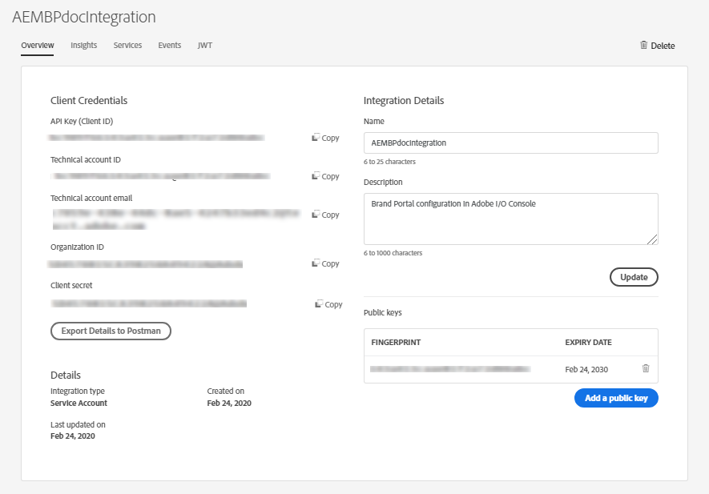
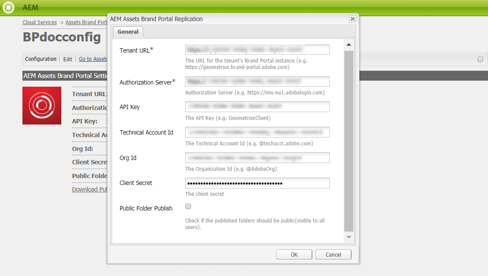

# Configure AEM Assets integration with Brand Portal on AEM 6.3 {#configure-integration-63}

Adobe Experience Manager (AEM) Assets is integrated with Brand Portal which enables asset publishing, asset distribution and asset contribution features.

Earlier, Brand Portal was configured in Classic UI via Legacy OAuth Gateway which uses JWT token exchange exchange to obtain an IMS Access token for authorization. 

Now, Brand Portal is integrated via Adobe Console I/O for authorization.

>[!NOTE]
   >
   >Integration with Legacy OAuth is no longer supported from April 6, 2020, and is shifted to Adobe I/O Console.
   >
   >Integration via Adobe I/O Console is supported on AEM 6.3 and above.

This help describes the following two use-cases: 
* [Configure new integration](#configure-new-integration-63) 
* [Upgrade existing integration](#upgrade-integration-63) 

## Configure new integration on AEM 6.3 {#configure-new-integration-63}

Perform the following steps in the listed sequence to configure integration for the first-time: 
1. [Create Brand Portal cloud service](#create-cloud-service)
1. [Create integration in Adobe I/O Console](#createnewintegration) 
1. [Configure Brand Portal cloud service](#configure-cloud-service)
1. [Test integration](#test-integration)

### Create cloud service {#create-cloud-service}

Create a cloud service configuration to connect your AEM Assets author instance to Brand Portal. Perform the following steps to create a cloud service configuration:

1. Login to your AEM Assets author instance

   Default URL: http:// localhost:4502/aem/start.html
1. From **Tools**  panel, navigate to **[!UICONTROL Deployment >> Cloud Services]**.

1. Find **[!UICONTROL Assets Brand Portal]** configuration section and click **[!UICONTROL Configure now]**.

1. Specify **[!UICONTROL Title]** and **[!UICONTROL Name]** for the new configuration, and click **[!UICONTROL Create]**. 
   
   

1. AEM Assets Brand Portal Replication window opens. 

   In **[!UICONTROL Tenant URL]**, enter the tenant URL of your organization.

   In **[!UICONTROL Authorization Server]**, enter the URL: [https://ims-na1.adobelogin.com/](https://ims-na1.adobelogin.com/)  

   Click **[!UICONTROL OK]**.

   

1. Cloud configuration is created and a public key is generated for your configuration.

   Download **[!UICONTROL Public key]**. This Public key is required for token authorization. 

   

The next step is to [Create integration in Adobe I/O Console](#createnewintegration) and then you can continue to configure the cloud service.

### Create integration {#createnewintegration}

Create new integration in Adobe I/O. The integration generates API Key, Technical Account Id, Organization Id, and Client Secret key which is required in configuring Brand Portal cloud service.

1. Login to Adobe Console with account having system administrator privileges on the IMS organization of the Brand Portal tenant.

   Default URL: [https://console.adobe.io/](https://console.adobe.io/) 

1. Click **[!UICONTROL Create Integration]**.

1. Select **[!UICONTROL Access an API]**, and click **[!UICONTROL Continue]**.

   

1. Create a new integration page opens. 
   
   Select your organization from the drop-down list.

   In **[!UICONTROL Experience Cloud]**, Select **[!UICONTROL AEM Brand Portal]** and click **[!UICONTROL Continue]**. 

   If the Brand Portal option is disabled for you, ensure that you have selected correct organization from the drop-down box above the **[!UICONTROL Adobe Services]** option. If you do not know your organization, contact your administrator.

   

1. Specify a name and description for the integration. Click **[!UICONTROL Select a File from your computer]** and upload the `AEM-Adobe-IMS.crt` certificate file.

1. Select the profile of your organization. 

   Or, select the default profile **[!UICONTROL Assets Brand Portal]** and click **[!UICONTROL Create Integration]**. The integration is created.

1. Click **[!UICONTROL Continue to integration details]** to view the integration information. 

   Copy **[!UICONTROL API Key]**, **[!UICONTROL Technical Account Id]**, **[!UICONTROL Org Id]**, and **[!UICONTROL Client Secret]** key.

   

   The API Key, Technical Account Id, Organization Id, and Client Secret key information will be used to create Brand Portal cloud service.

### Configure cloud service {#configure-cloud-service}

You can configure the cloud service to update the configuration. Continue with the last step where you left in [Create Cloud Service](#create-cloud-service).

1. Login to your AEM Assets author instance

   Default URL: http:// localhost:4502/aem/start.html

1. From **Tools**  panel, navigate to **[!UICONTROL Deployment >> Cloud Services]**.

1. Find **[!UICONTROL Assets Brand Portal]** configuration section and click **[!UICONTROL Show Configurations]**.

1. Click on the newly created cloud service and click **[!UICONTROL Edit]** to update the configurations.

1. Paste the **[!UICONTROL API Key]**, **[!UICONTROL Technical Account Id]**, **[!UICONTROL Org Id]**, and **[!UICONTROL Client Secret]** key that you have copied in the end of [Create integration in Adobe I/O Console](#createnewintegration).

   

1. Click **[!UICONTROL OK]** to update the configurations.

### Test integration {#test-integration}

1. Login to your AEM Assets author instance

   Default URL: http:// localhost:4502/aem/start.html

1. From **Tools**  panel, navigate to **[!UICONTROL Deployment >> Replication]**.

    

1. Replication page opens. 

   Click **[!UICONTROL Agents on author]**.

   

1. Four replication agents are created for each tenant. 

   Locate the replication agents of your Brand Portal tenant. 
   
   Click the replication agent URL. 

   

   >[!NOTE]
   >
   >The replication agents work in parallel and share the job distribution equally, thereby increasing the publishing speed by four times the original speed. After the cloud service is configured, additional configuration is not required to enable the replication agents that are activated by default to enable parallel publishing of multiple assets.

   >[!NOTE]
   >
   >Avoid disabling any of the replication agents, as it can cause the replication of some of the assets to fail.

1. To verify the connection between AEM Assets author and Brand Portal, click **[!UICONTROL Test Connection]**.

   

1. Look at the bottom of the test results to verify that the replication succeeded.

   

1. Verify the test results on all four replication agents one-by-one.

Brand Portal is successfully integrated with your AEM Assets author instance. You can now:

* Publish assets and folders from AEM Assets to Brand Portal
* Publish collections from AEM Assets to Brand Portal. 
* Configure Asset Sourcing enabling the Brand Portal users to contribute and publish assets to AEM Assets. 

## Upgrade existing integration on AEM 6.3 {#upgrade-integration-63}

Perform the following steps in the listed sequence to upgrade existing integration: 
1. [Verify running jobs](#verify-jobs)
1. [Delete existing configuration](#delete-existing-configuration)
1. [Create new integration](#configure-new-integration-63)

### Verify running jobs {#verify-jobs}

Ensure that no publishing job is running on your AEM Assets author instance before you make any modifications. For that, you can verify all four replication agents and ensure that the queue is ideal/empty.  

1. Login to your AEM Assets author instance

   Default URL: http:// localhost:4502/aem/start.html

1. From **Tools**  panel, navigate to **[!UICONTROL Deployment >> Replication]**.

1. Replication page opens. 

   Click **[!UICONTROL Agents on author]**.

   

1. Locate the replication agents of your Brand Portal tenant. 
   
   Ensure that the **Queue is Idle** for all the replication agents, no publishing job is active. 

   

### Delete existing configuration {#delete-existing-configuration}

You must run the following check-list while deleting the existing configuration.
* Delete all four replication agents
* Delete cloud service
* Delete MAC user 

Perform the following steps to delete the existing configuration:

1. Login to your AEM Assets author instance and open CRX Lite as an administrator.

   Default URL: http:// localhost:4502/crx/de/index.jsp

1. Navigate to `/etc/replications/agents.author` and delete all the four replication agents of your Brand Portal tenant.

   

1. Navigate to `/etc/cloudservices/mediaportal` and delete the **Cloud Service configuration**.

   

1. Navigate to `/home/users/mac` and delete the **MAC user** of your Brand Portal tenant.

   

You can now [configure new integration](#configure-new-integration-63) on your AEM 6.3 author instance. 

<!--
   Comment Type: draft

   <li> </li>
   -->

   <!--
   Comment Type: draft

   <li>Step text</li>
   -->
