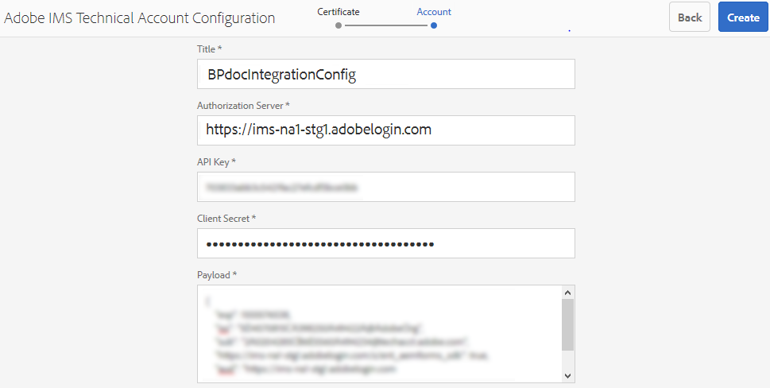
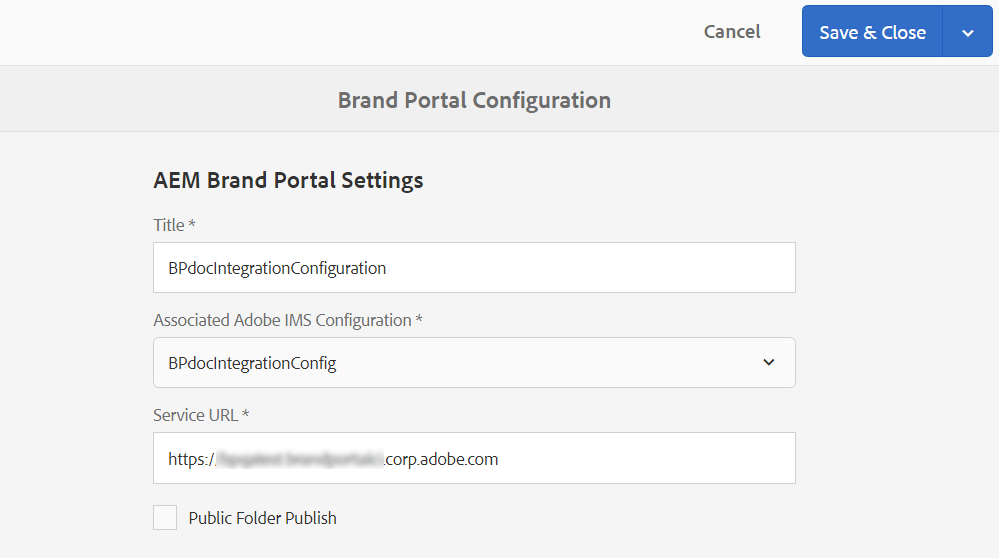
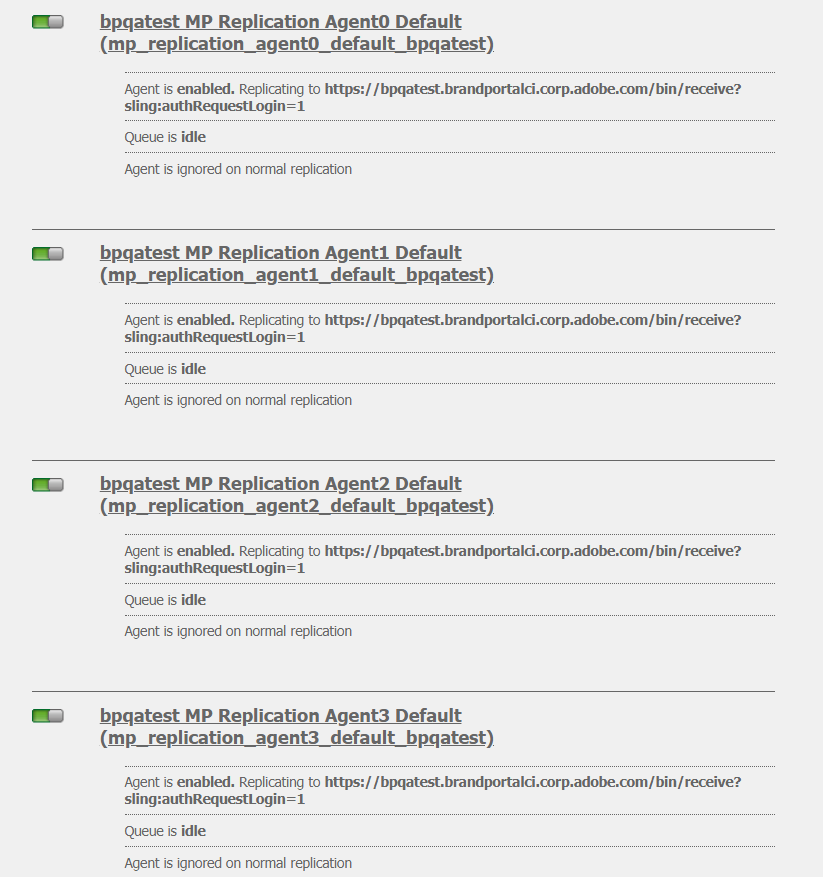
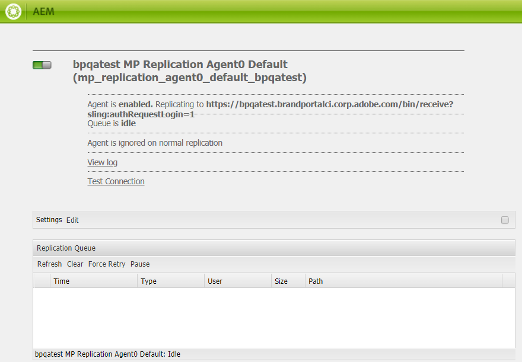
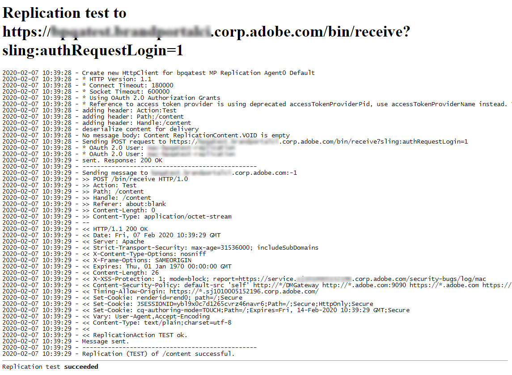

# Configure AEM Assets integration with Brand Portal on AEM 6.4 and above {#configure-integration-64-and-above}

Adobe Experience Manager (AEM) Assets is integrated with Brand Portal which enables asset publishing, asset distribution and asset contribution features.

This help describes the following two use-cases: 
* [Configure new integration](#configure-new-integration-65-64) 
* [Upgrade existing integration](#upgrade-integration-65-64) 

>[!NOTE]
   >
   >Integration via Adobe I/O Console is supported on AEM 6.3 and above.

## Configure new integration on AEM 6.5 or AEM 6.4 {#configure-new-integration-65-64}

Perform the following steps in the listed sequence to configure integration for the first-time: 
1. [Obtain public certificate](#public-certificate)
1. [Create integration in Adobe Console](#createnewintegration) 
1. [Create IMS configuration account](#create-ims-account-configuration)
1. [Configure Brand Portal cloud service](#configure-the-cloud-service)
1. [Test integration](#test-integration)

### Create IMS Configuration {#create-ims-configuration}

IMS configuration authenticates your Brand Portal tenant with AEM Assets author instance. 

IMS configuration includes two steps:

* [Obtain public certificate](#public-certificate) 
* [Create IMS Technical Account configuration](#create-ims-account-configuration)

### Obtain public certificate {#public-certificate}

Public certificate allows you to authenticate your profile on Adobe I/O.

1. Login to your AEM Assets author instance
Default URL: http:// localhost:4502/aem/start.html
1. From **Tools**  panel, navigate to **[!UICONTROL Security]** >> **[!UICONTROL Adobe IMS Configurations]**.

   

1. Adobe IMS Configurations page opens.
   
   Click **[!UICONTROL Create]**. 
   
   This will take you to the **[!UICONTROL Adobe IMS Technical Account Configuration]** page.

1. By default, **Certificate** tab opens.

   In **Cloud Solution**, select **[!UICONTROL Adobe Brand Portal]**.  

1. Mark the checkbox **[!UICONTROL Create new certificate]** and specify an **alias** for the certificate. The alias serves as name of the dialog. 

1. Click **[!UICONTROL Create certificate]**. A dialog appears. Click **[!UICONTROL OK]** to generate the public certificate.

   

1. Click **[!UICONTROL Download Public Key]** and save the *AEM-Adobe-IMS.crt* certificate file on your machine. The certificate file is used to [create integration](#createnewintegration) in Adobe I/O Console.  

   

1.  Click **[!UICONTROL Next]**. 

    **Account** tab opens. Here, you create the Adobe IMS Technical Account but for that you will need the integration details. Keep this page open for now.

    Open a new tab and [Create new integration in Adobe Console](#createnewintegration) to get the integration details for IMS Account configurations. 

### Create integration {#createnewintegration}

Create new integration in Adobe I/O. The integration generates API Key, Client Secret, and Payload (JWT) which is required in setting up the IMS Technical Account configurations.

1. Login to Adobe Console with account having system administrator privileges on the IMS organization of the Brand Portal tenant.

   Default URL: [https://console.adobe.io/](https://console.adobe.io/) 

1. Click **[!UICONTROL Create Integration]**.

1. Select **[!UICONTROL Access an API]**, and click **[!UICONTROL Continue]**.

   

1. Create a new integration page opens. 
   
   Select your organization from the drop-down list.

   In **[!UICONTROL Experience Cloud]**, Select **[!UICONTROL AEM Brand Portal]** and click **[!UICONTROL Continue]**. 

   If the Brand Portal option is disabled for you, ensure that you have selected correct organization from the drop-down box above the **[!UICONTROL Adobe Services]** option. If you do not know your organization, contact your administrator.

   

1. Specify a name and description for the integration. Click **[!UICONTROL Select a File from your computer]** and upload the `AEM-Adobe-IMS.crt` file downloaded in the [obtain public certificates](#obtainpubliccertificates) section.

1. Select the profile of your organization. 

   Or, select the default profile **[!UICONTROL Assets Brand Portal]** and click **[!UICONTROL Create Integration]**. The integration is created.

1. Click **[!UICONTROL Continue to integration details]** to view the integration information. 

   Copy the **[!UICONTROL API Key]** 
   
   Click **[!UICONTROL Retrieve Client Secret]** and copy the Client Secret key.

   

1. Navigate to **[!UICONTROL JWT]** tab, and copy the **[!UICONTROL JWT payload]**.

   The API Key, Client Secret key, and JWT payload information will be used to create IMS configuration on your local machine.

### Create IMS Technical Account Configuration {#create-ims-account-configuration}

Ensure that you have the performed the following steps:

* [Obtain public certificate](#public-certificate)
* [Create new integration](#createnewintegration)

**Steps to create IMS account configuration:**

1. Open the IMS Configuration page, **[!UICONTROL Accounts]** tab. You kept the page open at the end of section, [Obtain public certificate](#obtainpubliccertificates).

1. Specify a **[!UICONTROL Title]** for the IMS account.

   In **[!UICONTROL Authorization Server]**, enter the URL: [https://ims-na1.adobelogin.com/](https://ims-na1.adobelogin.com/)  

   Paste the API Key, Client Secret, and JWT payload that you have copied in the end of [Create Adobe I/O integration](#createnewintegration).

   Click **[!UICONTROL Create]**.

   The Integration is created.

   

   >[!CAUTION]
   >
   >Create only one IMS configuration. Do not create multiple IMS configuration.

1. Select the IMS configuration and click **[!UICONTROL Check Health]**. A dialog box appears. 

   Click **[!UICONTROL Check]**. On successful connection, the *Token retrieved successfully* message appears.

   

      

### Configure cloud service {#configure-the-cloud-service}

Create a cloud service configuration to connect your AEM Assets author instance to Brand Portal. Perform the following steps to create a cloud service configuration:

1. Login to your AEM Assets author instance

   Default URL: http:// localhost:4502/aem/start.html
1. From **Tools**  panel, navigate to **[!UICONTROL Cloud Services >> AEM Brand Portal]**.

   Brand Portal Configurations page opens.

1. Click **[!UICONTROL Create]**.

1. Specify a **[!UICONTROL Title]** for the configuration. 

   Select the IMS Configuration that you have created in [Create IMS Technical Account Configuration](#create-ims-account-configuration)
   
   In **[!UICONTROL Service URL]**, enter your Brand Portal tenant URL.   
   
    

1. Click **[!UICONTROL Save and Close]**. The cloud configuration is created. Your AEM Assets author instance is now integrted with the Brand Portal tenant. 

### Test integration {#test-integration}

1. Login to your AEM Assets author instance

   Default URL: http:// localhost:4502/aem/start.html

1. From **Tools**  panel, navigate to **[!UICONTROL Deployment >> Replication]**.

    

1. Replication page opens. 

   Click **[!UICONTROL Agents on author]**.

   

1. Four replication agents are created for each tenant. 

   Locate the replication agents of your Brand Portal tenant. 
   
   Click the replication agent URL. 

   

   >[!NOTE]
   >
   >The replication agents work in parallel and share the job distribution equally, thereby increasing the publishing speed by four times the original speed. After the cloud service is configured, additional configuration is not required to enable the replication agents that are activated by default to enable parallel publishing of multiple assets.

   >[!NOTE]
   >
   >Avoid disabling any of the replication agents, as it can cause the replication of some of the assets to fail.

1. To verify the connection between AEM Assets author and Brand Portal, click **[!UICONTROL Test Connection]**.

   

1. Look at the bottom of the test results to verify that the replication succeeded.

   

1. Verify the test results on all four replication agents one-by-one.

Brand Portal is successfully integrated with your AEM Assets author instance. You can now:

* Publish assets and folders from AEM Assets to Brand Portal
* Publish collections from AEM Assets to Brand Portal. 
* Configure Asset Sourcing enabling the Brand Portal users to contribute and publish assets to AEM Assets. 

## Upgrade existing integration on AEM 6.5 or AEM 6.4 {#upgrade-integration-65-64}

Perform the following steps in the listed sequence to upgrade existing integration: 
1. [Verify running jobs](#verify-jobs)
1. [Delete existing configuration](#delete-existing-configuration)
1. [Create new integration](#configure-new-integration-65-64)

### Verify running jobs {#verify-jobs}

Ensure that no publishing job is running on your AEM Assets author instance before you make any modifications. For that, you can verify all four replication agents and ensure that the queue is ideal/empty.  

1. Login to your AEM Assets author instance

   Default URL: http:// localhost:4502/aem/start.html

1. From **Tools**  panel, navigate to **[!UICONTROL Deployment >> Replication]**.

1. Replication page opens. 

   Click **[!UICONTROL Agents on author]**.

   

1. Locate the replication agents of your Brand Portal tenant. 
   
   Ensure that the **Queue is Idle** for all the replication agents, no publishing job is active. 

   

### Delete existing configuration {#delete-existing-configuration}

You must run the following check-list while deleting the existing configuration.
* Delete all four replication agents
* Delete cloud service
* Delete MAC user 

Perform the following steps to delete the existing configuration:

1. Login to your AEM Assets author instance and open CRX Lite as an administrator.

   Default URL: http:// localhost:4502/crx/de/index.jsp

1. Navigate to `/etc/replications/agents.author` and delete all the four replication agents of your Brand Portal tenant.

   

1. Navigate to `/etc/cloudservices/mediaportal` and delete the **Cloud Service configuration**.

   

1. Navigate to `/home/users/mac` and delete the **MAC user** of your Brand Portal tenant.

   

You can now [configure new integration](#configure-new-integration-65-64) on your AEM 6.5 or AEM 6.4 author instance. 

<!--
   Comment Type: draft

   <li> </li>
   -->

   <!--
   Comment Type: draft

   <li>Step text</li>
   -->
