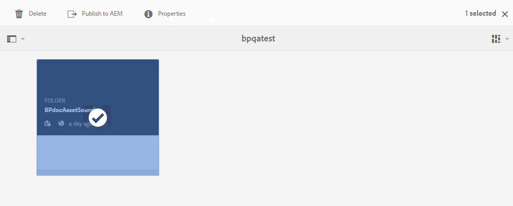
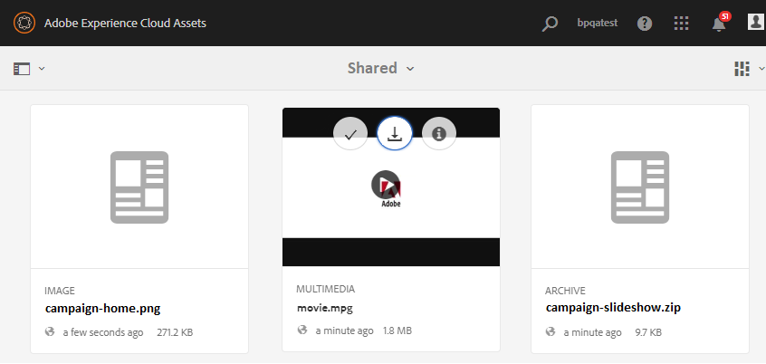

# Download asset requirements {#using-asset-souring-in-bp}

Brand Portal users automatically receive pulse/email notifications whenever a contribution folder is shared by the administrators, allowing them to download the brief (asset requirement) document, as well as download the baseline assets (reference content), from the **SHARED** folder to ensure they understand the asset requirements.

Brand Portal user performs the following activities to download asset requirements:

* **Download brief**: Download the brief (asset requirement document) attached to the contribution folder which contains asset related information like type of assets, purpose, supported formats, maximum asset size, etc.
* **Download baseline assets**: Download the baseline assets which can be used to understand the types of assets required. Brand Portal users can use these assets as reference to create new assets for contribution.

Brand Portal dashboard reflects all the existing folders permitted to the Brand Portal user along with the newly shared contribution folder. In this example, the Brand Portal user only has access to the newly created contribution folder, no other existing folder is shared with the user.

**To download asset requirements:**

1. Login to your Brand Portal instance.
1. Select contribution folder from the Brand Portal dashboard.
1. Click **[!UICONTROL Properties]** . Property window opens, displaying the Asset Contribution folder details.

1. Click **[!UICONTROL Download Brief]**  to download the asset requirement document on your local machine.

1. Go back to the Brand Portal dashboard.
1. Click to open the contribution folder, you can see two sub folders–**[!UICONTROL SHARED]** and **[!UICONTROL NEW]** within the contribution folder. The SHARED folder contains all the baseline assets (reference content) shared by the administrators. 
1. You can download the **[!UICONTROL SHARED]** folder containing all the baseline assets on your local machine. 
Or, you can to open the **[!UICONTROL SHARED]** folder and click **Download** icon  to download individual files/folders.

Go through the brief (asset requirement document) and refer to the baseline assets to understand the asset requirements. Now, you can create new assets for contribution and upload them to the contribution folder. See, [Upload assets to contribution folder](brand-portal-upload-assets-to-contribution-folder.md).

