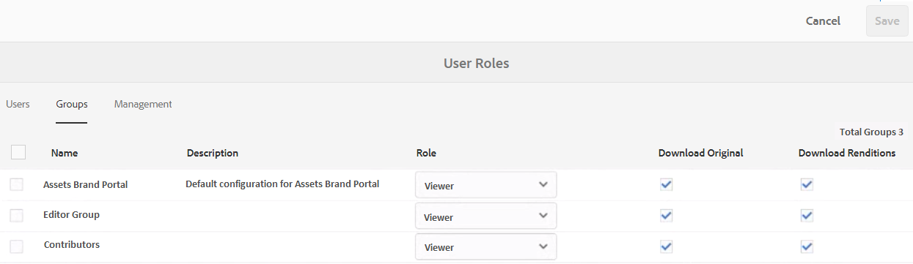
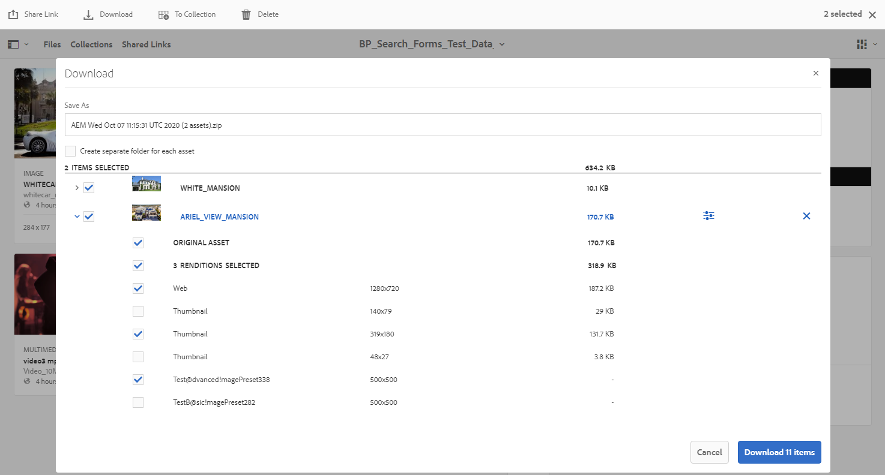
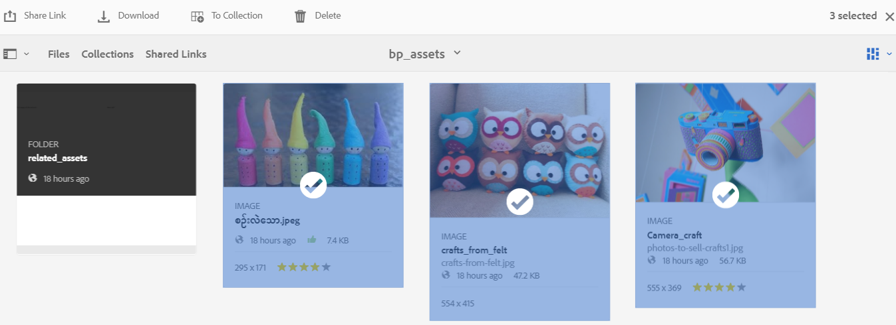
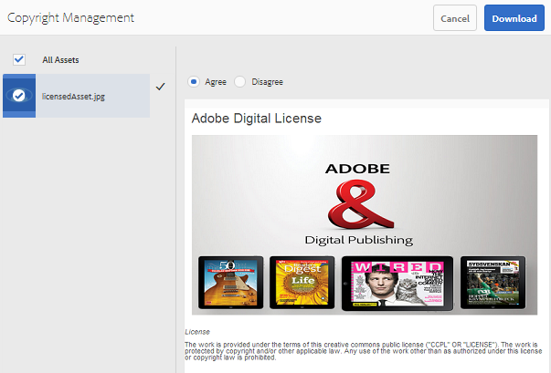
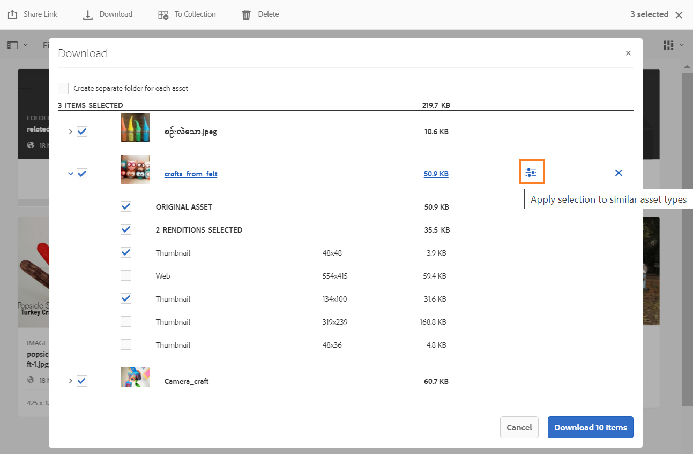
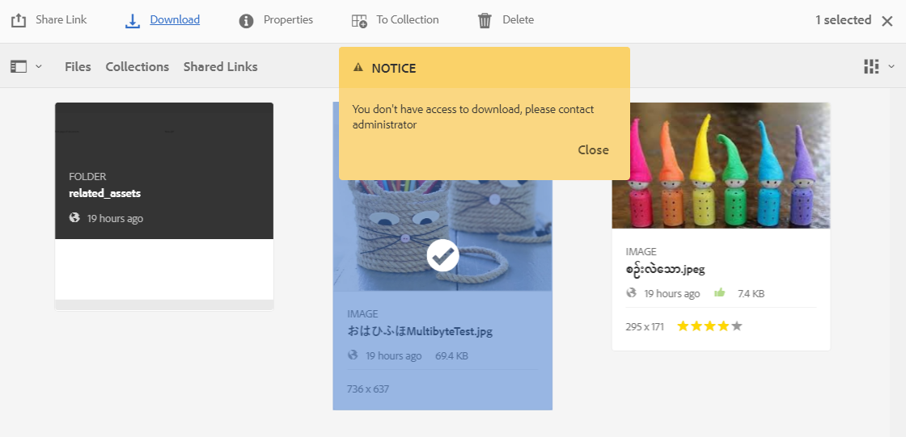
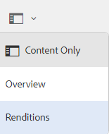
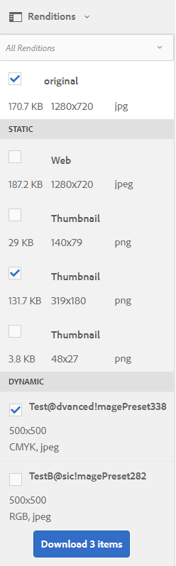

# Download assets from Brand Portal {#download-assets-from-bp}

<!-- Before update in Download experience - 26th Aug 2020 comment by Vishabh.
 All users can simultaneously download multiple assets and folders accessible to them from Brand Portal. This way, approved brand assets can be securely distributed for offline use. Read on to know how to download approved assets from Brand Portal, and what to expect from the [download performance](../using/brand-portal-download-assets.md#main-pars-header).
-->

Adobe Experience Manager Assets Brand Portal enhances the download experience by allowing the users to simultaneously download multiple assets and folders accessible to them from Brand Portal. This way, approved brand assets can be securely distributed for offline use. Read on to know how to download approved assets from Brand Portal, and what to expect from the [download performance](../using/brand-portal-download-assets.md#expected-download-performance).

>[!NOTE]
>
>Install IBM Aspera Connect 3.9.9 in your browser’s extension before downloading the assets from Brand Portal.

## Configure asset download {#configure-download}

Brand Portal administrators can configure the asset download settings and permissions for the Brand Portal users allowing them to access and download asset renditions from the Brand Portal interface. 

Accessing and downloading the renditions from Brand Portal is defined by the following configurations:

* Enable download settings
* Configure download permissions 

### Enable download settings {#enable-download-settings}

The administrators can enable the asset **[!UICONTROL Download Settings]** to define the set of renditions accessible to the Brand Portal users for download.  

The available settings are:

* **[!UICONTROL Fast Download]** 

  Enables high-speed download of the assets. 
  
  To know more, see [guide to accelerate downloads from Brand Portal](../using/accelerated-download.md).

* **[!UICONTROL Custom Renditions]** 
  
  Enables downloading custom and (or) dynamic renditions of the assets. 
  
  All the asset renditions other than the original asset and system-generated renditions are called custom renditions. It includes static as well as dynamic renditions available for the asset. Any user can create a custom static rendition in AEM Assets, whereas, only the AEM administrator can create custom dynamic renditions. To know more, see [how to apply image presets or dynamic renditions](../using/brand-portal-image-presets.md).

* **[!UICONTROL System Renditions]** 

  Enables downloading system-generated renditions of the assets. 
  
  These are the thumbnails which are automatically generated in AEM Assets based on the "DAM update asset" workflow. 

Log in to your Brand Portal tenant as an administrator and navigate to **[!UICONTROL Tools]** > **[!UICONTROL Download]**. By default, the **[!UICONTROL Fast Download]** configuration is enabled in the **[!UICONTROL Download Settings]**. 

The administrators can enable any combination of settings for the Brand Portal users to access and download renditions.

>[!NOTE]
>
>Only the administrators can download the expired assets. For more information about expired assets, see [manage digital rights of assets](../using/manage-digital-rights-of-assets.md).

### Configure download permissions {#configure-download-permissions}

In addition to the **[!UICONTROL Download Settings]**, the Brand Portal administrators can further configure permissions for different group of users to view and (or) download the original assets and their renditions.

Log in to your Brand Portal tenant as an administrator and navigate to **[!UICONTROL Tools]** > **[!UICONTROL Users]**. In the **[!UICONTROL User Roles]** page, navigate to the **[!UICONTROL Groups]** tab to configure the view and (or) download permissions for the user groups.

>[!NOTE]
>
>If a user is added to multiple groups and if one of those groups has restrictions, the restrictions will apply to the user.

Based on the configuration, the download workflow remains constant for stand-alone assets, multiple assets, folders containing assets, licensed or unlicensed assets, and downloading assets using share link.

The following matrix defines if a user would have access to the renditions depending on the [download configurations](#configure-download):

| **Download Settings: Custom Renditions** |**Download Settings: System Renditions** |**User Group Permissions: Download Original** | **User Group Permissions: Download Renditions** | **Result**  |
|---|---|---|---|---|
|ON|ON|ON|ON|View and download all renditions|
|ON|ON|OFF|OFF|View original asset|
|OFF|OFF|ON|ON|View and download original asset|
|ON|OFF|ON|ON|View and download original asset and custom renditions|
|OFF|ON|ON|ON|View and download original asset and system renditions|
|ON|OFF|OFF|OFF|View original asset|
|OFF|ON|OFF|OFF|View original asset|
|OFF|OFF|OFF|ON|View original asset|
|OFF|OFF|ON|OFF|View and download original asset|
|OFF|OFF|OFF|OFF|View original asset|

## Download assets {#download-assets}

Brand Portal users can download multiple assets, folders containing assets, and collections from the Brand Portal interface. 

>[!NOTE]
>
>Contact the Brand Portal administrator if you do not have permissions to access or download the renditions.   

If the user has access to renditions, the user is provided with the enhanced **[!UICONTROL Download]** dialog with the following capabilities:
* View all the available renditions of any asset in the download list.
* Exclude renditions of the assets which are not required for download.
* Apply the same set of renditions to all the similar asset types in one click.
* Apply a different set of renditions for different asset types. 
* Create a separate folder for each asset rendition.
* Download selected assets and their renditions. 

>[!NOTE]
>
>The **[!UICONTROL Download]** dialog appears only if the assets are selected for download, and **[!UICONTROL Custom Renditions]** or **[!UICONTROL System Renditions]** is enabled in the **[!UICONTROL Download Settings]**.

### Steps to download assets {#bulk-download}

Following are the steps to download assets or folders containing assets from the Brand Portal interface:

1. Log in to your Brand Portal tenant. By default, the **[!UICONTROL Files]** view opens which contains all the published assets and folders.  

   Do one of the following:

   * Select the assets or folders you want to download. From the toolbar at the top, click the **[!UICONTROL Download]** icon.

     

   * To download specific asset renditions of an asset, hover the pointer over the asset and click the **[!UICONTROL Download]** icon available in the quick action thumbnails.

     

     >[!NOTE]
     >
     >If you are downloading the assets for the first time and do not have IBM Aspera Connect installed in your browser, it will prompt you to install the Aspera download accelerator. 

     >[!NOTE]
     >
     >If the assets you are downloading also include licensed assets, you are redirected to the **[!UICONTROL Copyright Management]** page. In this page, select the assets, click **[!UICONTROL Agree]**, and then click **[!UICONTROL Download]**. If you choose to disagree, licensed assets are not downloaded. 
     > 
     >License-protected assets have [license agreement attached](https://helpx.adobe.com/experience-manager/6-5/assets/using/drm.html#DigitalRightsManagementinAssets) to them, which is done by setting asset's [metadata property](https://helpx.adobe.com/experience-manager/6-5/assets/using/drm.html#DigitalRightsManagementinAssets) in Experience Manager Assets.

     

1. The **[!UICONTROL Download]** dialog listing all the selected assets opens. 

   Click on any asset to view the available renditions and select the check boxes corresponding to the renditions you want to download. 

   You can manually select or exclude the renditions for individual assets, or click on the **Apply** icon to apply same set of renditions to all the similar asset types selected for download. Confirm to apply the rule to all the similar asset types. 

   

   You can also remove an asset from the download list (if required) by clicking on the **Remove** icon. 

   

   To preserve the Brand Portal folder hierarchy while downloading assets, select the **[!UICONTROL Create separate folder for each asset]** check box. By default, the Brand Portal folder hierarchy is ignored and all the assets are downloaded in a zip folder.

   The download button reflects the count of the selected items. Once you are done with applying the rules, click **[!UICONTROL Download items]**. 

   

1. If **[!UICONTROL Fast Download]** is enabled in the **[!UICONTROL Download Settings]**, a confirmation box appears. Click **[!UICONTROL Allow]**. 

   All the selected renditions are downloaded in a zip folder using the IBM Aspera Connect plugin. 

   If **[!UICONTROL Fast Download]** is turned-off, the selected renditions are directly downloaded in a zip folder. 

>[!NOTE]
>
>If more than 20 assets are selected for download, the **[!UICONTROL Download]** dialog is skipped and all the renditions accessible to the user excluding the dynamic renditions are directly downloaded in a zip folder. 
>
>The same behavior is followed while downloading the folders containing assets and collections. The accessible renditions excluding the dynamic renditions are directly downloaded in a zip folder.   

>[!NOTE]
>
>Brand Portal supports configuring Dynamic Media in both - Hybrid and Scene 7 mode. 
>
>(*If AEM author instance is running on **Dynamic Media Hybrid mode***)
>
>To preview or download dynamic renditions of an asset, ensure that the dynamic media is enabled and the asset's Pyramid tiff rendition exists at the AEM Assets author instance from where the assets have been published. When an asset is published from AEM to Brand Portal, its Pyramid tiff rendition is also published.
      
If you are not [authorized by the administrator to have access to the original renditions](../using/brand-portal-adding-users.md#main-pars-procedure-202029708), the original renditions of the selected assets are not downloaded. 

<!-- This issue has been resolved, check with engineering.
>[!NOTE]
>
>Once you have downloaded the asset renditions, the **[!UICONTROL Download]** button is disabled to avoid creating duplicate copies of the renditions. To download more (missing or another copy of renditions), refresh the browser to re-enable the download button.
-->

### Download assets from asset details page {#download-assets-from-asset-details-page}

In addition to the download workflow, there is another method of downloading the renditions for individual assets directly from the asset details page. 

The users can preview different renditions, select specific renditions, and directly download them from the **[!UICONTROL Renditions]** panel in the asset details page without having to open the **[!UICONTROL Download]** dialog.  

Following are the steps to download asset renditions from the asset details page:

1. Log in to your Brand Portal tenant and click on the asset to open the asset details page.
1. Click the overlay icon on the left, and then click **[!UICONTROL Renditions]**.

    
   
1. The **[!UICONTROL Renditions]** panel lists all the accessible asset renditions based on the asset [download configurations](#configure-download). 

   Select specific renditions you want to download and click **[!UICONTROL Download items]**.

   

1. If **[!UICONTROL Fast Download]** is enabled in the **[!UICONTROL Download Settings]**, a confirmation box appears. Click **[!UICONTROL Allow]**. 

   All the selected renditions are downloaded in a zip folder using the IBM Aspera Connect plugin. 

   If **[!UICONTROL Fast Download]** is turned-off, the selected renditions are directly downloaded in a zip folder. 

>[!NOTE]
>
>Assets that are individually downloaded are visible in the assets download report. However, if a folder containing assets is downloaded, the folder and assets are not displayed in the assets download report.

<!-- Backup of content before updating the new feature docs.
## Configure asset download {#configure-download}

The download configuration allows the Brand Portal administrators to define the set of renditions available to the Brand Portal users for downloading the assets. The administrator can configure the asset **[!UICONTROL Download]** settings from the Brand Portal interface. 

The available configurations are:

* **[!UICONTROL Fast Download]** 

  Enables high-speed download of the assets. To know more, see [guide to accelerate downloads from Brand Portal](../using/accelerated-download.md).

* **[!UICONTROL Custom Renditions]** 
  
  Download custom and (or) dynamic renditions of the assets. 
  All the asset renditions other than the original asset and system-generated renditions are called as custom renditions. It includes static as well as dynamic renditions available for the asset. Any user can create a custom static rendition in AEM Assets, whereas, only the AEM administrator can create custom dynamic renditions. To know more, see [how to apply image presets or dynamic renditions](../using/brand-portal-image-presets.md)

* **[!UICONTROL System Renditions]** 

  Download system-generated renditions of the assets. These are the thumbnails which are automatically generated in AEM Assets based on the "DAM update asset" workflow. 

Log in to your Brand Portal tenant as an administrator and navigate to **[!UICONTROL Tools]** > **[!UICONTROL Download]**. By default, the **[!UICONTROL Fast Download]** configuration is enabled in the **[!UICONTROL Download Settings]**. 

The administrators can enable any combination to configure the asset download process.

Based on the configuration, the download workflow remains constant for stand-alone assets, multiple assets, folders containing assets, licensed or unlicensed assets, and downloading assets using share link. 

* If both **[!UICONTROL Custom Renditions]** and **[!UICONTROL System Renditions]** configurations are turned-off, the original renditions of the assets are downloaded without any additional dialog being presented to the users.    

* If any of the **[!UICONTROL Custom Renditions]** or **[!UICONTROL System Renditions]** configuration is enabled, an additional **[!UICONTROL Download]** dialog box appears wherein you can choose whether to download the original asset along with its renditions, or download only specific renditions. 

>[!NOTE]
>
>Only the administrators can download the expired assets. For more information about expired assets, see [manage digital rights of assets](../using/manage-digital-rights-of-assets.md).

## Steps to download assets {#steps-to-download-assets}

Following are the steps to download assets or folders containing assets from Brand Portal:

1. From the Brand Portal interface, do one of the following:

   * Select the folders or assets you want to download. From the toolbar at the top, click the **[!UICONTROL Download]** icon.

     

   * To download a specific asset or folder, hover the pointer over the asset or folder and click the **[!UICONTROL Download]** icon available in the quick action thumbnails.

     

     >[!NOTE]
     >
     >If you are downloading the assets for the first time and do not have IBM Aspera Connect installed in your browser, it will prompt you to install the Aspera download accelerator. 

     >[!NOTE]
     >
     >If the assets you are downloading also include licensed assets, you are redirected to the **[!UICONTROL Copyright Management]** page. In this page, select the assets, click **[!UICONTROL Agree]**, and then click **[!UICONTROL Download]**. If you choose to disagree, licensed assets are not downloaded. 
     > 
     >License-protected assets have [license agreement attached](https://helpx.adobe.com/experience-manager/6-5/assets/using/drm.html#DigitalRightsManagementinAssets) to them, which is done by setting asset's [metadata property](https://helpx.adobe.com/experience-manager/6-5/assets/using/drm.html#DigitalRightsManagementinAssets) in Experience Manager Assets.

     

     
     >[!NOTE]
     >
     >Ensure to select all the required asset renditions while downloading them from the asset details page, and click **[!UICONTROL Download]**. The selected renditions are downloaded to your local machine.
     > 
     >Once you download, the **[!UICONTROL Download]** button is disabled to avoid creating duplicate copies of the downloaded renditions. To download more (missing or another copy of renditions), refresh the browser to re-enable the download button.

     If any of the **[!UICONTROL Custom Renditions]** or **[!UICONTROL System Renditions]** configuration is enabled in the **[!UICONTROL Download Settings]**, the **[!UICONTROL Download]** dialog appears with the **[!UICONTROL Asset(s)]** check box selected by default. If the **[!UICONTROL Fast Download]** configuration is enabled, the **[!UICONTROL Enable download acceleration]** check box is selected by default.

     

     >[!NOTE]
     >
     >If the downloading assets are image files, and you select only the **[!UICONTROL Asset(s)]** check box in the **[!UICONTROL Download]** dialog but are not [authorized by the administrator to have access to the original renditions of image files](../using/brand-portal-adding-users.md#main-pars-procedure-202029708) then no image files are downloaded and a notification appears, stating that you have been restricted by the administrator to access original renditions.

     

1. To download the renditions in addition to the original assets, select the **[!UICONTROL Rendition(s)]** check box. However, if you want to download the system-generated renditions along with the custom renditions, clear the **[!UICONTROL Exclude System Renditions]** check box.

   

   * To download only the renditions, clear the **[!UICONTROL Asset(s)]** check box.

     >[!NOTE]
     >
     >By default, only the assets are downloaded. However, original renditions of image files are not downloaded if you are not [authorized by the administrator to have access to the original renditions of image files](../using/brand-portal-adding-users.md#main-pars-procedure-202029708).

    * To share the selected assets with other users through a link, select the **[!UICONTROL Email]** check box. An email notification is sent to the users with the download link. To know how to download assets from shared links, see [downloading assets from shared links](../using/brand-portal-link-share.md#main-pars-header-1703469193).  

      

      >[!NOTE]
      >
      >The download link on email notification expires after 45 days.
      >
      >The administrators can customize email messages, that is, logo, description, and footer, using the [Branding](../using/brand-portal-branding.md) feature.

    * You can select a predefined image preset or create a custom dynamic rendition from the **[!UICONTROL Download]** dialog box. 

      To apply a [custom image preset to the asset and its renditions](../using/brand-portal-image-presets.md#applyimagepresetswhendownloadingimages), select the **[!UICONTROL Dynamic Rendition(s)]** check box. Specify the image preset properties (such as size, format, color space, resolution, and image modifier) to apply the custom image preset while downloading the asset and its renditions. To download only the dynamic renditions, clear the **[!UICONTROL Asset(s)]** check box.

      

      >[!NOTE]
      >
      >Brand Portal supports configuring Dynamic Media in both - Hybird and Scene 7 mode. 
      >
      >(*If AEM author instance is running on **Dynamic Media Hybrid mode***)
      >
      >To preview or download dynamic renditions of an asset, ensure that the dynamic media is enabled and the asset's Pyramid tiff rendition exists at the AEM Assets author instance from where the assets have been published. When an asset is published to Brand Portal, its Pyramid tiff rendition is also published.
      
  
    * To preserve the Brand Portal folder hierarchy while downloading assets, select the **[!UICONTROL Create separate folder for each asset]** check box. By default, the Brand Portal folder hierarchy is ignored and all the assets are downloaded in one folder in your local system.

1. Click **[!UICONTROL Download]**.

   The assets (and renditions if selected) are downloaded as a zip file to your local folder. However, no zip file is created if a single asset is downloaded without any of the renditions. 

   If you are not [authorized by the administrator to have access to the original renditions](../using/brand-portal-adding-users.md#main-pars-procedure-202029708), the original renditions of the selected assets are not downloaded. 

   >[!NOTE]
   >
   >Assets that are individually downloaded are visible in the assets download report. However, if a folder containing assets is downloaded, the folder and assets are not displayed in the assets download report.
-->

## Expected download performance {#expected-download-performance}

File download experience may vary for users at different client locations, depending on factors such as local Internet connectivity and server latency. The expected download performance for 2-GB file observed at different client locations is as follows, with Brand Portal server at Oregon in United States:

| Client location         | Latency between client and server | Expected download speed | Time taken to download a 2-GB file |
|-------------------------|-----------------------------------|-------------------------|------------------------------------|
| US West (N. California) | 18 milliseconds                   | 7.68 MB/s               | 4 minutes                          |
| US West (Oregon)        | 42 milliseconds                   | 3.84 MB/s               | 9 minutes                          |
| US East (N. Virginia)   | 85 milliseconds                   | 1.61 MB/s               | 21 minutes                         |
| APAC (Tokyo)            | 124 milliseconds                  | 1.13 MB/s               | 30 minutes                         |
| Noida                   | 275 milliseconds                  | 0.5 MB/s                | 68 minutes                         |
| Sydney                  | 175 milliseconds                  | 0.49 MB/s               | 69 minutes                         |
| London                  | 179 milliseconds                  | 0.32 MB/s               | 106 minutes                        |
| Singapore               | 196 milliseconds                  | 0.5 MB/s                | 68 minutes                         |

 >[!NOTE]
 >
 >Cited data are observed under test conditions, which may vary for users at different locations witnessing varied latency and bandwidth.
 
