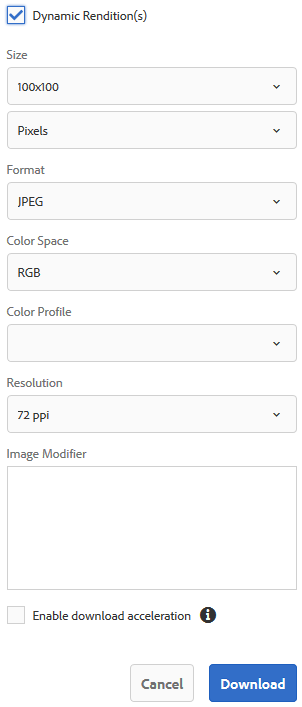

# Download assets {#download-assets}

All users can simultaneously download multiple assets and folders accessible to them from Brand Portal. This way, approved brand assets can be securely distributed for offline use. Read on to know how to download approved assets from Brand Portal, and what to expect from the [download performance](../using/brand-portal-download-users.md#main-pars-header).

>[!NOTE]
 >
 >Only Administrators can download expired assets. For more information about expired assets, see [Manage digital rights of assets](../using/manage-digital-rights-of-assets.md).
 >

## Steps to download assets {#steps-to-download-assets}

To download assets or folders containing assets for Brand Portal, follow these steps:

1. From the Brand Portal interface, do one of the following:

    * Select the folders or assets you want to download. From the toolbar at the top, click the **[!UICONTROL Download]** icon.

   

    * To download a single folder or an asset, hover the pointer over the folder or the asset. From the quick action thumbnails available, click the **[!UICONTROL Download]** icon.

   

   >[!NOTE]
    >
    >If the assets you are downloading also include licensed assets, you are redirected to the **[!UICONTROL Copyright Management]** page. In this page, select the assets, click **[!UICONTROL Agree]**, and then click **[!UICONTROL Download]**. If you choose to disagree, licensed assets are not downloaded.  
    >License-protected assets have [license agreement attached](https://helpx.adobe.com/experience-manager/6-5/assets/using/drm.html#DigitalRightsManagementinAssets) to them, which is done by setting asset's [metadata property](https://helpx.adobe.com/experience-manager/6-5/assets/using/drm.html#DigitalRightsManagementinAssets) in AEM Assets.
    >

   

   The **[!UICONTROL Download]** dialog box appears with the **[!UICONTROL Asset(s)]** option selected by default.

   

   >[!NOTE]
    >
    >If the assets you are downloading are image files, and you select only the **[!UICONTROL Asset(s)]** option in Download dialog but are not [authorized by the administrator to have access to the original renditions of image files](../using/brand-portal-adding-users.md#main-pars-procedure-202029708) then no image files are downloaded and a Notice prompts, stating that you have been restricted by administrator to access original renditions.
    >

   

1. To download the renditions of assets in addition to the assets, select **[!UICONTROL Rendition(s)]**. However, to allow auto-generated renditions to download along with custom renditions, deselect **[!UICONTROL Exclude Auto Generated Renditions]**, which is selected by default.

   

    To download only the renditions, deselect **[!UICONTROL Asset(s)]**.

   >[!NOTE]
    >
    >By default, only the assets are downloaded. However, original renditions of image files are not downloaded if you are not [authorized by the administrator to have access to the original renditions of image files](../using/brand-portal-adding-users.md#main-pars-procedure-202029708).
    >

    * To speed up the download of asset files from Brand Portal, select **[!UICONTROL Enable download acceleration]** option and [follow the wizard](../using/accelerated-download.md#main-pars-header-405749062). To know more about faster download of assets refer [guide to accelerate downloads from Brand Portal](../using/accelerated-download.md).

    * To apply a [custom image preset to the asset and its renditions](../using/brand-portal-image-presets.md#applyimagepresetswhendownloadingimages), select **[!UICONTROL Dynamic Rendition(s)]**. Specify custom image preset properties (size, format, color space, resolution, and image modifier) to apply the custom image preset while downloading the asset and its renditions. To download only the dynamic renditions, delesect **[!UICONTROL Asset(s)]**.

   

   >[!NOTE]
    >
    >To preview (or download) dynamic renditions of any asset, ensure that the dynamic media is enabled and the asset's Pyramid tiff rendition exists at the AEM author instance, from where the assets have been published. When an asset is published to Brand Portal, its Pyramid tiff rendition is also published. There is no way of generating the Pyramid tiff rendition from Brand Portal.
    >

    * To preserve the Brand Portal folder hierarchy while downloading assets, select **[!UICONTROL Create separate folder for each asset]**. By default, Brand Portal folder hierarchy is ignored and all assets are downloaded in one folder in your local system.

    * To send an email notification to users with a link for downloading the assets, select **[!UICONTROL Email]**.

   

   >[!NOTE]
    >
    >Download link on email notification expires after 45 days.
    >
    >Administrators can customize email messages, that is, logo, description, and footer, using the [Branding](../using/brand-portal-branding.md) feature.
    >

1. Click **[!UICONTROL Download]**.

   The assets (and renditions if selected) are downloaded as a ZIP file to your local folder. However, no zip file is created if a single asset is downloaded without any of the renditions, thereby ensuring speedy download.

   Original renditions of the selected assets are not downloaded if you are not [authorized by administrator to have access to the original renditions](../using/brand-portal-adding-users.md#main-pars-procedure-202029708).

   >[!NOTE]
    >
    >Assets that are selected individually and downloaded are visible in the assets downloaded report. However, if a folder containing assets is downloaded, neither the folder nor the assets are displayed in the assets downloaded report.
    >

   To know how to download assets from shared links, refer [downloading assets from shared links](../using/brand-portal-link-share.md#main-pars-header-1703469193).

## Expected download performance {#expected-download-performance}

File download experience may vary for users at different client locations, depending on factors such as local Internet connectivity and server latency. The expected download performance for 2 GB file observed at different client locations is as follows, with Brand Portal server at Oregon in United States:

| Client location         | Latency between client and server | Expected download speed | Time taken to download a 2 GB file |
|-------------------------|-----------------------------------|-------------------------|------------------------------------|
| US West (N. California) | 18 milliseconds                   | 7.68 MB/s               | 4 minutes                          |
| US West (Oregon)        | 42 milliseconds                   | 3.84 MB/s               | 9 minutes                          |
| US East (N. Virginia)   | 85 milliseconds                   | 1.61 MB/s               | 21 minutes                         |
| APAC (Tokyo)            | 124 milliseconds                  | 1.13 MB/s               | 30 minutes                         |
| Noida                   | 275 milliseconds                  | 0.5 MB/s                | 68 minutes                         |
| Sydney                  | 175 milliseconds                  | 0.49 MB/s               | 69 minutes                         |
| London                  | 179 milliseconds                  | 0.32 MB/s               | 106 minutes                        |
| Singapore               | 196 milliseconds                  | 0.5 MB/s                | 68 minutes                         |

**Note**: Cited data are observed under test conditions, which may vary for users at different locations witnessing varied latency and bandwidth.
