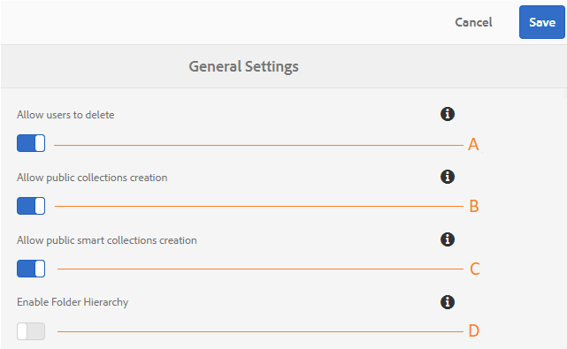

# Administer general tenant configurations {#administer-general-tenant-configurations}

AEM Assets Brand Portal allows organizations to configure the following capabilities for specific tenants:

* Asset deletion by administrators
* Public collection creation by non-admin users
* Public smart collection creation by non-admin users
* Parent hierarchy of shared folders visible to non-admin users

These configurations have been provided as **[!UICONTROL General Settings]** configurations on the administrative tools panel.

**A**   Configuration to allow administrators to delete assets from Brand Portal. (Default is enabled)

**B**   Configuration to allow the non-admin users to create public collections. (Default is enabled)

**C**   Configuration to allow the non-admin users to create public smart collections. (Default is enabled)

**D**  Configuration to display folder hierarchy (from the root) of shared folders to non-admin users (Editors, Viewers, Guest Users). (Default is disabled)

## Enable/ disable General configurations {#enable-disable-general-configurations}

To enable/disable each of these configurations:

1. Log in with administrator privileges.
1. Select the AEM logo to access administrative tools, from the toolbar at the top.
1. From the administrative tools panel, select **[!UICONTROL General]** to open the **[!UICONTROL General Settings]** page.
1. Use the respective toggle switch to enable/ disable any of the General configurations.
1. **[!UICONTROL Save]** the changes.
1. Logout to let the changes take effect.

## Allow admin users to delete assets from Brand Portal {#allow-admin-users-to-delete-assets-from-brand-portal}

**[!UICONTROL Allow users to delete]** configuration enables organizations to allow (or restrict) users with administrator privileges to delete assets and folders from Brand Portal.

## Allow public collections creation by non-admins {#allow-public-collections-creation-by-non-admins}

[[!UICONTROL Allow public collections creation]](../using/brand-portal-share-collection.md#main-pars-text-1915052376) configuration controls whether non-administrators can create public collections on Brand Portal. The configuration is enabled by default. By disabling the configuration organizations can prevent having numerous public collections on their portal so that system space can be saved.

## Allow public smart collections creation by non-admins {#allow-public-smart-collections-creation-by-non-admins}

[[!UICONTROL Allow public smart collections creation]](../using/brand-portal-searching.md#main-pars-header-500620467) configuration controls whether non-administrators can save their searches as smart collections and make them public for that tenant. The configuration is enabled by default. By disabling the configuration organizations can prevent having a huge number of public smart collections created by non-admin users on organization's Brand Portal.

<!-- 
## Allow download acceleration {#allow-download-acceleration}

[[!UICONTROL Allow download acceleration]](../using/accelerated-download.md) configuration lets the organizations to allow accelerated downloads of assets from Brand Portal and shared links, by integrating with IBM Aspera Connect that is an install-on-demand application. The application uses proprietary technology to remove TCP overheads.
-->

## Enable Folder Hierarchy {#enable-folder-hierarchy}

[[!UICONTROL Enable Folder Hierarchy]](../using/brand-portal-sharing-folders.md#non-admin-user-access-to-shared-folders) configuration allows the administrators to control how the non-admin users (Editors, Viewers, and Guest Users) see the shared folders after logging in.
