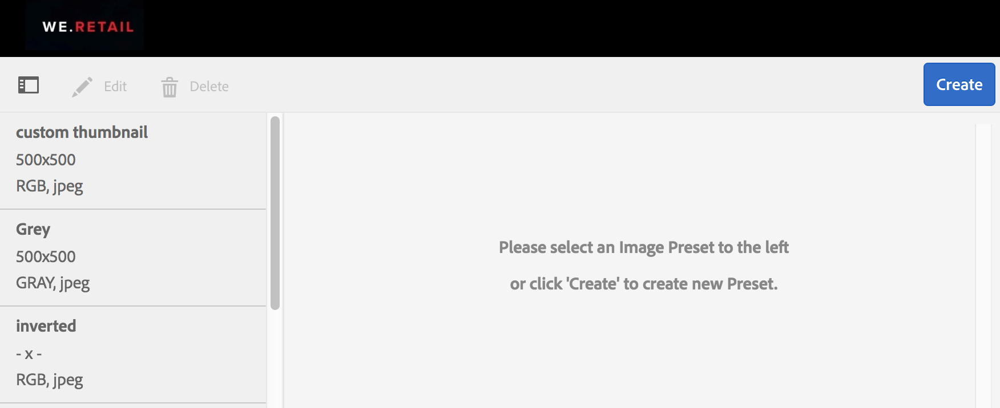
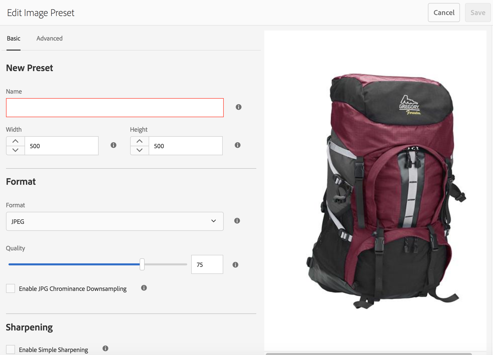
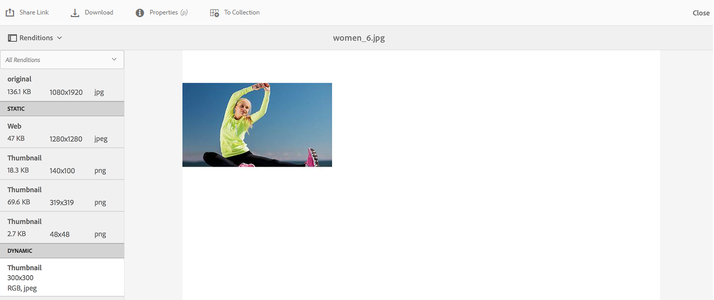

# Apply image presets or dynamic renditions{#apply-image-presets-or-dynamic-renditions}

Like a macro, an image preset is a predefined collection of sizing and formatting commands saved under a name. Image presets enable AEM Assets Brand Portal to dynamically deliver images of different sizes, formats, and properties.

An image preset is used to generate dynamic renditions of images that can be previewed and downloaded. When previewing images and their renditions, you can choose a preset to reformat images to the specifications set by your Administrator.

>[!NOTE]
>
>When downloading images and their renditions, there is no option to choose from the existing presets. Instead, you can specify the properties of a custom image preset. For more information, see [Apply image presets when downloading images](../using/brand-portal-image-presets.md#main-pars-text-1403412644).

For more information about the parameters required while creating image presets, see [Managing Image Presets](https://docs.adobe.com/docs/en/aem/6-0/administer/integration/dynamic-media/image-presets.html).

## Create an image preset {#create-an-image-preset}

Administrators can create image presets that appear as dynamic renditions on the asset detail page. You can create an image preset from scratch or save an existing one with a new name. When creating an image preset, choose a size for image delivery and the formatting commands. When an image is delivered for viewing, its appearance is optimized according to the chosen commands.

>[!NOTE]
>
>Only Administrators can create image presets in Brand Portal.

>[!NOTE]
>
>To view dynamic renditions of an asset in Brand Portal, ensure that its PTIFF rendition exists at the AEM author instance from where you publish to Brand Portal. When you publish the asset, its PTIFF rendition is also published to Brand Portal. There is no way of generating the PTIFF rendition from Brand Portal.

1. From the AEM toolbar at the top, click the Adobe logo to access administrative tools.

   

2. From the administrative tools panel, click **Image Presets**.

   

3. In the image presets page, click **Create**.

   

4. In the **Edit Image Preset** page, enter values into the **Basic** and **Advanced** tabs as appropriate, including a name. The options are outlined in [Image Preset options](https://docs.adobe.com/docs/en/aem/6-0/administer/integration/dynamic-media/image-presets.html#Image%20preset%20options). Presets appear in the left pane and can be used on-the-fly with other assets.

   

   >[!NOTE]
   >
   >You can also use the **Edit Image Preset** page to edit the properties of an existing image preset. To edit an image preset, select it from the image presets page, and click **Edit**.

5. Click **Save**. The image preset is created and displayed on the image presets page.
6. To delete an image preset, select it from the image presets page and click **Delete**. In the confirmation page, click **Delete** to confirm the deletion. The image preset is removed from the image presets page.

## Apply image presets when previewing images  {#apply-image-presets-when-previewing-images}

When previewing images and their renditions, choose from the existing presets to reformat images to the specifications set by your Administrator.

1. From the Brand Portal interface, click an image to open it.
2. Click the overlay icon on the left, and choose **Renditions**.

   

3. From the **Renditions** list, select the appropriate dynamic rendition, for example, **Thumbnail**. The preview image is rendered based on your choice of the rendition.

   

## Apply image presets when downloading images {#apply-image-presets-when-downloading-images}

When downloading images and their renditions from Brand Portal, you cannot choose from the existing image presets. However, you can customize image preset properties based on which you want to reformat images.

1. From the Brand Portal interface, do one of the following:

    * Hover the pointer over the image you want to download. From the quick action thumbnails available, click the **Download** icon.

   

    * Select the image you want to download. From the toolbar at the top, click the **Download** icon.

   

2. From the **Download** dialog box, select the required options depending upon whether you want to download the asset with or without its renditions.

   

3. To download dynamic renditions of the asset, select the **Dynamic Rendition(s)** option.
4. Customize image preset properties based on which you want to dynamically reformat the image and its renditions during download. Specify the size, format, color space, resolution, and image modifier.

   

5. Click **Download**. The custom dynamic renditions are downloaded in a ZIP file along with the image and renditions that you chose to download. However, no zip file is created if a single asset is downloaded, which ensures speedy download.
