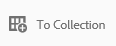
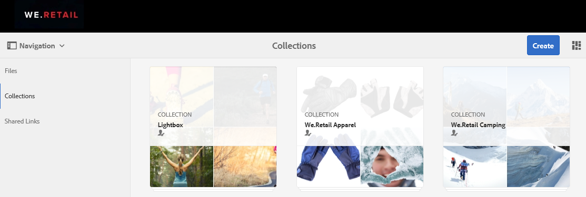
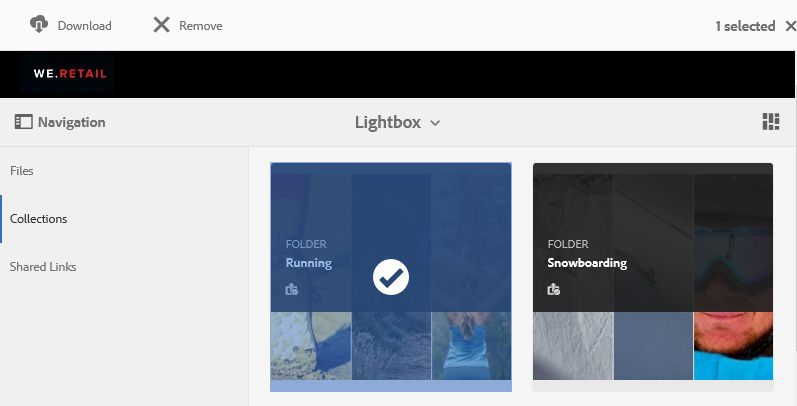

# Manage the lightbox collection {#manage-the-lightbox-collection}

[!DNL lightbox] is a special type of collection that provides easy access to assets. Each user has an exclusive [!DNL lightbox] that is automatically created when they log in to [!DNL Brand Portal] for the first time. The [!DNL lightbox] collection cannot be deleted.

## Add assets to lightbox {#add-assets-to-lightbox}

To add assets to [!DNL lightbox], do the following:

1. Navigate to the location of the assets that you want to add to [!DNL lightbox], and select the assets.

   
   
2. From the toolbar at the top, click the add to collection icon.

   

3. On the **Add To Collection** page, the [!DNL lightbox] collection is selected by default.

   Click **Add**. The selected assets are added to [!DNL lightbox]. 

   

4. To review the assets added to [!DNL lightbox], click **Collections** on the left rail, and then click the [!DNL lightbox] collection.

   

   The assets added to [!DNL lightbox] appear in the [!DNL lightbox] page.

   

## Remove assets from lightbox {#remove-assets-from-lightbox}

1. To review the assets in [!DNL lightbox], click **Collections** on the left rail, then click the [!DNL lightbox] collection.

   

2. Select the folder you want to remove from the collection, then click **Remove** from the toolbar at the top.

   

3. From the warning message box, click **Remove** to confirm removal.

The folder is deleted from the [!DNL lightbox] collection.
