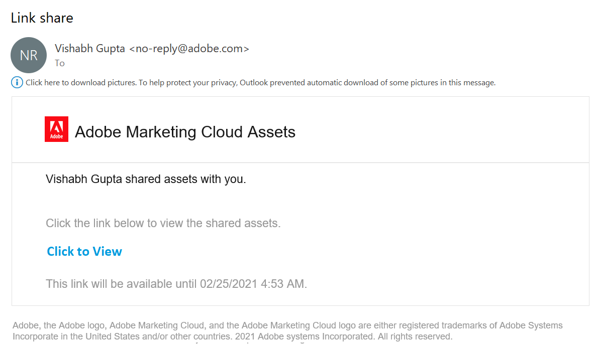
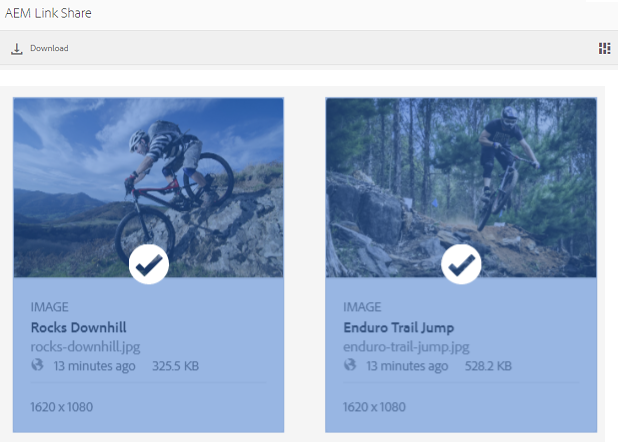
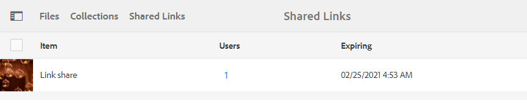
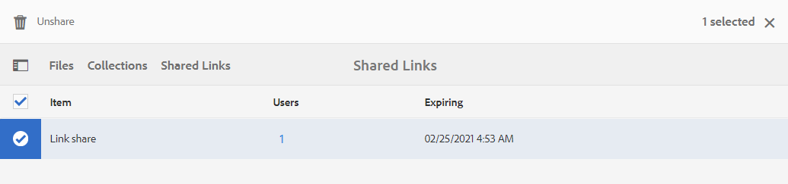

# Share assets as a link {#share-assets-as-a-link} 

Adobe Experience Manager Assets Brand Portal administrators can share links of multiple assets with authorized internal users and external entities, including partners and vendors. Editors can view and share only the assets shared with them.

Sharing assets through a link is a convenient way of making them available to external parties as the receivers do not have to log in to Brand Portal to access the assets.

<!-- Link sharing access is restricted to editors and administrators. 
-->

For more information, see [Managing users, groups, and user roles](../using/brand-portal-adding-users.md#manage-user-roles).

>[!NOTE]
>
>Upto 5GB of zip download is allowed using link share feature on Brand Portal.

Following are the steps to share assets as a link:

1. Log in to your Brand Portal tenant. By default, the **[!UICONTROL Files]** view opens which contains all the published assets and folders.

1. Select the assets or folders that you want to share, or navigate to the **[!UICONTROL Collections]** view to share the collections that you have created. 

   

1. From the toolbar at the top, click the **[!UICONTROL Share Link]** icon.

   The **[!UICONTROL Link Sharing]** dialog box appears.

   

   * In the email address box, type the email ID of the user with whom you want to share the link. You can share the link with multiple users. If the user is a member of your organization, select their email ID from the suggestions that appear in the drop-down list. If the user is external, type the complete email ID and press **[!UICONTROL Enter]**; the email ID is added to the list of users.

     

   * In the **[!UICONTROL Subject]** box, type a subject for the asset you want to share.
   * In the **[!UICONTROL Message]** box, type a message if necessary.
   * In the **[!UICONTROL Expiration]** field, use the date picker to specify an expiration date and time for the link. By default, the expiry date is set to 7 days from the date on which you share the link.
   * Enable the **[!UICONTROL Allow downlod of original file]** check box to allow the recepients to download the original rendition. 

   The assets shared through the link expire after crossing the date and time specified in the **[!UICONTROL Expiration]** field. For information about the behavior of expired assets and changes in the permissible activities based on user roles in Brand Portal, see [Manage digital rights of assets](../using/manage-digital-rights-of-assets.md#asset-expiration).

   >[!NOTE]
   >
   >The default expiry time for the link is 7 days. The link must be emailed to the users using the **[!UICONTROL Link Sharing]** dialog box, do not copy and share the link separately. 

1. Click **[!UICONTROL Share]**. A message confirms that the link is shared with the users. Users receive an email containing the shared link.

   

   >[!NOTE]
   >
   >Administrators can customize the email messaging, which includes customizing logo, description, and footer with [Branding](../using/brand-portal-branding.md) feature.

## Download assets from shared links {#download-assets-from-shared-links}

Click the link in the email, to access the shared asset. The AEM Link Share page opens.

To download the shared assets:

1. Click the assets or folders, and then click the **[!UICONTROL Download]** icon from the toolbar.

   

   >[!NOTE]
   >
   >Currently, you can generate a preview and thumbnail only for certain assets, depending on the file format. For more information about the supported file formats, see [Preview and thumbnail support for asset formats](#preview-thumbnail-support).

1. The **[!UICONTROL Download]** dialog box appears.

   
    
1. By default the **[!UICONTROL Fast Download]** setting is enabled in the **[!UICONTROL Download Settings]**. Therefore, a confirmation box appears to continue downloading using IBM Aspera Connect. 

   To continue using **[!UICONTROL Fast Download]**, click **[!UICONTROL Allow]**. 
   
   All the selected renditions are downloaded in a zip folder containing a separate folder for each asset.

   >[!NOTE]
   >
   >If a folder, collection, or more than 20 assets are selected for download, the **[!UICONTROL Download]** dialog is skipped and all the asset renditions accessible to the user excluding the dynamic renditions are downloaded in a zip folder. A separate folder is created for each asset inside the zip folder.

   >[!NOTE]
   >
   >Original renditions are not downloaded using the shared link if the user who shared the assets as a link is not [authorized by the administrator to have access to the original renditions](../using/brand-portal-adding-users.md#manage-group-roles-and-privileges).

>[!NOTE]
>
>Brand Portal restricts downloading assets larger than 5GB per file size.

<!--
1. The **[!UICONTROL Download]** dialog box appears.

   

    * To speed up the download of asset files shared as the link, select **[!UICONTROL Enable download acceleration]** option and [follow the wizard](../using/accelerated-download.md#download-workflow-using-file-accelerator). To know more about the fast download of assets on Brand Portal refer [Guide to accelerate downloads from Brand Portal](../using/accelerated-download.md).
    
1. To download the renditions of assets in addition to the assets from the shared link, select **[!UICONTROL Rendition(s)]** option. When you do so, **[!UICONTROL Exclude System Renditions]** option appears that is selected by default. This prevents the download of out-of-the-box renditions along with approved assets or their custom renditions.

   However, to allow auto-generated renditions to download along with custom renditions, deselect the **[!UICONTROL Exclude System Renditions]** option.

   >[!NOTE]
   >
   >Original renditions are not downloaded using the shared link if the user who shared the assets as a link is not [authorized by the administrator to have access to the original renditions](../using/brand-portal-adding-users.md#manage-group-roles-and-privileges).

   

1. Click **[!UICONTROL Download]**. The assets (and renditions if selected) are downloaded as a ZIP file to your local folder. However, no zip file is created if a single asset is downloaded without any of the renditions, thereby ensuring speedy download.

>[!NOTE]
>
>Brand Portal restricts downloading assets larger than 5GB per file size.
--> 

## Preview and thumbnail support for asset formats {#preview-thumbnail-support}

The following matrix lists the asset formats for which Brand Portal supports thumbnail and preview:

| Asset format | Thumbnail support | Preview support |
|--------------|-------------------|-----------------|
| PNG          | ✓                 | ✓               |
| GIF          | ✓                 | ✓               |
| TIFF         | ✓                 | ✕               |
| JPEG         | ✓                 | ✓               |
| BMP          | ✓                 | ✕               |
| PNM*         | NA                | NA              |
| PGM*         | NA                | NA              |
| PBM*         | NA                | NA              |
| PPM*         | NA                | NA              |
| PSD          | ✓                 | ✕               |
| EPS          | NA                | ✕               |
| DNG          | ✓                 | ✕               |
| PICT         | ✓                 | ✕               |
| PSB*         | ✓                 | ✕               |
| JPG          | ✓                 | ✓               |
| AI           | ✓                 | ✕               |
| DOC          | ✕                 | ✕               |
| DOCX         | ✕                 | ✕               |
| ODT*         | ✕                 | ✕               |
| PDF          | ✓                 | ✕               |
| HTML         | ✕                 | ✕               |
| RTF          | ✕                 | ✕               |
| TXT          | ✓                 | ✕               |
| XLS          | ✕                 | ✕               |
| XLSX         | ✕                 | ✕               |
| ODS          | ✕                 | ✕               |
| PPT          | ✓                 | ✕               |
| PPTX         | ✕                 | ✕               |
| ODP          | ✕                 | ✕               |
| INDD         | ✓                 | ✕               |
| PS           | ✕                 | ✕               |
| QXP          | ✕                 | ✕               |
| EPUB         | ✓                 | ✕               |
| AAC          | ✕                 | ✕               |
| MIDI         | ✕                 | ✕               |
| 3GP          | ✕                 | ✕               |
| MP3          | ✕                 | ✕               |
| MP4          | ✕                 | ✕               |
| OGA          | ✕                 | ✕               |
| OGG          | ✕                 | ✕               |
| RA           | ✕                 | ✕               |
| WAV          | ✕                 | ✕               |
| WMA          | ✕                 | ✕               |
| DVI          | ✕                 | ✕               |
| FLV          | ✕                 | ✕               |
| M4V          | ✕                 | ✕               |
| MPG          | ✕                 | ✕               |
| OGV          | ✕                 | ✕               |
| MOV          | ✕                 | ✕               |
| WMV          | ✕                 | ✕               |
| SWF          | ✕                 | ✕               |
| TGZ          | NA                | ✕               |
| JAR          | ✓                 | ✕               |
| RAR          | NA                | ✕               |
| TAR          | NA                | ✕               |
| ZIP          | ✓                 | ✕               |

The following legend explains the symbols used in the matrix:

| Symbol |Meaning |
|---|---|
| ✓ |This file format supports this feature  |
| ✕ |This file format does not support this feature  |
| NA |This feature is not applicable to this file format |
| &#42; |This feature requires add-on support for this file format on AEM author instance but not on Brand Portal after assets are published to Brand Portal |

## Unshare assets shared as a link {#unshare-assets-shared-as-a-link}

To unshare previously shared assets as a link, do the following:

1. When you login to Brand Portal, the **[!UICONTROL File]** view opens by default. To view the assets you shared as links, navigate to the **[!UICONTROL Shared Links]** view. 

1. Review the links you shared from the list displayed.
   
   

1. To unshare a link from the list, select it and click the **[!UICONTROL Unshare]** icon from the toolbar at the top.

   

   >[!NOTE]
   >
   >The display of shared links is user-specific. This feature does not display all the links shared by all users of a tenant.

1. In the warning message box, click **[!UICONTROL Continue]** to confirm unshare. The entry for the link is removed from the list of shared links.
