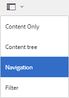
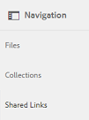
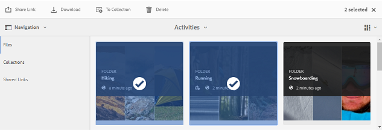
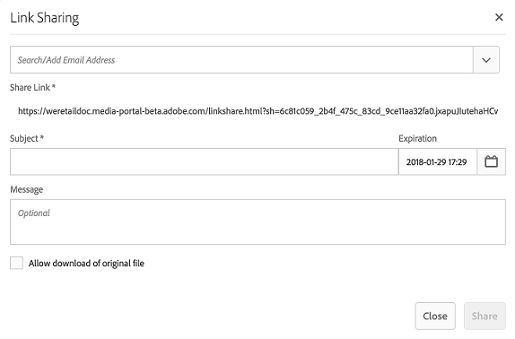
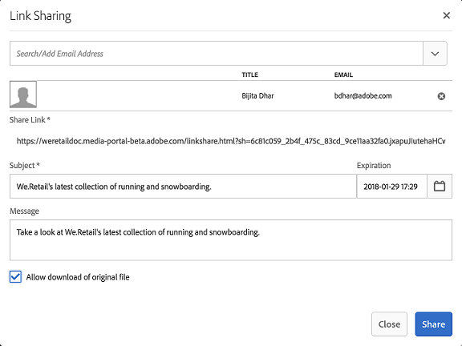
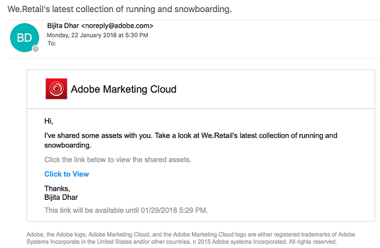
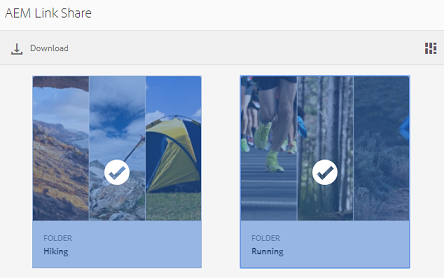
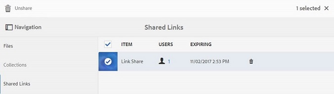

# Share assets as a link {#share-assets-as-a-link} 

[!DNL AEM Assets Brand Portal] Administrators can share links of multiple assets with authorized internal users and external entities, including partners and vendors. Editors can view and share only the assets shared with them.

Sharing assets through a link is a convenient way of making them available to external parties as the receivers do not have to log in to [!DNL Brand Portal] to access the assets.

Link sharing access is restricted to editors and administrators. For more information, see [Managing users, groups, and user roles](../using/brand-portal-adding-users.md#manage-user-roles).

>[!NOTE]
>
>Upto 5GB of zip download is allowed using link share feature on [!DNL brand portal].

To share assets as a link, follow these steps:

1. Click the overlay icon on the left, and choose **Navigation**.

   

2. From the siderail on the left, click **Files** to share folders or images. To share collections, click **[!UICONTROL Collections]**.

   

3. Select the folders or collections you want to share as a link.

   

4. From the toolbar at the top, click the **Share Link** icon.

   The **Link Sharing** dialog box appears.

   

   >[!NOTE]
   >
   >The **Share Link** field displays an automatically created asset link. The default expiry time for this link is 7 days. You can copy the link and share it separately with users or share it from the **Link Sharing** dialog box.

5. In the email address box, type the email ID of the user with whom you want to share the link. You can share the link with multiple users.

   If the user is a member of your organization, select their email ID from the suggestions that appear in the drop-down list. If the user is external, type the complete email ID and press **Enter**; the email ID is added to the list of users.

   

6. In the **Subject** box, type a subject for the asset you want to share.
7. In the **Message** box, type a message if necessary.
8. In the **Expiration** field, use the date picker to specify an expiration date and time for the link. By default, the expiry date is set to 7 days from the date on which you share the link.

   The assets shared through the link expire after crossing the date and time specified in the **Expiration** field. For information about the behavior of expired assets and changes in the permissible activities based on user roles in [!DNL Brand Portal], see [Manage digital rights of assets](../using/manage-digital-rights-of-assets.md#asset-expiration).

9. Click **Share**. A message confirms that the link is shared with the users. Users receive an email containing the link.

   

   >[!NOTE]
   >
   >Administrators can customize the email messaging, which includes customizing logo, description, and footer with [Branding](../using/brand-portal-branding.md) feature.

## Download assets from shared links {#download-assets-from-shared-links}

Click the link in the email, to view the shared asset. The [!DNL AEM] Link Share page opens.

To download the shared assets:

1. Click the assets and then click **Download** icon from the toolbar.

   

   >[!NOTE]
   >
   >Currently, you can generate a preview and thumbnail only for certain assets, depending on the file format. For more information about the supported file formats, see [Preview and thumbnail support for asset formats](#preview-thumbnail-support).

   >[!NOTE]
   >
   >If the assets you are downloading also include licensed assets, you are redirected to the **Copyright Management** page. In this page, select the licensed assets, click **Agree**, and then click **Download**. If you choose to disagree, only the unlicensed assets are downloaded.  
   >License-protected assets have [license agreement attached](https://helpx.adobe.com/experience-manager/6-5/assets/using/drm.html#DigitalRightsManagementinAssets) to them, which is done by setting asset's [metadata property](https://helpx.adobe.com/experience-manager/6-5/assets/using/drm.html#DigitalRightsManagementinAssets) in [!DNL AEM Assets].

   

   The **Download** dialog box appears.
   

    * To speed up the download of asset files shared as the link, select **Enable download acceleration** option and [follow the wizard](../using/accelerated-download.md#download-workflow-using-file-accelerator). To know more about the fast download of assets on [!DNL Brand Portal] refer [Guide to accelerate downloads from [!DNL Brand Portal]](../using/accelerated-download.md).

2. To download the renditions of assets in addition to the assets from the shared link, select **Rendition(s)** option. When you do so, **Exclude System Renditions** option appears that is selected by default. This prevents the download of out-of-the-box renditions along with approved assets or their custom renditions.

   However, to allow auto-generated renditions to download along with custom renditions, deselect the **Exclude System Renditions** option.

   >[!NOTE]
   >
   >Original renditions are not downloaded using the shared link if the user who shared the assets as a link is not [authorized by the administrator to have access to the original renditions](../using/brand-portal-adding-users.md#manage-group-roles-and-privileges).

   

3. Tap/ click **Download**. The assets (and renditions if selected) are downloaded as a ZIP file to your local folder. However, no zip file is created if a single asset is downloaded without any of the renditions, thereby ensuring speedy download.

>[!NOTE]
>
>[!DNL Brand Portal] restricts downloading assets larger than 5 GB per file size.

## Preview and thumbnail support for asset formats {#preview-thumbnail-support}

The following matrix lists the asset formats for which [!DNL Brand Portal] supports thumbnail and preview:

| Asset format | Thumbnail support | Preview support |
|--------------|-------------------|-----------------|
| PNG          | ✓                 | ✓               |
| GIF          | ✓                 | ✓               |
| TIFF         | ✓                 | ✕               |
| JPEG         | ✓                 | ✓               |
| BMP          | ✓                 | ✕               |
| PNM*         | NA                | NA              |
| PGM*         | NA                | NA              |
| PBM*         | NA                | NA              |
| PPM*         | NA                | NA              |
| PSD          | ✓                 | ✕               |
| EPS          | NA                | ✕               |
| DNG          | ✓                 | ✕               |
| PICT         | ✓                 | ✕               |
| PSB*         | ✓                 | ✕               |
| JPG          | ✓                 | ✓               |
| AI           | ✓                 | ✕               |
| DOC          | ✕                 | ✕               |
| DOCX         | ✕                 | ✕               |
| ODT*         | ✕                 | ✕               |
| PDF          | ✓                 | ✕               |
| HTML         | ✕                 | ✕               |
| RTF          | ✕                 | ✕               |
| TXT          | ✓                 | ✕               |
| XLS          | ✕                 | ✕               |
| XLSX         | ✕                 | ✕               |
| ODS          | ✕                 | ✕               |
| PPT          | ✓                 | ✕               |
| PPTX         | ✕                 | ✕               |
| ODP          | ✕                 | ✕               |
| INDD         | ✓                 | ✕               |
| PS           | ✕                 | ✕               |
| QXP          | ✕                 | ✕               |
| EPUB         | ✓                 | ✕               |
| AAC          | ✕                 | ✕               |
| MIDI         | ✕                 | ✕               |
| 3GP          | ✕                 | ✕               |
| MP3          | ✕                 | ✕               |
| MP4          | ✕                 | ✕               |
| OGA          | ✕                 | ✕               |
| OGG          | ✕                 | ✕               |
| RA           | ✕                 | ✕               |
| WAV          | ✕                 | ✕               |
| WMA          | ✕                 | ✕               |
| DVI          | ✕                 | ✕               |
| FLV          | ✕                 | ✕               |
| M4V          | ✕                 | ✕               |
| MPG          | ✕                 | ✕               |
| OGV          | ✕                 | ✕               |
| MOV          | ✕                 | ✕               |
| WMV          | ✕                 | ✕               |
| SWF          | ✕                 | ✕               |
| TGZ          | NA                | ✕               |
| JAR          | ✓                 | ✕               |
| RAR          | NA                | ✕               |
| TAR          | NA                | ✕               |
| ZIP          | ✓                 | ✕               |

The following legend explains the symbols used in the matrix:

| Symbol |Meaning |
|---|---|
| ✓ |This file format supports this feature  |
| ✕ |This file format does not support this feature  |
| NA |This feature is not applicable to this file format |
| &#42; |This feature requires add-on support for this file format on [!DNL AEM] author instance but not on [!DNL Brand Portal] after assets are published to [!DNL Brand Portal] |

## Unshare assets shared as a link {#unshare-assets-shared-as-a-link}

To unshare previously shared assets as a link, do the following:

1. To view the assets you shared as links, click the overlay icon on the left, and choose **Navigation**.

   

2. From the siderail, click **Shared Links**.

   

3. Review the links you shared from the list displayed.
4. To unshare a link from the list, select it and click the bin icon next to the link entry, or the **Unshare** icon from the toolbar at the top.

   

   >[!NOTE]
   >
   >The display of shared links is user-specific. This feature does not display all the links shared by all users of a tenant.

5. In the warning message box, click **Continue** to confirm unshare. The entry for the link is removed from the list of shared links.
