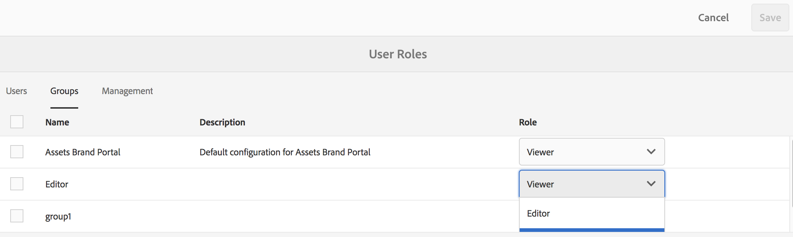

# Manage roles and access control{#manage-roles-and-access-control}

Administrators can use Adobe Admin Console to create AEM Assets Brand Portal users and product profiles, and manage their roles using the Brand Portal user interface. This privilege is not available to Viewers and Editors.

In [Admin Console](https://adminconsole.adobe.com/enterprise/overview), you can view all the products associated with your organization. A product could be any Experience Cloud solution, such as Adobe Analytics, Adobe Target, or AEM Assets Brand Portal. You must choose the AEM Assets Brand Portal product, and create product profiles (formerly known as product configurations&#42;).

>[!NOTE]
>
>&#42; The nomenclature has changed from product configurations to product profiles in the new Adobe Admin Console.

These product profiles are synced with the Brand Portal user interface and visible as groups in Brand Portal.

>[!NOTE]
>
>To create groups in Brand Portal, from Adobe Admin Console, use **Products** page &gt; **Product Profiles**, instead of **User** page &gt; **User Groups**. Product profiles in Adobe Admin Console are used to create groups in Brand Portal.

After you add users and create product profiles, and add users to those product profiles, you can assign roles to users and groups in Brand Portal.

## Manage user roles {#manage-user-roles}

An Administrator can modify roles for users in Brand Portal.

In addition to the Administrator role, Brand Portal supports the following roles:

* **Viewer**: A user with this role has limited privileges. A Viewer can view the files and folders that an Administrator shares with them. A Viewer can also search for and download assets. However, a Viewer cannot share content (files, folders, and collections) with other users.
* **Editor**: A user with this role has all the privileges of a Viewer. In addition, an Editor can share content (folders, collections, and links) with other users.

1. From the AEM toolbar at the top, click the Adobe logo to access administrative tools.

   

1. From the administrative tools panel, click **Users**.

   

1. In the **User Roles** page, the **Users** tab is selected by default. For the user whose role you want to change, select **Editor** or **Viewer** from the **Role** drop-down.

   

   To modify the role of multiple users simultaneously, select the users and choose the appropriate role from the **Role** drop-down.

   >[!NOTE]
   >
   >The **Role** list for Administrator users is disabled. You cannot select these users to modify their roles.

   >[!NOTE]
   >
   >The user role is also disabled if the user is a member of the Editor group. To revoke editing privileges from the user, either remove the user from the Editor group or change the role of the entire group to Viewer.

1. Click **Save**. The role is modified for the corresponding user. If you selected multiple users, the roles for all the users are modified simultaneously.

   >[!NOTE]
   >
   >
   >    
   >    
   >    * Changes in user permissions are reflected in the **User Roles** page only after the users re-login to Brand Portal.
   >    * All changes are synced to Brand Portal every 8 hours and are effective after the next sync job runs. 
   >    
   >

## Manage group roles {#manage-group-roles}

An Administrator may assign a role to a group to simultaneously change the roles of the associated members.

In addition to the Administrator role, Brand Portal supports the following roles:

* **Viewer**: A user with this role has limited privileges. A Viewer can view the files and folders that an Administrator shares with them. A Viewer can also search for and download assets. However, a Viewer cannot share content (files, folders, and collections) with other users.
* **Editor**: A user with this role has all the privileges of a Viewer. In addition, an Editor can share content (folders, collections, and links) with other users.

1. From the AEM toolbar at the top, click the Adobe logo to access administrative tools.

   

1. From the administrative tools panel, click **Users**.

   

1. To modify the roles for a group, from the **User Roles** page, navigate to the **Groups** tab, and select the groups for which you want to change roles. Select the appropriate role from the **Role** drop-down list.

   

1. Click **Save**. The role is modified for the corresponding groups.

   >[!NOTE]
   >
   >The user-to-group association, or the group membership of a user, is synced to Brand Portal every 8 hours. Changes to user or group roles are effective after the next sync job runs.

