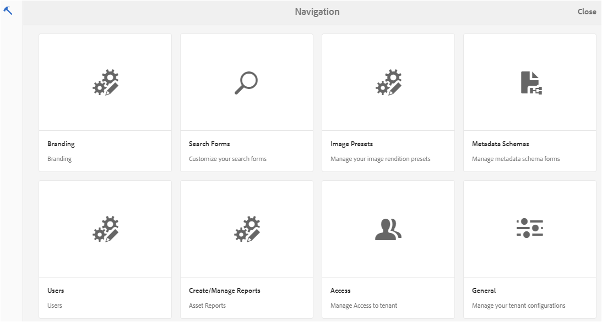
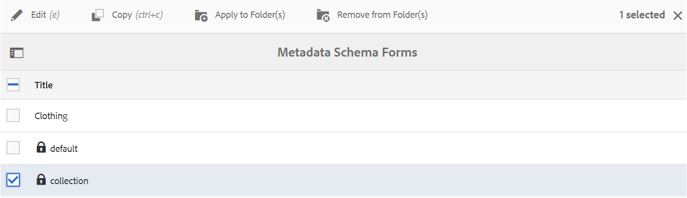
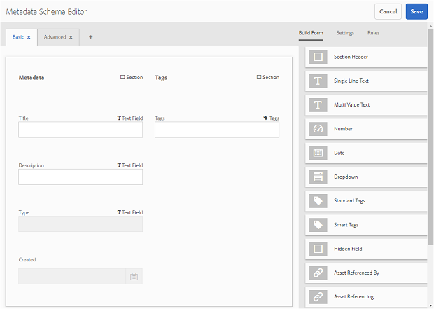
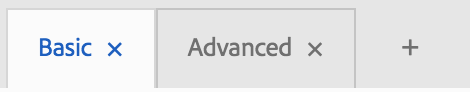
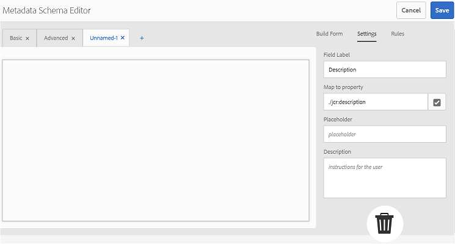
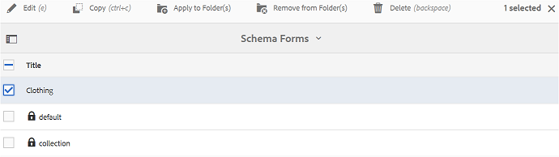
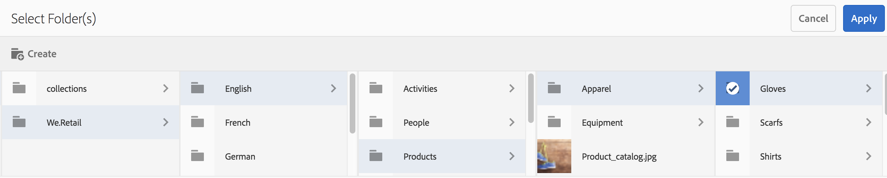
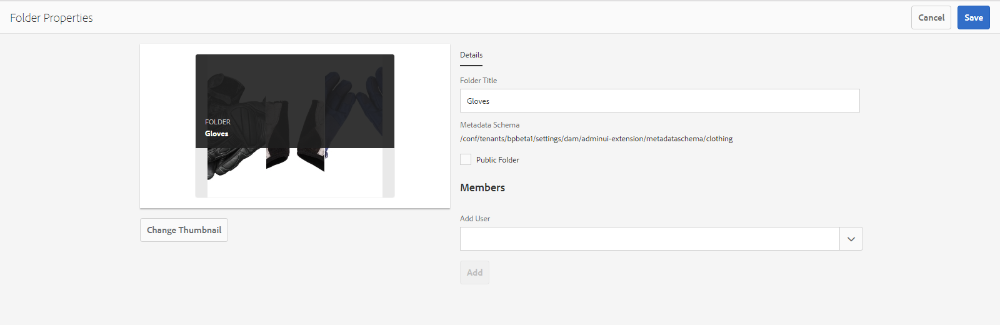

# Use the metadata schema form {#use-the-metadata-schema-form}

A metadata schema describes the layout of the Properties page and the metadata properties displayed for assets that use the particular schema. The schema that you apply to an asset determines the metadata fields that appear on its Properties page.

The **[!UICONTROL Properties]** page for each asset includes default metadata properties depending upon the MIME type of the asset. Administrators can use the Metadata Schema Editor to modify existing schemas or add custom metadata schemas. AEM Assets Brand Portal provides default forms for assets of various MIME types. However, you can also add custom forms for such assets.

## Add a metadata schema form {#add-a-metadata-schema-form}

To create a new metadata schema form, do the following:

1. From the AEM toolbar at the top, click the Adobe logo to access administrative tools.

   

1. From the administrative tools panel, click **[!UICONTROL Metadata Schemas]**.

   

1. On the **[!UICONTROL Metadata Schema Forms]** page, click **[!UICONTROL Create]**.

   

1. In the **[!UICONTROL Create Schema Form]** dialog box, specify the title of the Schema form, and then click **[!UICONTROL Create]** to complete the form creation process.

   

## Edit a metadata schema form {#edit-a-metadata-schema-form}

You can edit a newly added or existing metadata schema form. The metadata schema form contains content derived from its parent, including tabs and form items within tabs. You can map or configure these form items to a field within a metadata node.

You can add new tabs or form items to the metadata schema form. The derived tabs and form items (from the parent) are in the locked state. You cannot alter them at the child level.

To edit a metadata schema form, do the following:

1. From the AEM toolbar at the top, click the Adobe logo to access administrative tools.

   

1. From the administrative tools panel, click **[!UICONTROL Metadata Schemas]**.
1. From the **[!UICONTROL Metadata Schema Forms]** page, select a schema form to edit its properties, for example, **[!UICONTROL collection]**.

   

   >[!NOTE]
   >
   >Unedited templates display a lock symbol before them. If you customize any of the templates, the Lock symbol before the template disappears.

1. From the toolbar at the top, click **[!UICONTROL Edit]**.

   The **[!UICONTROL Metadata Schema Editor]** page opens with the **[!UICONTROL Basic]** tab open on the left and the **[!UICONTROL Build Form]** tab open on the right.

1. In the **[!UICONTROL Metadata Schema Editor]** page, customize the **[!UICONTROL Properties]** page of the asset by dragging one or more components from a list of component types in the **[!UICONTROL Build Form]** tab to the **[!UICONTROL Basic]** tab.

   

1. To configure a component, select it and modify its properties in the **[!UICONTROL Settings]** tab.

### Components in the Build Form tab {#components-in-the-build-form-tab}

The **[!UICONTROL Build Form]** tab lists items that you can use in your schema form. The **[!UICONTROL Settings]** tab provides the attributes of each item that you select in the **[!UICONTROL Build Form]** tab. The following table lists the form items available in the **[!UICONTROL Build Form]** tab:

| Component Name      | Description                                                                                                                                                                                                                                                                                |
|---------------------|--------------------------------------------------------------------------------------------------------------------------------------------------------------------------------------------------------------------------------------------------------------------------------------------|
| **[!UICONTROL Section Header]**      |  Add a section heading for a list of common components.                                                                                                                                                                                                                                    |
| **[!UICONTROL Single Line Text]**    |  Add a single line text property. It is stored as a string.                                                                                                                                                                                                                                |
| **[!UICONTROL Multi ValueText]**     |  Add a multi-value text property. It is stored as a string array.                                                                                                                                                                                                                          |
| **[!UICONTROL Number]**              |  Add a number component.                                                                                                                                                                                                                                                                   |
| **[!UICONTROL Date]**                |  Add a date component.                                                                                                                                                                                                                                                                     |
| **[!UICONTROL Dropdown]**            |  Add a dropdown list.                                                                                                                                                                                                                                                                      |
| **[!UICONTROL Standard Tags]**       |  Add a tag. **Note:** Administrators might need to change the path value, for example, `/etc/tags/mac/<tenant_id>/<custom_tag_namespace>`, if they publish the metadata schema form from AEM, where the path does not include tenant information, for example, `/etc/tags/<custom_tag_namespace>`. |
| **[!UICONTROL Smart Tags]**          |  Auto-detected tags if you have purchased and configured the AEM smart tags add-on.                                                                                                                                                                                                        |
| **[!UICONTROL Hidden Field]**        |  Add a hidden field. It is sent as a POST parameter when the asset is saved.                                                                                                                                                                                                               |
| **[!UICONTROL Asset Referenced By]** |  Add this component to view list of assets referenced by the asset.                                                                                                                                                                                                                        |
| **[!UICONTROL Asset Referencing]**   |  Add to display a list of assets that reference the asset.                                                                                                                                                                                                                                 |
| **[!UICONTROL Asset Rating]**        |  Average rating of an asset added from AEM Assets before it is published to Brand Portal.                                                                                                                                                                                                  |
| **[!UICONTROL Contextual Metadata]** |  Add to control the display of other metadata tabs in the Properties page of assets.                                                                                                                                                                                                       |

>[!NOTE]
>
>Do not use **[!UICONTROL Product References]**, as it is not functional.

#### Edit the metadata component {#edit-the-metadata-component}

To edit the properties of a metadata component on the form, click the component and edit its properties in the **[!UICONTROL Settings]** tab.

* **[!UICONTROL Field Label]**: The name of the metadata property that is displayed on the asset's Properties page.

* **[!UICONTROL Map to Property]**: The value of this property provides the relative path/name to the asset node where it is saved in the CRX repository. It starts with "**./**" because indicating that the path is under the asset's node.

The following are the valid values for this property:

-- `./jcr:content/metadata/dc:title`: Stores the value at the asset's metadata node as the property [!UICONTROL `dc:title`].

-- `./jcr:created`: Displays the jcr property at the asset's node. If you configure these properties on view properties, we recommend that you mark them as Disable Edit, because they are protected. Otherwise, the error "Asset(s) failed to modify" occurs when you save the asset's properties.

* **[!UICONTROL Placeholder]**: Use this property to provide the user any relevant information regarding the metadata property.
* **[!UICONTROL Required]**: Use this property to mark a metadata property as mandatory on the Properties page.
* **[!UICONTROL Disable Edit]**: Use this property to make a metadata property uneditable on the Properties page.
* **[!UICONTROL Show Empty Field In Read Only]**: Mark this property to display a metadata property on the Properties page even if it has no value. By default, when a metadata property has no value, it is not be listed on the Properties page.
* **[!UICONTROL Description]**: Use this property to add a short description for the metadata component.
* **[!UICONTROL Delete icon]**: Click this icon to delete a component from the schema form.

>[!NOTE]
>
>All the metadata fields are read-only in the metadata editor form of an asset. Since metadata of the asset must be edited in AEM Assets before an asset is published to Brand Portal.

#### Add or delete a tab in the schema form {#add-or-delete-a-tab-in-the-schema-form}

The default schema form includes the **[!UICONTROL Basic]** and **[!UICONTROL Advanced]** tabs. The schema editor lets you add or delete a tab.

* To add a new tab on a schema form, click **[!UICONTROL +]**. By default, the new tab has the name "Unnamed-1". You can modify the name from the **[!UICONTROL Settings]** tab.

* To delete a tab, click **[!UICONTROL x]**. Click **[!UICONTROL Save]** to save the changes.

## Apply a metadata schema to a folder {#apply-a-metadata-schema-to-a-folder}

Brand Portal allows you to customize and control the metadata schema so that the **[!UICONTROL Properties]** page of an asset displays only the specific information you choose to reveal. To control the metadata displayed in the **[!UICONTROL Properties]** page, remove the required metadata from the metadata schema form and apply it to the specific folder.

To apply a metadata schema form to a folder, do the following:

1. From the AEM toolbar at the top, click the Adobe logo to access administrative tools.

   

1. From the administrative tools panel, click **[!UICONTROL Metadata Schemas]**.

1. From the **[!UICONTROL Metadata Schema Forms]** page, select the schema form that you want to apply to an asset, for example, **[!UICONTROL clothing]**.

   

1. From the toolbar at the top, click **[!UICONTROL Apply to Folder(s)]**.

1. From the **[!UICONTROL Select Folder(s)]** page, navigate to the folder to which you want to apply the **[!UICONTROL clothing]** metadata schema, for example, **[!UICONTROL Gloves]**.

   

1. Click **[!UICONTROL Apply]** to apply the metadata schema form to the folder.

   The metadata available in the **[!UICONTROL clothing]** metadata schema form is applied to the **[!UICONTROL Gloves]** folder and visible in the **[!UICONTROL Properties]** page of the folder.

   

>[!NOTE]
>
>If you apply a schema that includes nested schemas to a folder containing video files, metadata properties for the video files may not render properly. To ensure the metadata properties render correctly, remove the nested schemas and apply only the parent schema to the folder.

## Delete a metadata schema form {#delete-a-metadata-schema-form}

Brand Portal lets you delete custom schema forms only. It does not let you delete the default schema forms/templates. However, you can delete any custom changes in these forms.

To delete a form, select a form and click the **[!UICONTROL Delete]** icon.

>[!NOTE]
>
>After you delete the custom changes made to a default form, the **[!UICONTROL Lock]** symbol reappears before the form name on the Metadata Schema interface to indicate that the form is reverted to its default state.

## Schema forms for MIME TYPES {#schema-forms-for-mime-types}

### Adding new forms for MIME types {#adding-new-forms-for-mime-types}

In addition to the default forms, you can add custom forms for assets of various MIME types, or create a new form under an appropriate form type. For example, to add a new template for the **[!UICONTROL image/png]** subtype, create the form under the "image" forms. The title for the schema form is the subtype name. In this case, the title is "png".

#### Using an existing schema template for various MIME types {#using-an-existing-schema-template-for-various-mime-types}

You can use an existing template for a different MIME type. For example, use the **image/jpeg** form for assets of MIME type **image/png**.

In this case, create a new node at [!UICONTROL `/etc/dam/metadataeditor/mimetypemappings`] in the CRX repository. Specify a name for the node and define the following properties:

| **Name** |**Type** |**Value** |
|---|---|---|
| exposedmimetype |String |image/jpeg |
| mimetypes |String[] |image/png |

* **exposedmimetype**: Name of the existing form to be mapped 
* **mimetypes**: List of MIME types that use the form defined in the **exposedmimetype** attribute

Brand Portal maps the following MIME types and schema forms:

| **Schema Form** |**MIME types** |
|---|---|
| image/jpeg |image/pjpeg |
| image/tiff |image/x-tiff |
| application/pdf |application/postscript |
| application/x-ImageSet |Multipart/Related; type=application/x-ImageSet |
| application/x-SpinSet |Multipart/Related; type=application/x-SpinSet |
| application/x-MixedMediaSet |Multipart/Related; type=application/x-MixedMediaSet |
| video/quicktime |video/x-quicktime |
| video/mpeg4 |video/mp4 |
| video/avi |video/avi, video/msvideo, video/x-msvideo |
| video/wmv |video/x-ms-wmv |
| video/flv |video/x-flv |

The following is a list of default metadata properties:

* jcr:content/metadata/cq:tags
* jcr:content/metadata/dc:format
* jcr:content/metadata/dam:status
* jcr:content/metadata/videoCodec
* jcr:content/metadata/audioCodec
* jcr:content/metadata/dc:title
* jcr:content/metadata/dc:description
* jcr:content/metadata/xmpMM:InstanceID
* jcr:content/metadata/xmpMM:DocumentID
* jcr:content/metadata/dam:sha1
* jcr:content/metadata/dam:solutionContext
* jcr:content/metadata/videoBitrate
* jcr:content/metadata/audioBitrate
* jcr:content/usages/usedBy
* jcr:content/jcr:lastModified
* jcr:content/metadata/prism:expirationDate
* jcr:content/onTime
* jcr:content/offTime
* jcr:content/metadata/dam:size
* jcr:content/metadata/tiff:ImageWidth
* jcr:content/metadata/tiff:ImageLength
