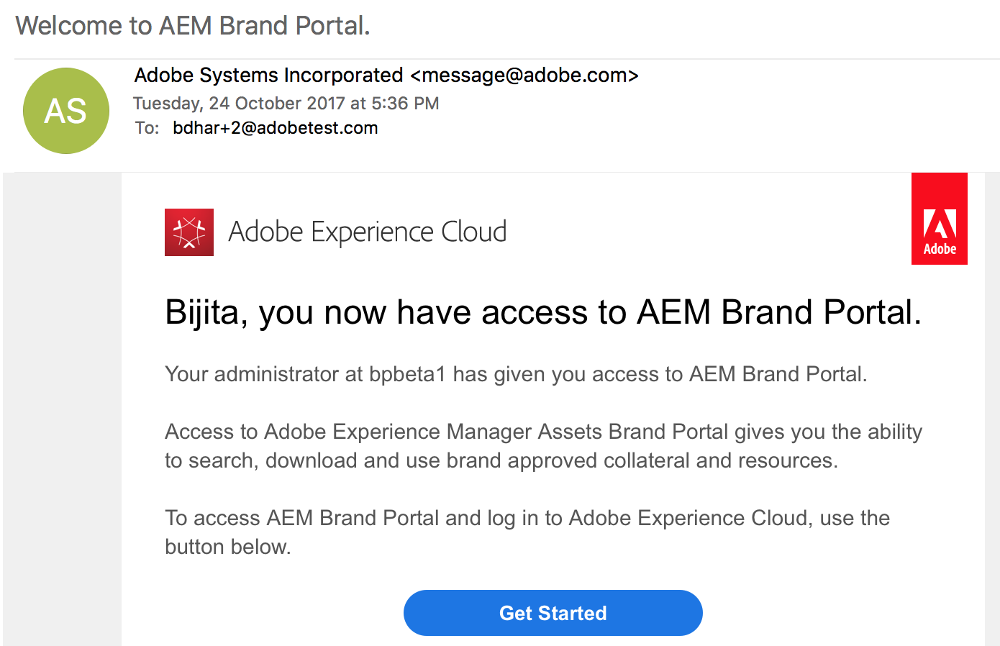
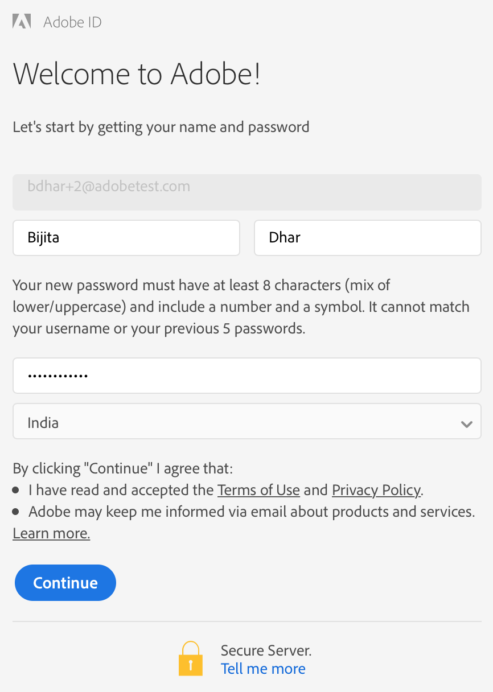
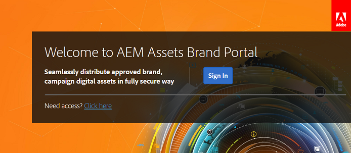

# First-time login experience{#first-time-login-experience}

The first-time login experience is same for all new AEM Assets Brand Portal users, including Administrators. After an Administrator adds you to your organization's Brand Portal account, you need not accept invitations, you are automatically added. You receive a welcome email that contains a link to your organization’s Brand Portal account.

After an Administrator adds new users, they need not accept invitations to get added to the Brand Portal account, they are added automatically.

To log in to Brand Portal for the first time, do the following:

1. Open the welcome email, and click **Get Started**.

   

1. In the sign-up page, specify your details (including first name, last name, password, and country/region). 

   

   >[!NOTE]
   >
   >If you are an existing Adobe Marketing Cloud user, a sign-in page is displayed instead of the sign-up page. To log in to Adobe Marketing Cloud, enter your Adobe ID and password.

   >[!NOTE]
   >
   >If your organization uses enterprise IDs, instead of viewing this sign-up page, you are redirected to the enterprise login page. For more information, see [Enterprise ID, sign in, and account help](https://helpx.adobe.com/enterprise/kb/enterprise-id-faq.html).

1. Click **Continue** to proceed to your organization's Brand Portal page.
1. From the Brand Portal sign-in page, click **Sign In** to log in to Brand Portal.

   

   >[!NOTE]
   >
   >You cannot access Brand Portal if you are not associated with any product profile (formerly known as product configuration&#42;). To be able to log in to Brand Portal, you must be associated with at least one AEM product profile.
   >
   >The nomenclature has changed from product configurations to product profiles in the new Admin Console.

