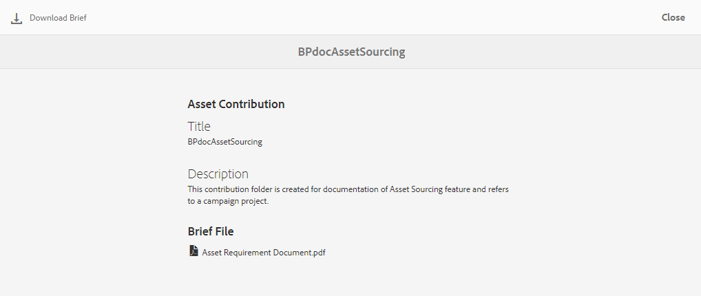
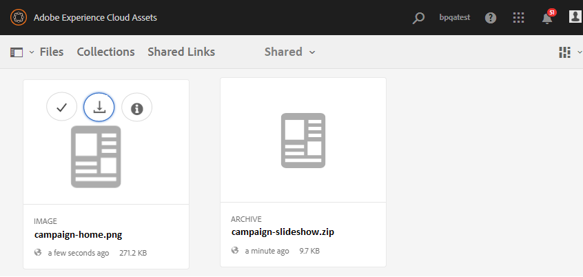
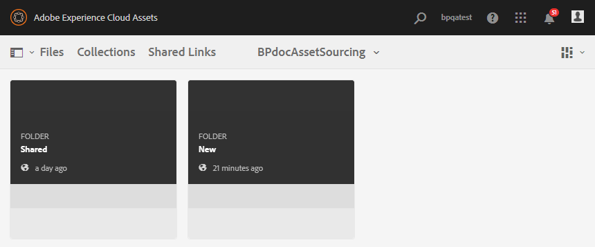
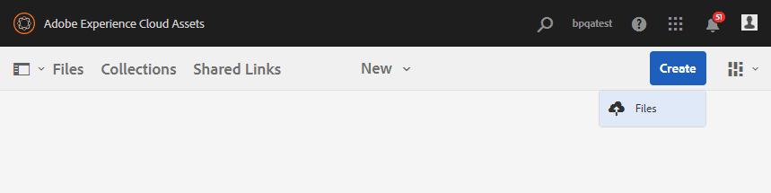
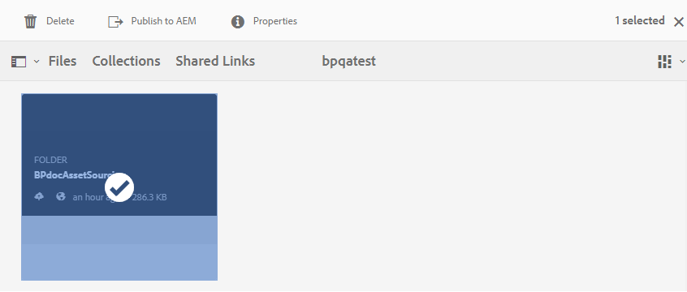
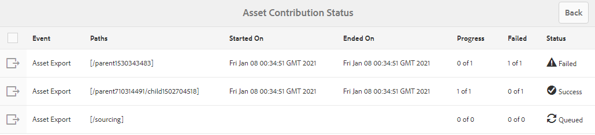
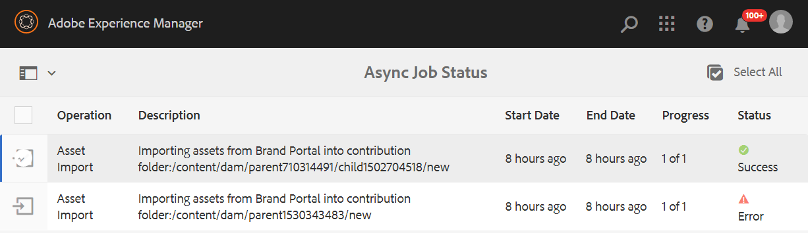
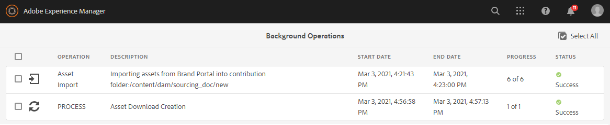
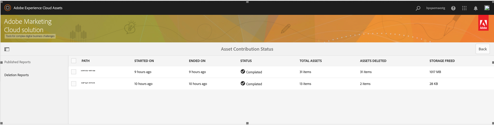
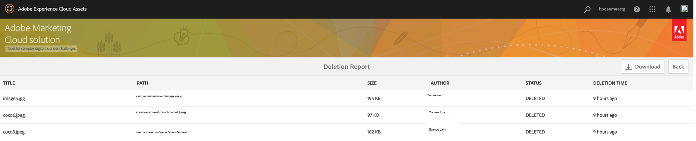

# Publish contribution folder to Experience Manager Assets {#using-asset-souring-in-bp}

Brand Portal users with appropriate permissions can upload multiple assets, or folders containing multiple assets, to the contribution folder. However, Brand Portal users are only able to upload assets to the **NEW** folder. The **SHARED** folder is meant for the distribution of baseline assets (reference content) which can be used by the Brand Portal users while creating new assets for contribution.

Brand Portal user having permission to access the contribution folder can perform the following activities:

* [Download asset requirements](#download-asset-requirements)
* [Upload new assets to the contribution folder](#uplad-new-assets-to-contribution-folder)
* [Publish contribution folder to Experience Manager Assets](#publish-contribution-folder-to-aem)

## Download asset requirements {#download-asset-requirements}

Brand Portal users automatically receive email/pulse notifications whenever a contribution folder is shared by the Experience Manager Assets user, allowing them to download the brief (asset requirement) document, as well as download the baseline assets (reference content), from the **SHARED** folder to ensure they understand the asset requirements.

Brand Portal user performs the following activities to download asset requirements:

* **Download brief**: Download the brief (asset requirement document) attached to the contribution folder which contains asset related information like type of assets, purpose, supported formats, maximum asset size, etc.
* **Download baseline assets**: Download the baseline assets which can be used to understand the types of assets required. Brand Portal users can use these assets as reference to create new assets for contribution.

Brand Portal dashboard reflects all the existing folders permitted to the Brand Portal user along with the newly shared contribution folder. In this example, the Brand Portal user only has access to the newly created contribution folder, no other existing folder is shared with the user.

**To download asset requirements:**

1. Log in to your Brand Portal instance.
1. Select contribution folder from the Brand Portal dashboard.
1. Click **[!UICONTROL Properties]**. The Property window containing the contribution folder details opens.

   

   

1. Click on the **[!UICONTROL Download Brief]** option to download the asset requirement document on your local machine.

   

1. Go back to the Brand Portal dashboard.
1. Click to open the contribution folder, you can see two sub folders–**[!UICONTROL SHARED]** and **[!UICONTROL NEW]** within the contribution folder. The SHARED folder contains all the baseline assets (reference content) shared by the administrators. 
1. You can download the **[!UICONTROL SHARED]** folder containing all the baseline assets on your local machine. 
Or, you can to open the **[!UICONTROL SHARED]** folder and click the **Download** icon to download individual files/folders.

   
   
   

Go through the brief (asset requirement document) and refer to the baseline assets to understand the asset requirements. Now, you can create new assets for contribution and upload them to the contribution folder..

## Upload assets to contribution folder {#upload-new-assets-to-contribution-folder}

After going through the asset requirements, the Brand Portal users can create new assets for contribution and upload them to the NEW folder within the contribution folder. A user can upload multiple assets to an asset contribution folder. However, only one folder can be created at a time.

>[!NOTE]
>
>The Brand Portal users can upload assets (maximum of **2**GB per file size) to the NEW folder. 
>
>The maximum upload limit for any Brand Portal tenant is **10**GB which is cumulatively applied to all the contribution folders.
>
>The assets uploaded to Brand Portal are not processed for renditions and does not contain previews. 

>[!NOTE]
>
>It is recommended to release the upload space after publishing the contribution folder to Experience Manager Assets so that it is available to the other Brand Portal users for contribution. 
>
>If there is a need to extend the upload limit of your Brand Portal tenant beyond **10**GB, contact Customer Support specifying the requirement.

**To upload new assets:**

1. Log in to your Brand Portal instance.
The Brand Portal dashboard reflects all the existing folders permitted to the Brand Portal user along with the newly shared contribution folder.

1. Select the contribution folder and click to open it. The contribution folder contains two sub folders – **[!UICONTROL SHARED]** and **[!UICONTROL NEW]**.

1. Click on the **[!UICONTROL NEW]** folder.

   

1. Click **[!UICONTROL Create]** > **[!UICONTROL Files]** to upload individual files or folder (.zip) containing multiple assets.

   

1. Browse and upload assets (files or folders) to the **[!UICONTROL NEW]** folder.

   

After uploading all the assets or folders to the NEW folder, publish the contribution folder to Experience Manager Assets. 

## Publish contribution folder to Experience Manager Assets {#publish-contribution-folder-to-aem}

Brand Portal users can publish the contribution folder to Experience Manager Assets without needing access to the Experience Manager author instance.

Ensure that you have gone through the asset requirements and upload the newly created assets in **NEW** folder within the contribution folder. 

**To publish contribution folder:**

1. Log in to your Brand Portal instance.

1. Select contribution folder from the Brand Portal dashboard.
1. Click **[!UICONTROL Publish to AEM]**. 

   
   
   

An email/pulse notification is sent to the Brand Portal user and administrators at different stages of the publishing workflow:

1. **Queued** - A notification is sent to the Brand Portal user and Brand Portal administrators when a publishing workflow triggers in Brand Portal.

1. **Complete** - A notification is sent to the Brand Portal user and Brand Portal administrators when the contribution folder is successfully published to Experience Manager Assets.

After publishing the newly created assets to Experience Manager Assets, the Brand Portal users can delete them from the NEW folder. Whereas, the Brand Portal administrator can delete the assets from both NEW and SHARED folder. 

Once the objective of creating the contribution folder is achieved, the Brand Portal administrator can delete the contribution folder to release the upload space for other users. 

## Publishing job status {#publishing-job-status}

There are two reports which the administrators can utilize to view the status of the asset contribution folders published from Brand Portal to Experience Manager Assets. 

* In Brand Portal, navigate to **[!UICONTROL Tools]** > **[!UICONTROL Asset Contribution Status]**. This report reflects the status of all the publishing jobs at different stages of the publishing workflow.  

  

* In Experience Manager Assets (on premise or managed service), navigate to **[!UICONTROL Assets]** > **[!UICONTROL Jobs]**. This report reflects the final state (Success or Error) of all the publishing jobs. 

  

* In Experience Manager Assets as a Cloud Service, navigate to **[!UICONTROL Assets]** > **[!UICONTROL Jobs]**. 

  Or, you can directly navigate to **[!UICONTROL Jobs]** from the global navigation.

  This report reflects the final state (Success or Error) of all the publishing jobs including the import of assets from Brand Portal to Experience Manager Assets as a Cloud Service.

  

<!--
>[!NOTE]
>
>Currently, no report is generated in AEM Assets as a Cloud Service for the Asset Sourcing workflow. 
-->

## Automatic deletion of assets published to Experience Manager Assets from Contribution folder {#automatically-delete-published-assets-from-contribution-folder}

Brand Portal now executes automatic jobs every twelve hours to scan all Contribution folders and delete all assets that are published to AEM. As a result, you do not need to delete the assets in the Contribution folder manually to keep the folder size below the [threshold limit](#upload-new-assets-to-contribution-folder). You can also monitor the status of the delete jobs automatically executed during the last seven days. The report for a job provides the following details:

* Job start time
* Job end time
* Job status
* Total assets included in a job
* Total assets successfully deleted in a job
* Total storage made available as a result of the job run

   

You can also drill-down further to view the details of each asset included in a delete job. Details such as asset title, size, author, delete status, and deletion time are included in the report.

>[!NOTE]
>
> * Customers can request Adobe Customer Support to disable and reenable the automatic delete job capability or to change the frequency of its execution.
> * This feature is available with Experience Manager 6.5.13.0 and later releases. 

### View and download deletion reports {#view-delete-jobs}

To view and download reports for a delete job:

1. In Brand Portal, navigate to **[!UICONTROL Tools]**>**[!UICONTROL Asset Contribution Status]**>**[!UICONTROL Deletion Reports]** option.

1. Select a job and click **[!UICONTROL View]** to view the report.

   View the details of each asset included in a delete job. Details such as asset title, size, author, delete status, and deletion time are included in the report. Click **[!UICONTROL Download]** to download the report for the job in CSV format.

   The delete status for an asset in the report can have the following possible values:

   * **Deleted** - The asset is deleted from the Contribution folder successfully.

   * **Not Found** - Brand Portal could not find the asset in the Contribution folder. The asset is already deleted from the folder manually.

   * **Skipped** - Brand Portal skipped the asset deletion as there is a new version available for the asset in the Contribution folder, which is not yet published to Experience Manager.

   * **Failed** - Brand Portal failed to delete the asset. There are three retry attempts to delete an asset with a `Failed` delete status. If the asset fails the third retry delete attempt, you need to delete the asset manually. 

### Delete a report

Brand Portal also allows you to select one or multiple reports and delete them manually.

To delete a report:

1. Navigate to **[!UICONTROL Tools]**>**[!UICONTROL Asset Contribution Status]**>**[!UICONTROL Deletion Reports]** option.

1. Select one or more reports and click **[!UICONTROL Delete]**.

