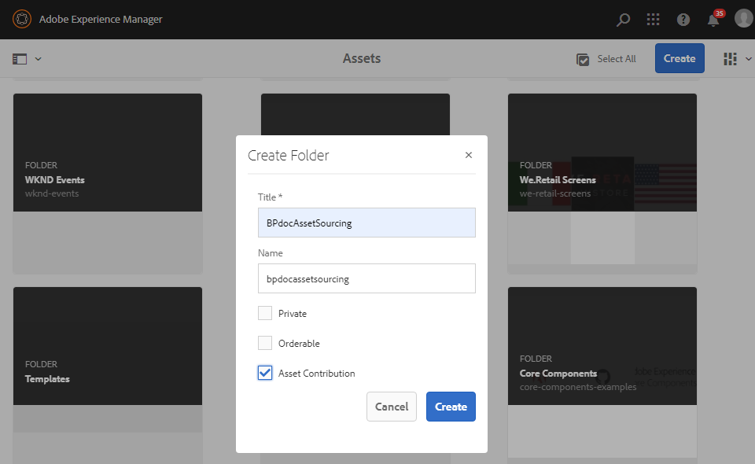
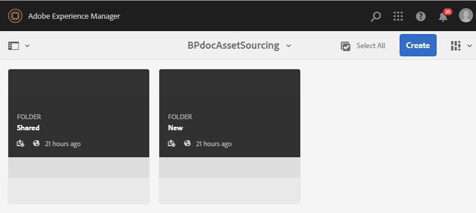
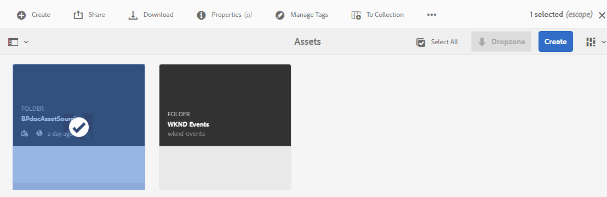
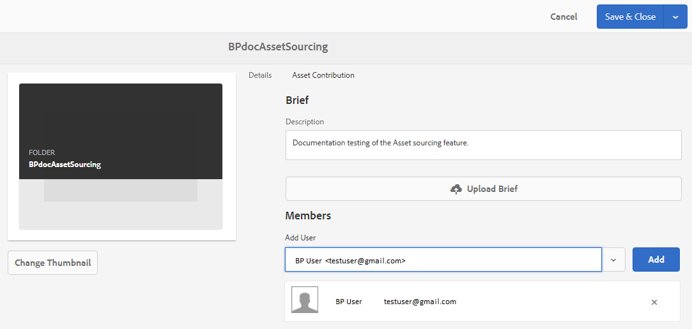
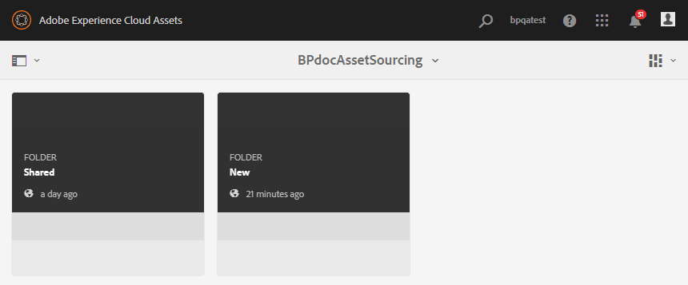
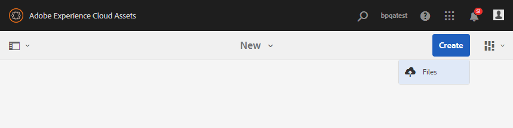
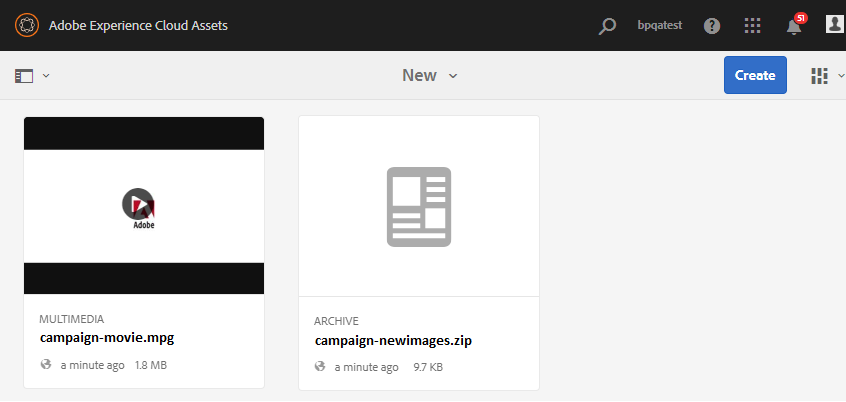
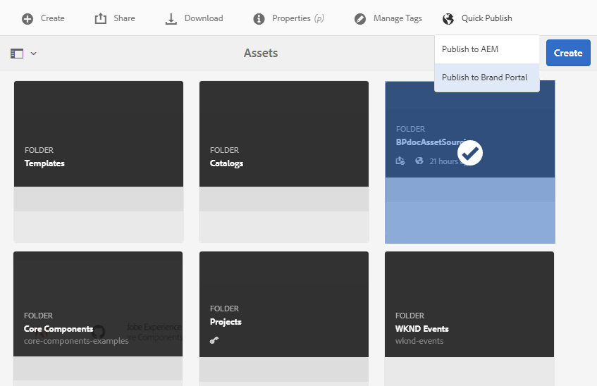

# Configure contribution folder in AEM Assets {#configure-contribution-folder}

For collaborative asset sourcing, AEM users (administrators and non-admin users having permission) can create new folders of type **Asset Contribution**, ensuring the new folder created is open to asset submission by Brand Portal users.  This automatically triggers a workflow which creates two additional sub folders, called **SHARED** and **NEW**, within the newly created **Contribution** folder.

AEM user then defines the asset requirements by uploading a brief about the types of assets that should be added to the contribution folder, as well as a set of baseline assets, to the **SHARED** folder to ensure Brand Portal users have the information they need. The administrator can then grant active Brand Portal users access to the contribution folder before publishing the newly created Contribution folder to Brand Portal.

The following video demonstrates, how to configure a Contribution folder in AEM Assets:

>[!VIDEO](https://video.tv.adobe.com/v/30547)

AEM user performs the following activities while configuring a contribution folder:

* [Create contribution folder](#create-contribution-folder)
* [Upload asset requirements and assign contributors](#configure-contribution-folder-properties)
* [Upload baseline assets](#uplad-new-assets-to-contribution-folder)
* [Publish contribution folder from AEM Assets to Brand Portal](#publish-contribution-folder-to-brand-portal)

## Create contribution folder {#create-contribution-folder}

AEM administrators and non-admin users having permission to create a new folder, can create a contribution folder in AEM Assets. 
To create a contribution folder, create a new folder of type Asset Contribution, ensuring the new folder created is open to asset submission by Brand Portal users.  This automatically triggers a workflow which creates two additional sub folders, called SHARED and NEW, within the contribution folder.

>[!NOTE]
>
>You can create multiple contribution folders within a folder. Do not create a contribution folder inside another contribution folder.

You can configure the contribution folder properties separately as well as while creating the contribution folder. In this example, we are configuring the properties separately.

**To create a contribution folder:**
1. Log in to your AEM Assets instance.

1. Navigate to **[!UICONTROL Assets]** > **[!UICONTROL Files]**. It lists all the existing folders in the AEM Assets repository.

1. Click **[!UICONTROL Create]** to create a new folder. **[!UICONTROL Create Folder]** dialog opens.

1. Enter **[!UICONTROL Title]** and **[!UICONTROL Name]** of the folder and select the **[!UICONTROL Asset Contribution]** check box.
It is recommended to use lowercase letters without any space to name the folder.

1. Click **[!UICONTROL Create]**. You can see the contribution folder listed in the AEM Assets repository.

   >[!NOTE]
   >
   >A non-admin user can create and share an asset contribution folder but cannot modify or delete it.  

   

1. Click to open the contribution folder, you can see two sub folders–**[!UICONTROL SHARED]** and **[!UICONTROL NEW]** are automatically created within the contribution folder. 
  
   

## Configure contribution folder properties {#configure-contribution-folder-properties}

AEM administrator performs the following activities while configuring the properties of a contribution folder.

* **Add description**: Provide a high-level description of the contribution folder.
* **Upload brief**:  Upload Asset Requirement document containing asset related information.
* **Add contributors**: Add Brand Portal users to grant them access to the contribution folder.

Asset requirement refers to the details provided by administrators to help contributors (Brand Portal users) understand the need and requirements of the contribution folder. Administrator uploads an asset requirement document which contains a brief about the type of assets that should be added to the contribution folder and asset related information, for example, purpose, type of images, max size, etc.

**To configure contribution folder properties:**

1. Log in to your AEM Assets instance. 

1. Navigate to **[!UICONTROL Assets > Files]** and locate the contribution folder.
1. Select contribution folder and click **[!UICONTROL Properties]** to open the Folder properties window.

   

   

1. Navigate to **[!UICONTROL Asset Contribution]** tab.
1. Enter high-level **[!UICONTROL Description]** of the contribution folder.
1. Click **[!UICONTROL Upload Brief]** to browse from your local machine and upload an **Asset Requirement Document**.

    

1. In the **[!UICONTROL Add User]** field, add Brand Portal users with whom you want to share the contribution folder. These users can access and upload content to the contribution folder using the Brand Portal interface.
1. Click **[!UICONTROL Save]**.

   

>[!NOTE]
>
>The search results are based on the Brand Portal user list configured in AEM Assets. Make sure you have the updated Brand Portal user list. 

## Upload assets to contribution folder {#uplad-new-assets-to-contribution-folder}

The Brand Portal users can download the asset requirements to understand the need of contribution. 
They can then create new assets for contribution and upload them to the NEW folder within the contribution folder.

>[!NOTE]
>
>The Brand Portal users can upload assets only to the NEW folder.
>
>The maximum upload limit for any Brand Portal tenant is **10**GB which is cumulatively applied to all the contribution folders. 

After publishing the newly created assets to AEM Assets, the Brand Portal users can delete them from the NEW folder. Whereas, the Brand Portal administrator can delete the assets from both NEW and SHARED folder. 

Once the objective of creating the contribution folder is achieved, the Brand Portal administrator can delete the contribution folder to release the upload space for other users. 

>[!NOTE]
>
>It is recommended to release the upload space after publishing the contribution folder to AEM Assets so that it is available to the other Brand Portal users for contribution. 
>
>If there is a need to extend the upload limit of your Brand Portal tenant beyond **10**GB, contact Adobe Support specifying the requirement.

**To upload new assets:**

1. Log in to your Brand Portal instance.
The Brand Portal dashboard reflects all the existing folders permitted to the Brand Portal user along with the newly shared contribution folder.

1. Select the contribution folder and click to open it. The contribution folder contains two sub folders – **[!UICONTROL SHARED]** and **[!UICONTROL NEW]**.

1. Click on the **[!UICONTROL NEW]** folder.

   

1. Click **[!UICONTROL Create]** > **[!UICONTROL Files]** to upload individual files or folder (.zip) containing multiple assets.

   

1. Browse and upload assets (files or folders) to the **[!UICONTROL NEW]** folder.

   

After uploading all the assets or folders to the NEW folder, publish the contribution folder to AEM Assets. 

## Publish contribution folder to Brand Portal {#publish-contribution-folder-to-brand-portal}

Once the contribution folder is configured, AEM user (administrator/non-admin user) can publish the contribution folder from AEM Assets to Brand Portal. Brand Portal users having permission to access the contribution folder will receive an email/pulse notification at the completion of the publish action.

**To publish contribution folder:**

1. Log in to your AEM Assets instance. 

1. Navigate to **[!UICONTROL Assets > Files]** and locate the contribution folder in which you want to publish to Brand Portal.
1. Select contribution folder and click **[!UICONTROL Quick Publish]** > **[!UICONTROL Publish to Brand Portal]**.

   
      
   You will receive a success message once the contribution folder is published to Brand Portal.

An email/pulse notification is sent to the Brand Portal users assigned to the contribution folder. The Brand Portal users can access the contribution folder and begin contribution. See, [Upload assets to the contribution folder and publish to AEM Assets](brand-portal-publish-contribution-folder-to-aem-assets.md).
