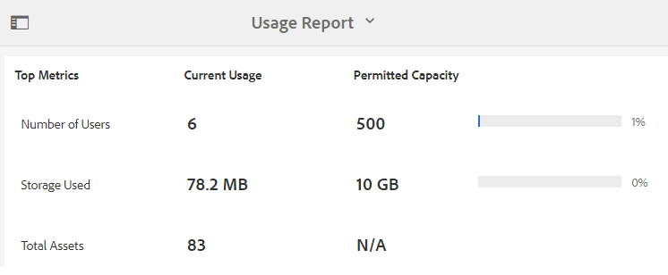
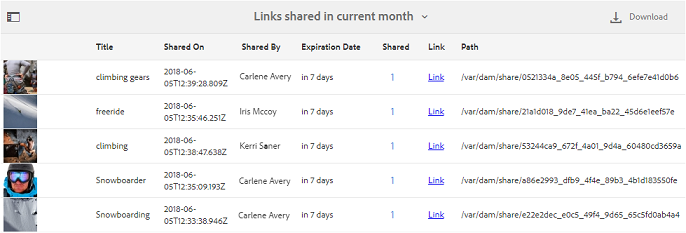
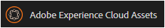
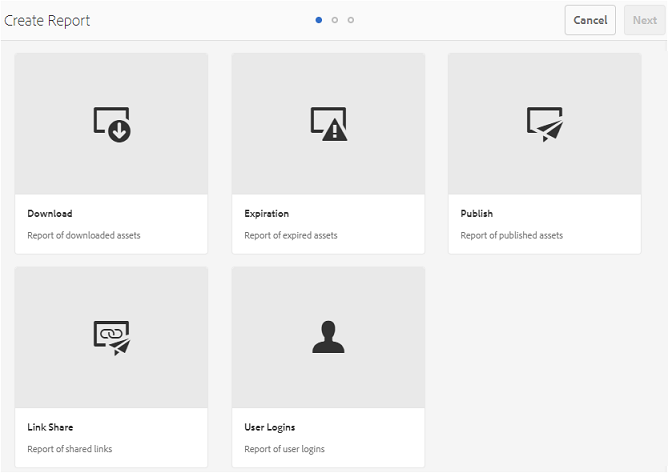
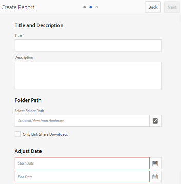
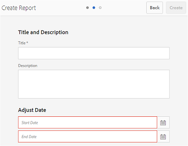
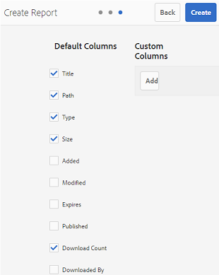
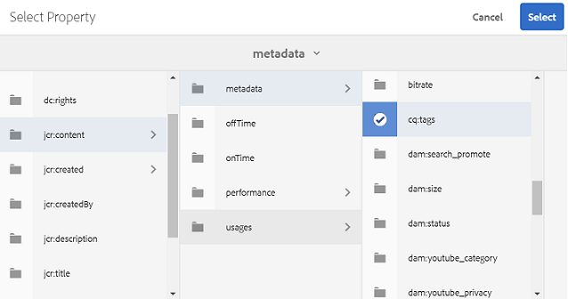
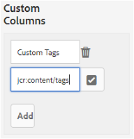
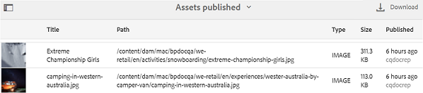

# Work with reports{#work-with-reports}

The reporting capability is instrumental in assessing Brand Portal usage, and knowing how internal and external users interact with approved assets. Administrators can view Brand Portal Usage report, which is always available on Asset Reports page. However, reports for user logins and assets downloaded, expired, published, and assets shared through links can be generated and viewed from Asset Reports page. These reports are helpful in analyzing asset deployment, which let you derive key success metrics to measure the adoption of approved assets within and outside your organization.

The report management interface is intuitive and includes fine-grained options and controls to access saved reports. You can view, download, or delete reports from the Asset Reports page, where all previously generated reports are listed.

## View reports {#view-reports}

To view a report, follow these steps:

1. From the toolbar at the top, tap/click the AEM logo to access administrative tools.

   

1. From the administrative tools panel, click **Create/Manage Reports **to open **Asset Reports **page.

   

1. Access **Usage **report and other generated reports from Asset Reports page.

   >[!NOTE]
   >
   >Usage report is present by default in Brand Portal. It can not be created or deleted. However, you can create, download and delete the Download, Expiration, Publish, Link Share, and User Logins reports.

   To view a report, tap/click the report link. Alternatively, select the report, and tap/click the View icon from the toolbar.

   **Usage Report** displays information about the number of current Brand Portal users, the storage space occupied by all the assets, and the total assets count in Brand Portal. The report also displays the permitted capacity for each of these information metrics.

   

   **User Logins** report gives information about the users who logged in to Brand Portal. The report shows display names, email IDs, personas (admin, viewer, editor, guest), groups, last login, activity status, and login count of each user from Brand Portal 6.4.2 deployment until the time of report generation.

   

   **Download** report lists and details about all the assets downloaded in a specific date and time range.

   

   >[!NOTE]
   >
   >The assets** Download** report displays only the assets that were individually selected and downloaded from Brand Portal. If a user has downloaded a folder containing assets, the report does not display the folder or the assets inside the folder.

   **Expiration** report lists and details all the assets that expired in a specific time frame.

   

   **Publish** report lists and gives information about all the assets that are published from AEM to Brand Portal in a specified time frame.

   

   >[!NOTE]
   >
   >Publish Report does not display information about content fragments, as the content fragments cannot be published to the Brand Portal.

   **Link Share **report** **lists all the assets shared through links from Brand Portal interface in a specific time frame. The report also informs when was the asset shared via link, by which user, when does the link expire, and the number of shared links for the tenant (and users with whom the asset link was shared). The columns of Link Share Report are not customizable.

   

   >[!NOTE]
   >
   >The Link Share Report does not display users who have access to the asset shared via the link or have downloaded the asset through the link. 
   >
   >
   >For tracking downloads through the shared link, you need to generate download report after selecting **Only Link Share Downloads **option on **Create Report** page. However, user (Downloaded by) is anonymous in this case.

## Generate reports {#generate-reports}

Administrators can generate and manage the following standard reports, once generated, they are saved to be [accessed](../using/brand-portal-reports.md#main-pars-header) later:

* User Logins
* Download
* Expiration
* Publish
* Link Share

The columns in the Download, Expiration, and Publish report can be customized for viewing. To generate a report, follow these steps:

1. From toolbar at the top, tap/click the AEM logo to access administrative tools.

   

1. From the administrative tools panel, tap/click **Create/Manage Reports **to open **Asset Reports **page.

   

1. In the Asset Reports page, tap/click **Create**.
1. From the **Create Report** page, select a report to create, and tap/click **Next**.

   

1. Configure report details. Specify title, description, folder structure (where report needs to run and generate statistics), and date range for **Download**, **Expiration**, and **Publish** reports.

   

   Whereas, **Link Share** **Report **only needs the title, description, and date range parameters.

   

   >[!NOTE]
   >
   >Special characters # and % in report title are replaced by a hyphen (-) on the report generation.

1. Tap/click **Next**, to configure the columns of Download, Expiration, and Publish reports.
1. Select or deselect the appropriate checkboxes as required. For example, to view names of users (who downloaded assets) in **Download **report, select **Downloaded By**. The following image illustrates selecting default columns in Download report.

   

   You can also add custom columns to these reports to display more data for your custom requirements.

   To add custom columns to Download, Publish or Expiration report, follow these steps:

    1. To display a custom column, tap/click **Add** within **Custom Columns**.
    1. 
    1. Specify name of the column in **Column Name** field.
    1. Select the property to which the column needs to map to, using property picker. 
    
           
    
       Alternatively, type the path in the property path field.
    
           
    
       To add more custom columns, tap/click **Add** and repeat steps 2 and 3.

1. Tap/click **Create**. A message notifies that report generation has been initiated.

## Download reports {#download-reports}

To save and download a report as .csv file, do one of the following:

* Select a report on Asset Reports page, and tap/click **Download** from the toolbar at the top.

* From Asset Reports page, open a report. Select **Download** option from the top of the report page.

## Delete reports {#delete-reports}

To delete an existing report, select the report from **Asset Reports** page and tap/click **Delete** from the toolbar at the top.

>[!NOTE]
>
>**Usage** report cannot be deleted.

