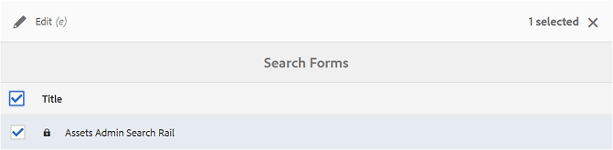
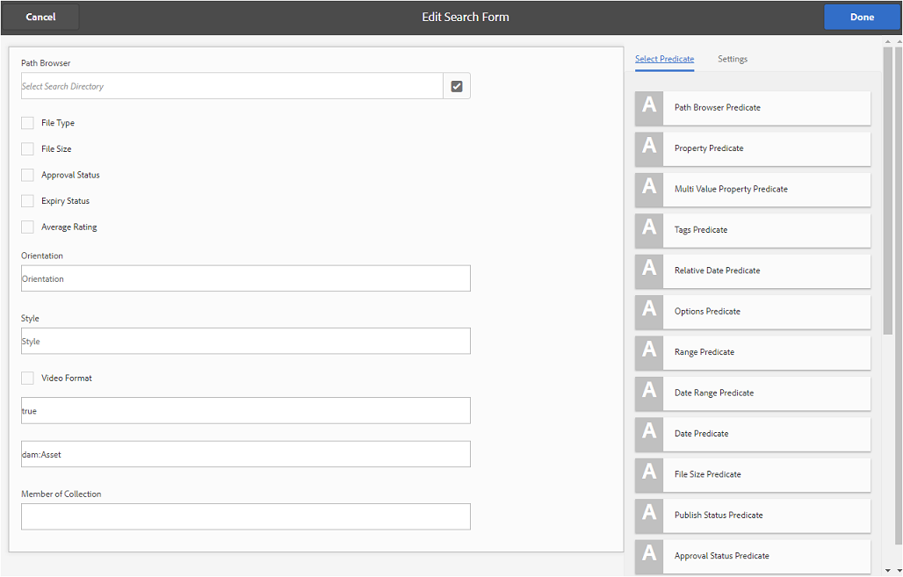
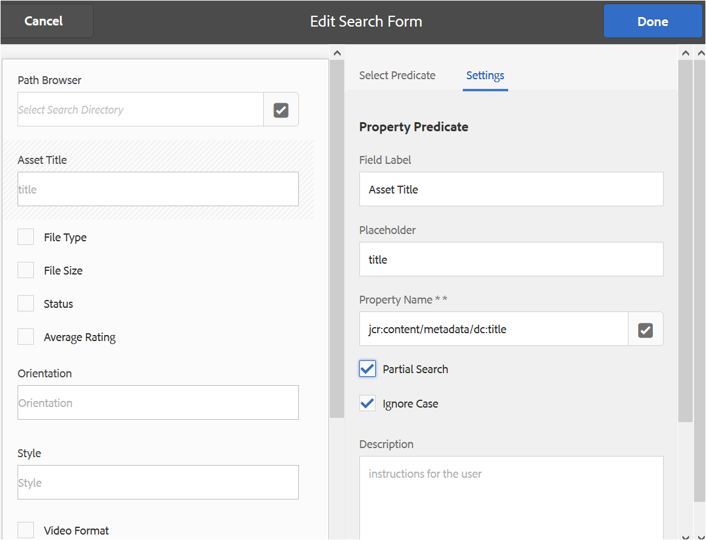
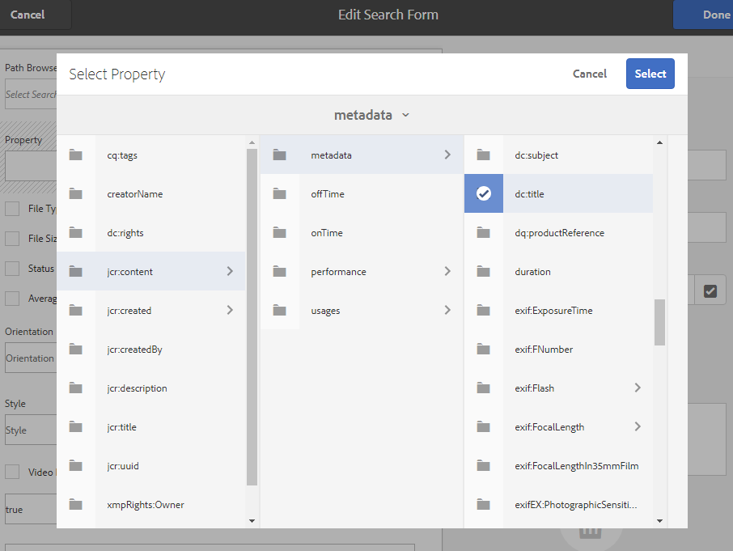
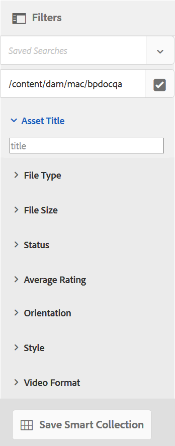
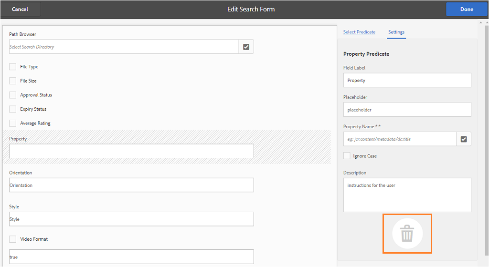

# Use custom search facets {#use-custom-search-facets}

Administrators can add search predicates to the [!UICONTROL Filters] panel to customize search and make the search functionality versatile.

Brand Portal supports [faceted search](../using/brand-portal-searching.md#search-using-facets-in-filters-panel) for granular searches of approved brand assets, which is possible due to [**Filters** panel](../using/brand-portal-searching.md#search-using-facets-in-filters-panel). Search facets are made available on Filters panel through **[!UICONTROL Search Form]** in the admin tools. A default search form named Asset Admin Search Rail exists in Search Forms page in admin tools. However, Administrators can customize the default Filters panel by editing the default Search Form (Asset Admin Search Rail) by adding, modifying, or removing search predicates, thereby making the search functionality versatile.

You can use various search predicates to customize the **[!UICONTROL Filters]** panel. For example, add the property predicate to search for assets that match a single property that you specify in this predicate. Add the options predicate to search for assets that match one or more values that you specify for a particular property. Add the date range predicate to search for assets created within a specified date range.

>[!NOTE]
>
>AEM allows organizations to [publish the customized search forms from AEM Author](../using/publish-schema-search-facets-presets.md#publish-search-facets-to-brand-portal) to Brand Portal, instead of re-creating the same form on Brand Portal.

## Add a search predicate {#add-a-search-predicate}

To add a search predicate to the **[!UICONTROL Filters]** panel:

1. To access administrative tools, click the AEM logo from the toolbar at the top.

   

1. From the administrative tools panel, click **[!UICONTROL Search Forms]**.

   

1. In the **[!UICONTROL Search Forms]** page, select **[!UICONTROL Assets Admin Search Rail]**.

   

1. On toolbar that appears at the top, click **[!UICONTROL Edit]** to open the edit search form.

   

1. In the [!UICONTROL Edit Search Form] page, drag a predicate from the [!UICONTROL Select Predicate] tab to the main pane. For example, drag **[!UICONTROL Property Predicate]**.

   The **[!UICONTROL Property]** field appears in the main pane and the **[!UICONTROL Settings]** tab on the right displays property predicates.

   

   >[!NOTE]
   >
   >The header label in the **[!UICONTROL Settings]** tab identifies the type of predicate you select.

1. In the **[!UICONTROL Settings]** tab, enter a label, placeholder text, and description for the property predicate.

    * Select **[!UICONTROL Partial Search]**, if you want to allow partial phrase search (and wildcard search) of assets-based on the specified property value. By default, the predicate supports the full-text search.
    * Select **[!UICONTROL Ignore Case]**, if you want the asset search based on property value to be non-case sensitive. By default, the search for property values in search Filter is case-sensitive.

   >[!NOTE]
   >
   >On selecting **[!UICONTROL Partial Search]** checkbox, **[!UICONTROL Ignore Case]** is selected by default.

1. In the **[!UICONTROL Property Name]** field, open property picker and select the property based on which the search is performed. Alternatively, enter a name for the property. For example, enter `  jcr :content/metadata/dc:title` or `./jcr:content/metadata/dc:title`.

   >[!NOTE]
   >
   >In Brand Portal, all the properties (except the ones starting with `xmp`) in `jcrcontent/metadata` of `dam:asset` are indexed by default. 
   >
   >Any property which is indexed can be used while creating a property predicate. If any non-indexed property is configured, the search query on an un-indexed property may not give any search result. 

      

1. Click **[!UICONTROL Done]** to save the settings.
1. From the [!UICONTROL Assets] user interface, click the overlay icon and choose **[!UICONTROL Filter]** to navigate to the **[!UICONTROL Filters]** panel. The **[!UICONTROL Property]** predicate is added to the panel.

   

1. Enter a title for the asset to be searched in the **[!UICONTROL Property]** text box. For example, "Adobe". When you perform a search, assets with the title matching "Adobe" are displayed in the search results.

## List of search predicates {#list-of-search-predicates}

Similar to the way you add a **[!UICONTROL Property]** predicate, you can add the following predicates to the **[!UICONTROL Filters]** panel:

| **Predicate Name** | **Description** | **Properties** |
|-------|-------|----------|
| **[!UICONTROL Path Browser]** | Search predicate to search assets at a particular location. **Note:** *For a logged-in user, path browser on Filter shows only the content structure of the folders (and their ancestors) shared with the user.*   Admin users can search assets in any folder by navigating to that folder using Path Browser.   Whereas, non-admin users can search assets in a folder (accessible to them) by navigating to that folder in Path Browser. | <ul><li>Field Label</li><li>Path</li><li>Description</li></ul> |
| **[!UICONTROL Property]** | Search assets based on a particular metadata property. **Note:** *On selecting Partial Search, Ignore Case is selected by default*. | <ul><li>Field Label</li><li>Placeholder</li><li>Property Name</li><li>Partial Search</li><li>Ignore Case</li><li> Description</li></ul> |
| **[!UICONTROL Multi-Value Property]** | Similar to property predicate but allows multiple input values, separated by a delimiter (default is COMMA[,]) assets matching any of the input values are returned in results. | <ul><li>Field Label</li><li>Placeholder</li><li>Property name</li><li>Delimiter Support</li><li>Ignore Case</li><li>Description</li></ul> |
| **[!UICONTROL Tags]** | Search predicate to search assets based on tags. You can configure the Path property to populate various tags in the Tags list. *Note: Administrators might need to change the path value, for example, [!UICONTROL `/etc/tags/mac/<tenant_id>/<custom_tag_namespace>`], if they publish the search form from AEM, where the path does not include tenant information, for example, [!UICONTROL `/etc/tags/<custom_tag_namespace>`]. | <ul><li>Field Label</li><li>Property name</li><li>Path</li><li>Description</li></ul> |
| **[!UICONTROL Path]** | Search predicate to search assets at a particular location. | <ul><li>Field Label</li><li>Path</li><li>Description</li></ul> |                                                     |
| **[!UICONTROL Relative Date]** | Search predicate to search assets based on the relative date of their creation. | <ul><li>Field Label</li><li>Property name</li><li>Relative date</li></ul> |
| **[!UICONTROL Range]** | Search predicate to search assets that lie within a specified range of property values. In the Filters panel, you can specify minimum and maximum property values for the range. | <ul><li>Field Label</li><li>Property name</li><li>Description</li></ul> |
| **[!UICONTROL Date Range]** | Search predicate to search assets created within a specified range for a date property. In the Filters panel, you can specify Start and End dates. | <ul><li>Field Label</li><li>Placeholder</li><li>Property name</li><li>Range text (From)</li><li>Range text (To)</li><li>Description</li></ul> |
| **[!UICONTROL Date]** | Search predicate for a slider-based search of assets based on a date property. | <ul><li>Field Label</li><li>Property name</li><li>Description</li></ul> |
| **[!UICONTROL File Size]** | Search predicate to search assets based on their size. | <ul><li>Field Label</li><li>Property name</li><li>Path</li><li>Description</li></ul> |
| **[!UICONTROL Asset Last Modified]**  | Search predicate to search assets based on the last modified date. | <ul><li>Field Label</li><li>Property name</li><li>Description</li></ul> |
| **[!UICONTROL Approval Status]** | Search predicate to search assets based on approval metadata property. The default property name is **dam:status**. | <ul><li>Field Label</li><li>Property name</li><li>Description</li></ul> |
| **[!UICONTROL Checkout Status]** | Search predicate to search assets based on the check-out status of an asset when it was published from AEM Assets. | <ul><li>Field Label</li><li>Property name</li><li>Description</li></ul> |
| **[!UICONTROL Checked Out By]** | Search predicate to search assets based on the user who has checked out the asset. | <ul><li>Field Label</li><li>Property name</li><li>Description</li></ul> |
| **[!UICONTROL Expiry Status]** | Search predicate to search assets based on the expiration status. | <ul><li>Field Label</li><li>Property name</li><li>Description</li></ul> |
| **[!UICONTROL Member of collection]** | Search predicate to search assets based on whether an asset is a part of a collection. | Description |
| **[!UICONTROL Hidden]** | This predicate is not explicitly visible to the end users and is used for any hidden constraints typically for restricting search results type to **dam:Asset**. | <ul><li>Field Label</li><li>Property name</li><li>Description</li></ul> |

>[!NOTE]
>
>Do not use **[!UICONTROL Options Predicate]**, **[!UICONTROL Publish Status Predicate]**, and **[!UICONTROL Rating Predicate]** as these predicates are not functional in Brand Portal.

## Delete a search predicate {#delete-a-search-predicate}

To delete a search predicate, follow these steps:

1. Click the Adobe logo to access administrative tools.

   

1. From the administrative tools panel, click **[!UICONTROL Search Forms]**.

   

1. In the **[!UICONTROL Search Forms]** page, select **[!UICONTROL Assets Admin Search Rail]**.

   

1. On toolbar that appears at the top, click **[!UICONTROL Edit]** to open the edit search form.

   

1. In the [!UICONTROL Edit Search Form] page, from the main pane, select the predicate you want to delete. For example, select **[!UICONTROL Property Predicate]**.

   The **[!UICONTROL Settings]** tab on the right displays property predicate fields.

1. To delete the property predicate, click the bin icon. On the **[!UICONTROL Delete Field]** dialog box, click **[!UICONTROL Delete]** to confirm the delete action.

   The **[!UICONTROL Property Predicate]** field is removed from the main pane, and the **[!UICONTROL Settings]** tab becomes empty.

   

1. To save the changes, click **[!UICONTROL Done]** in the toolbar.
1. From the **[!UICONTROL Assets]** user interface, click the overlay icon and choose **[!UICONTROL Filter]** to navigate to the **[!UICONTROL Filters]** panel. The **[!UICONTROL Property]** predicate is removed from the panel.

   
