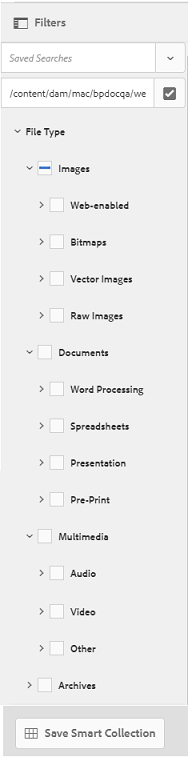

# Search assets on Brand Portal{#search-assets-on-brand-portal}

Brand Portal search capability lets you quickly search for relevant assets using  omnisearch , and search filters help you further narrow down your search. Save your searches as smart collections for future.

## Search assets using Omnisearch {#search-assets-using-omnisearch}

To search for assets on Brand Portal:

1. From the toolbar, click the **Search** icon, or press the** "/"** key to launch O  mnisearch .

   

1. In the search box, type a keyword for the assets you want to search. 

   

1. Select from the related suggestions that appear in the drop-down list to quickly access relevant assets.

   

## Faceted search by applying filters to search {#faceted-search-by-applying-filters-to-search}

Search filters in Brand Portal help you perform granular searches and narrow down your search results.

For example, the **File Type** search filter enables you to search based on fine-grained mime types such as .jpg, .png, and .psd, further within Images, Documents, Multimedia, and Archives options.

Additionally, **Path Browser** allows searching of assets in a specific directory. For non-admin users, path browser on Filter shows only the content structure of the folders (and their ancestors) shared with the user. Whereas, Admin users can search assets in any folder by navigating to that folder using Path Browser.

>[!NOTE]
>
>The default search path of search predicate for Path Browser is */content/dam/mac/&lt;tenant-id&gt;/, *which can be configured by editing the default search form.

To apply filters to your search, using the available [search facets](../using/brand-portal-search-facets.md):

1. To apply filters to your recent search, click the overlay icon and select **Filter**.

   

1. From the **Filters** panel on the left, select the appropriate options to apply the relevant filters.

   >[!NOTE]
   >
   >You can add or remove specific search predicates from the **Filters** panel through the [Edit Search Form](/using/brand-portal-search-facets.html?cq_ck=1507546531810#AddingaPredicate). See the [list of all the available and usable search predicates on Brand Portal](/using/brand-portal-search-facets.html?cq_ck=1507546531810#Listofsearchpredicates).

   The search results are displayed according to the filters applied, along with the search results count.

   

1. You can easily navigate to an item from the search result, and return to the same search result using the back button in your browser without having to re-run the search query.

## Save your searches as smart collection {#save-your-searches-as-smart-collection}

You can save the search settings as a smart collection to be able to quickly repeat the same search without having to redo the same settings later.

To save the search settings as a smart collection:

1. Tap/ click **Save Smart Collection** and provide a name for the smart collection.

   To make the smart collection accessible to all users, select **Public**. A message confirms that the smart collection was created and added to the list of your saved searches.

   >[!NOTE]
   >
   >Non-admin users can be restricted from making smart collections public, to avoid having a huge number of public smart collections created by non-admin users on organization's Brand Portal. Organizations can disable the **Allow public smart collections creation **configuration from **General** settings available in admin tools panel.

   

1. To save the smart collection in a different name, and select or clear the **Public** checkbox, click **Edit Smart Collection**.

   

1. On the **Edit Smart Collection** dialog box, select **Save As** and enter a name for the smart collection. Click **Save**.

   

