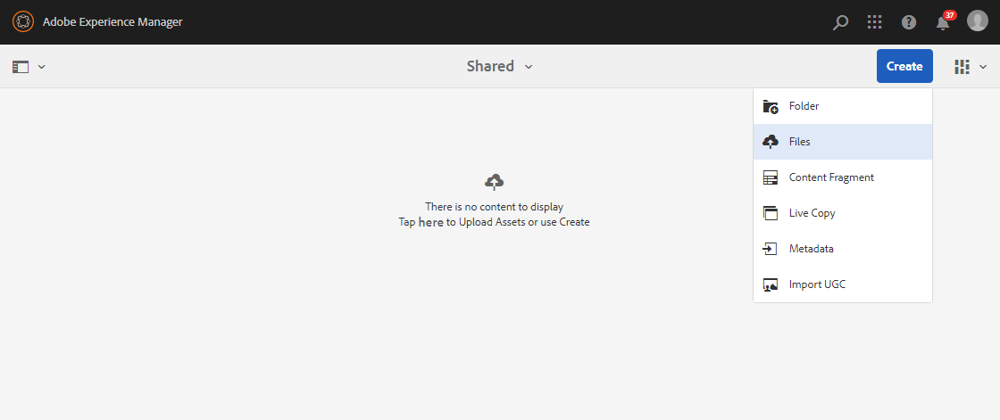
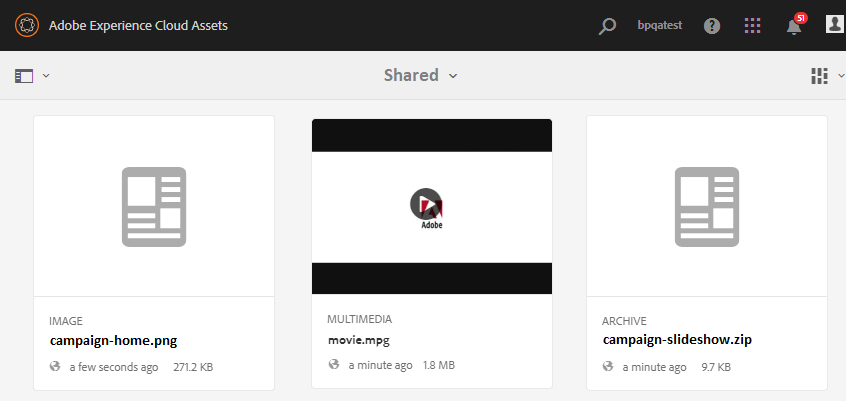

# Upload baseline assets {#upload-baseline-assets}

AEM administrator uploads baseline assets in the **SHARED** folder to help Brand Portal users understand the types of assets required during contribution. These assets can be used as reference content by the Brand Portal users while creating new assets for contribution.

**To upload baseline assets:**

1. Log in to your AEM author instance.
Default URL: http:// localhost:4502/aem/start.html
1. Navigate to **[!UICONTROL Assets > Files]** and locate the contribution folder in which you want to upload baseline assets.
1. Click to open the contribution folder, you can see two sub folders–**[!UICONTROL SHARED]** and **[!UICONTROL NEW]** within the contribution folder.
1. Click **[!UICONTROL SHARED]** folder.
1. Click **[!UICONTROL Create > Files]**  to upload individual assets.
Or, click **[!UICONTROL Create > Folder]** to upload folder (.zip) containing multiple assets.

1. Browse and upload baseline assets (files/folders) in the **[!UICONTROL SHARED]** folder.

Once upload is finished, administrators can publish the contribution folder to Brand Portal. See, [Publish contribution folder to Brand Portal](brand-portal-publish-contribution-folder-to-brand-portal.md).