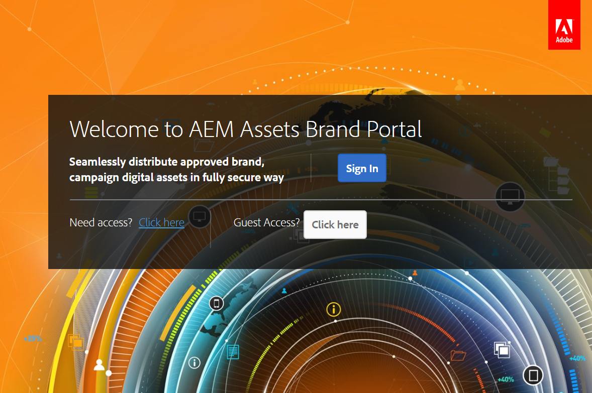
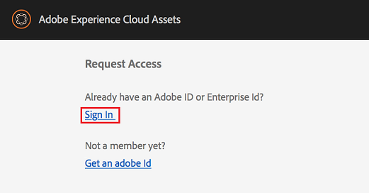
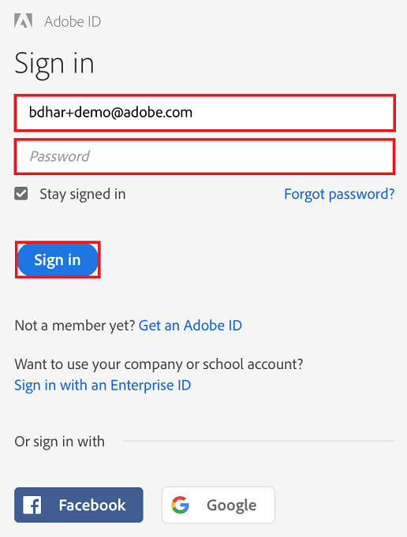
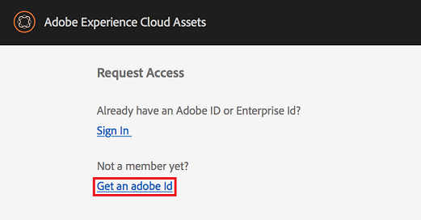
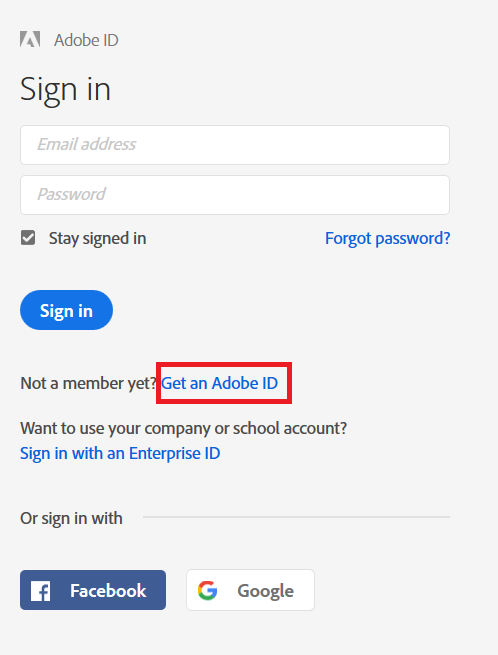
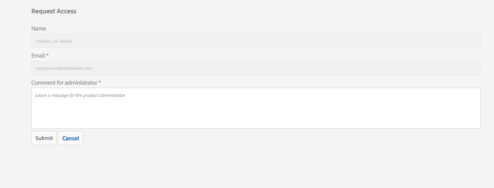
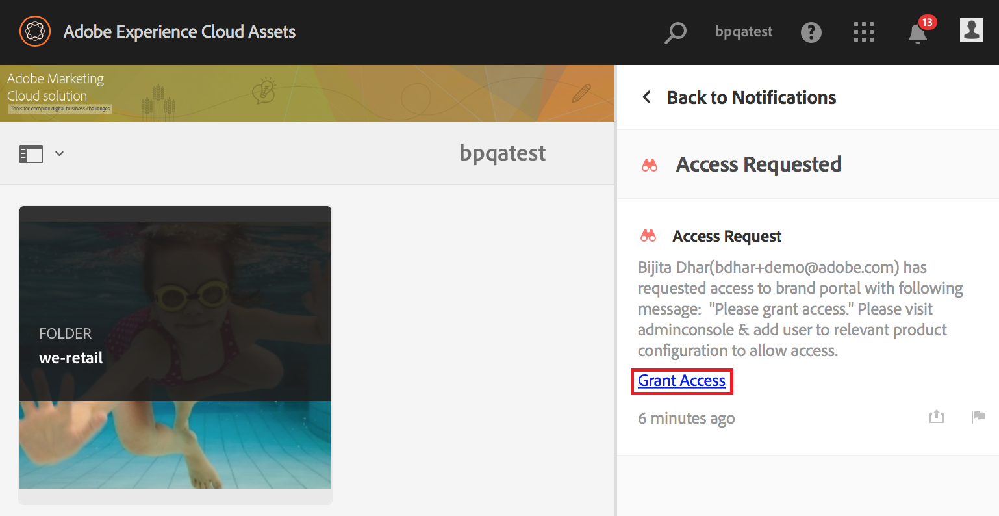
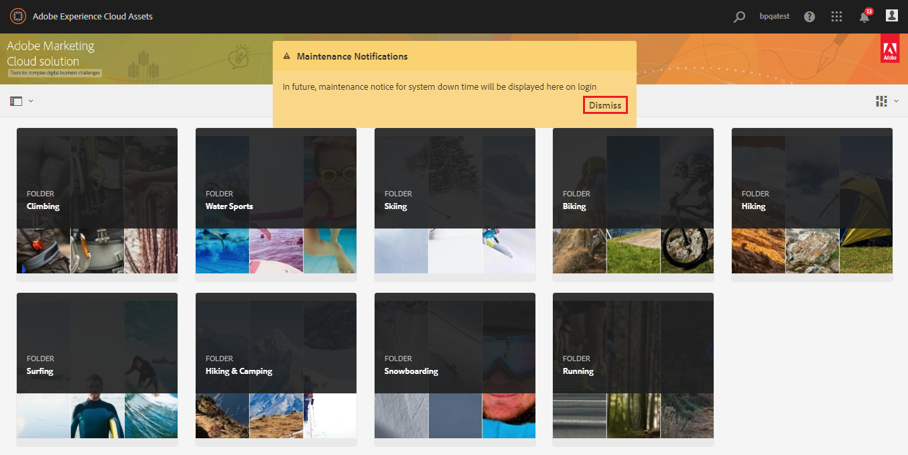

# Overview of AEM Assets Brand Portal{#overview-of-aem-assets-brand-portal}

AEM Assets Brand Portal can help you easily acquire, control, and securely distribute approved creative assets to external parties and internal business users across devices.

As a marketer, you sometimes require collaborating with channel partners and internal business users to quickly create, manage, and deliver relevant digital content to customers. Timely delivery of relevant content across the entire customer journey is critical to driving greater demand, conversion, engagement, and customer loyalty.

However, it is a challenge to develop solutions that support efficient and secure sharing of approved brand logos, guidelines, campaign assets, or product shots with extended internal teams, partners, and resellers.

The lack of a secure asset sharing solution can result in:

* Manual asset sharing through email, cloud, and so on
* Brand compliance issues
* Lack of control over asset usage
* Delays in campaigns and product launches
* Duplication of content across geographic locations and organizations
* Unsecured storage of assets before release

Adobe Experience Manager (AEM) Assets Brand Portal can help you easily acquire, control, and securely distribute approved creative assets to external parties and internal business users across devices. It helps improve the efficiency of asset sharing, accelerates the time-to-market for assets, and reduces the risk of non-compliance and unauthorized access.

Brand Portal's browser-based portal environment enables you to easily upload, browse, search, preview, and export assets in approved formats.

Brand Portal supports various user personas that include the following roles:

* Guest user
* Viewer
* Editor
* Administrator

The following table lists the tasks that users in these roles can perform:

<table border="1" cellpadding="1" cellspacing="0" width="100%"> 
 <tbody>
  <tr>
   <td valign="top" width="104">
 
 </td> 
   <td valign="top" width="104">
<strong>Browse</strong>
 </td> 
   <td valign="top" width="104">
<strong>Search </strong>
 </td> 
   <td valign="top" width="104">
<strong>Download</strong>
 </td> 
   <td valign="top" width="104">
<strong>Share folders</strong>
 </td> 
   <td><strong>Share a collection</strong></td> 
   <td><strong>Share assets as a 
     <g class="gr_ gr_5 gr-alert gr_gramm gr_inline_cards gr_disable_anim_appear Grammar multiReplace" data-gr-id="5" id="5">
      link
     </g></strong></td> 
   <td valign="top" width="104">
<strong>Access to Admin Tools</strong>
 </td> 
  </tr>
  <tr>
   <td><strong>Guest user</strong></td> 
   <td style="text-align: left;">✓*</td> 
   <td style="text-align: left;">✓*</td> 
   <td style="text-align: left;">✓*</td> 
   <td style="text-align: left;">x</td> 
   <td style="text-align: left;">x</td> 
   <td style="text-align: left;">
    <g class="gr_ gr_139 gr-alert gr_spell gr_inline_cards gr_run_anim ContextualSpelling ins-del" data-gr-id="139" id="139">
     x
    </g></td> 
   <td style="text-align: left;">
    <g class="gr_ gr_139 gr-alert gr_spell gr_inline_cards gr_disable_anim_appear ContextualSpelling ins-del" data-gr-id="139" id="139">
     x
    </g></td> 
  </tr>
  <tr>
   <td valign="top" width="104">
<strong>Viewer</strong>
 </td> 
   <td valign="top" width="104">
✓
 </td> 
   <td valign="top" width="104">
✓
 </td> 
   <td valign="top" width="104">
✓
 </td> 
   <td valign="top" width="104">
x
 </td> 
   <td style="text-align: left;">x</td> 
   <td style="text-align: left;">
    <g class="gr_ gr_8 gr-alert gr_spell gr_inline_cards gr_run_anim ContextualSpelling ins-del" data-gr-id="8" id="8">
     x
    </g></td> 
   <td valign="top" width="104">

     <g class="gr_ gr_8 gr-alert gr_spell gr_inline_cards gr_disable_anim_appear ContextualSpelling ins-del" data-gr-id="8" id="8">
      x
     </g>  
 </td> 
  </tr>
  <tr>
   <td valign="top" width="104">
<strong>Editor</strong>
 </td> 
   <td valign="top" width="104">
✓
 </td> 
   <td valign="top" width="104">
✓
 </td> 
   <td valign="top" width="104">
✓
 </td> 
   <td valign="top" width="104">
✓
 </td> 
   <td style="text-align: left;">✓</td> 
   <td style="text-align: left;">✓</td> 
   <td valign="top" width="104">
x
 </td> 
  </tr>
  <tr>
   <td valign="top" width="104">
<strong>Administrator</strong>
 </td> 
   <td valign="top" width="104">
✓
 </td> 
   <td valign="top" width="104">
✓
 </td> 
   <td valign="top" width="104">
✓
 </td> 
   <td valign="top" width="104">
✓
 </td> 
   <td style="text-align: left;">✓</td> 
   <td style="text-align: left;">✓</td> 
   <td valign="top" width="104">
✓
 </td> 
  </tr>
 </tbody>
</table>

&#42; Guest users can browse, access, and search assets in public folders and collections only.

## Guest user {#guest-user}

Any user having limited access to assets on Brand Portal without undergoing authentication is a guest user. The guest session allows users access to public folders and collections. As a guest user, you can browse through asset details and have full asset view of members of public folders and collection. You can search, download, and add public assets to lightbox collection.

However, guest session restricts you from creating collections and saved searches, and share them further. Users in a guest session cannot access folder and collections settings, and cannot share assets as link. Here is a list of tasks that a guest user can perform:

[Browse and access public assets](../using/browse-folders-and-collections.md)

[Search public assets](../using/brand-portal-searching.md)

[Download public assets](../using/brand-portal-download-users.md)

[Add assets to lightbox](../using/brand-portal-light-box.md#main-pars_title)

## Viewer {#viewer}

A standard user in Brand Portal is typically a user with the role of Viewer. A user with this role can access permitted folders, collections, and assets. The user can also browse, preview, download, and export assets (original or specific renditions), configure account settings, and search for assets. Here is a list of tasks that a Viewer can perform:

[Browse assets](../using/browse-folders-and-collections.md)

[Search for assets](../using/brand-portal-searching.md)

[Download assets](../using/brand-portal-download-users.md)

## Editor {#editor}

A user with the role of Editor can perform all tasks that a Viewer can perform. In addition, and Editor can view the files and folders that an administrator shares. The user with the role of an Editor can also share content (files, folders, collections) with others.

Apart from the tasks that a Viewer can perform, an Editor can perform the following additional tasks:

[Share folders](../using/brand-portal-sharing-folders.md)

[Share a collection](../using/brand-portal-share-collection.md)

[Share assets as a link](../using/brand-portal-link-share.md)

## Administrator {#administrator}

An administrator includes a user marked as system administrator or Brand Portal product administrator in Admin Console. An administrator can add and remove system administrators and users, define presets, send email to users, and view portal usage and storage reports.

An administrator can perform all tasks that an Editor can perform and the following additional tasks:

[Manage users, groups, and user roles](../using/brand-portal-adding-users.md)

[Customize wallpaper, page headers, and emails](../using/brand-portal-branding.md)

[Use custom search facets](../using/brand-portal-search-facets.md)

[Use the metadata schema form](../using/brand-portal-metadata-schemas.md)

[Apply image presets or dynamic renditions](../using/brand-portal-image-presets.md)

[Work with reports](../using/brand-portal-reports.md)

In addition to the above tasks, an Author in AEM Assets can perform the following tasks:

[Configure AEM Assets integration with Brand Portal](/content/help/en/experience-manager/6-2/assets/using/configuring-assets-brandportal-integration)

[Publish folders to Brand Portal](/content/help/en/experience-manager/6-2/assets/using/brand-portal-publish-folder)

[Publish collections to Brand Portal](/content/help/en/experience-manager/6-2/assets/using/brand-portal-publish-collection)

## Tenant alias for portal url {#tenant-alias-for-portal-url}

Brand Portal 6.4.3 onwards, organizations can have one alternate (alias) URL for existing URL of their Brand Portal tenant. The alias URL can be created by having an alternate prefix in the URL.  
Note that only the prefix of the Brand Portal URL can be customized and not the entire URL. For example, an organization with existing domain **geomettrix.brand-portal.adobe.com** can get **geomettrixinc.brand-portal.adobe.com** created on request.

However, AEM Author instance can be [configured](/content/help/en/experience-manager/6-4/assets/using/brand-portal-configuring-integration) only with the tenant id URL and not with tenant alias (alternate) URL.

>[!NOTE]
>
>To get an alias for tenant name in existing portal URL, organizations need to contact Adobe support with a new tenant alias creation request. This request is processed by first checking if the alias is available and then creating the alias.
>
>To replace the old or delete the old alias, the same process needs to be followed.

## Request access to Brand Portal {#request-access-to-brand-portal}

Users can request access to Brand Portal from the login screen. These requests are sent to Brand Portal administrators, who grant access to users through the Adobe Admin Console. After access is granted, users receive a notification email.

To request access, do the following:

1. From the Brand Portal login page, select the **Click here** corresponding to **Need Access?**. However, to enter the guest session, select the **Click here** corresponding to **Guest Access?**.

   

   The **Request Access** page opens.

1. To be able to request access to an organization’s Brand Portal, you must have a valid Adobe ID, Enterprise ID, or Federated ID.

   In the **Request Access** page, sign in using your ID (scenario 1) or create an Adobe ID (scenario 2):

    * Scenario 1: If you have an Adobe ID, Enterprise ID, or Federated ID, click **Sign In**.

   

   The **Sign in** page opens. Provide your Adobe ID credentials and click **Sign in**. 

   

   You are redirected to the **Request Access** page.

    * Scenario 2: If you do not have an Adobe ID, to create one, click **Get an Adobe ID** from the** Request Access** page.

   

   The **Sign in** page opens. Click **Get an Adobe ID**. 

   

   The **Sign up** page opens. Enter your first and last name, email ID, and password. Click **Sign up**. 

   

   You are redirected to the **Request Access** page.

1. The next page displays the current user’s name and email ID being used to request access. Leave a comment for the administrator, and click **Submit**.

   

   Brand Portal product administrators receive access requests in their Brand Portal notification area and through emails in their inbox.

   

   >[!NOTE]
   >
   >Step 4 onwards, the workflow is applicable only to Brand Portal product administrators.

1. To grant access, click the relevant notification in Brand Portal notification area and then click **Grant Access**. Alternatively, follow the link provided in the access request email to visit Adobe Admin Console and add the user to the relevant product configuration.

   

   You are redirected to the [Adobe Admin Console](http://adminconsole.adobe.com/enterprise/overview) home page. Use Adobe Admin Console to create users and assign them to product profiles (formerly known as product configurations), which show as groups in Brand Portal. For more information about adding users in Admin Console, see [Add a user](../using/brand-portal-adding-users.md#Addauser) (follow Steps 4-7 in the procedure to add a user).

## Brand Portal maintenance notification {#brand-portal-maintenance-notification}

Before Brand Portal is scheduled to go down for maintenance, a notification is displayed as a banner after you log in to Brand Portal. A sample notification:

You can dismiss this notification and continue using Brand Portal. This notification appears in every new session.

## Release and system information {#release-and-system-information}

[What's new](../using/whats-new.md) [Release Notes](../release-notes/brand-portal-release-notes-642.md) [Supported file formats](../using/brand-portal-supported-formats.md)

## Related resources {#related-resources}

[Adobe Customer Care](https://helpx.adobe.com/marketing-cloud/contact-support.html)

[AEM Forums](http://www.adobe.com/go/aod_forums_en)
