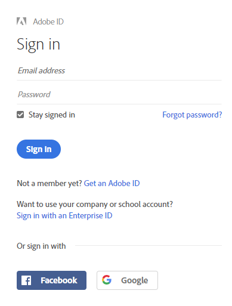
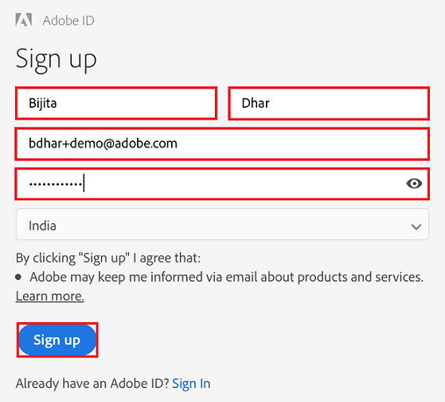
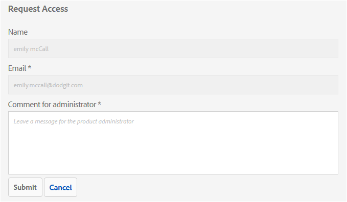
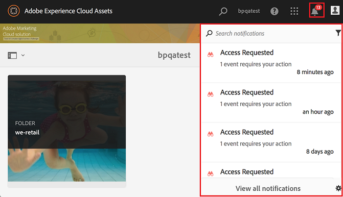
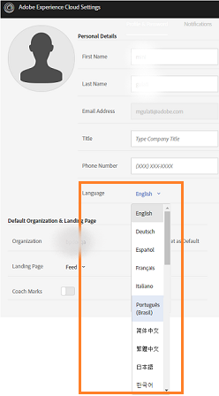
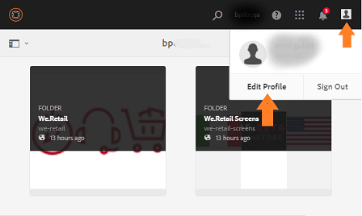

# Overview of Experience Manager Assets Brand Portal {#overview-of-aem-assets-brand-portal}

As a marketer, you sometimes need to collaborate with channel partners and internal business users to quickly create, manage, and deliver relevant digital content to customers. Timely delivery of relevant content across the entire customer journey is critical to driving greater demand, conversion, engagement, and customer loyalty.

However, it is a challenge to develop solutions that support efficient and secure sharing of approved brand logos, guidelines, campaign assets, or product shots with extended internal teams, partners, and resellers.

**Adobe Experience Manager (AEM) Assets Brand Portal** focuses on the marketer’s need to effectively collaborate with the globally distributed Brand Portal users by providing asset distribution and asset contribution capabilities.

Asset distribution allows you to easily acquire, control, and securely distribute approved creative assets to external parties and internal business users across devices. Whereas, Asset contribution enables the Brand Portal users with the ability to upload assets to Brand Portal and publish to Experience Manager Assets, without needing access to the author environment. The contribution feature is called as **Assets Sourcing in Brand Portal**. And together, it improves the overall Brand Portal experience of asset distribution and contribution from the Brand Portal users (external agencies/teams), accelerates the time-to-market for assets, and reduces the risk of non-compliance and unauthorized access.
See, [Asset Sourcing in Brand Portal](brand-portal-asset-sourcing.md).

The browser-based portal environment enables you to easily upload, browse, search, preview, and export assets in approved formats.

## Configure Experience Manager Assets with Brand Portal {#configure-brand-portal}

Configuring Adobe Experience Manager Assets with Brand Portal enables asset publishing, asset distribution, and asset contribution features for the Brand Portal users. 

>[!NOTE]
>
>Configuring Experience Manager Assets with Brand Portal is supported on Experience Manager Assets as a Cloud Service, Experience Manager Assets 6.3 and above.

Experience Manager Assets as a Cloud Service is automatically configured with Brand Portal by activating Brand Portal from the Cloud Manager. The activation workflow creates the required configurations at the backend and activates Brand Portal on the same IMS org as of the Experience Manager Assets as a Cloud Service instance.  

Whereas, Experience Manager Assets (on premise and managed service) is manually configured with Brand Portal using Adobe Developer Console, which procures an Adobe Identity Management Services (IMS) token for authorization of the Brand Portal tenant. 

For more information, see [configuring Experience Manager Assets with Brand Portal](../using/configure-aem-assets-with-brand-portal.md).

## User personas in Brand Portal {#Personas}

Brand Portal supports the following user roles:

* Guest user
* Viewer
* Editor
* Administrator

The following table lists the tasks that users in these roles can perform:

|  | **Browse** | **Search** | **Download** | **Share folders** | **Share a collection** | **Share assets as a link** | **Access to Admin Tools** |
|--- |--- |--- |--- |--- |--- |--- |--- |
| **Guest user** | ✓* | ✓* | ✓* | x | x | x | x |
| **Viewer** | ✓ | ✓ | ✓ | x | x | x | x |
| **Editor** | ✓ | ✓ | ✓ | ✓ | ✓ | ✓ | x |
| **Administrator** | ✓ | ✓ | ✓ | ✓ | ✓ | ✓ | ✓ |

>[!NOTE]
>
>Guest users can browse, access, and search assets in public folders and collections only.

<!--
&#42; Viewer users can access and download the public assets shared with them, and can add these assets to create their own collections.

>[!NOTE]
>
>There is a known issue that the share link for collections is currently visible to the viewer users. The viewer users does not have the privilege to add users to create a share link. This issue will be fixed in the upcoming release, the option to share link for the collections will not be available to the viewer users.
-->

### Guest user {#guest-user}

Any user having limited access to assets on Brand Portal without undergoing authentication is a guest user. The guest session allows users access to public folders and collections. As a guest user, you can browse through asset details and have full asset view of members of public folders and collections. You can search, download, and add public assets to [!UICONTROL Lightbox] collection.

However, guest session restricts you from creating collections and saved searches, and share them further. Users in a guest session cannot access folder and collections settings, and cannot share assets as link. Here is a list of tasks that a guest user can perform:

* [Browse and access public assets](browse-assets-brand-portal.md)

* [Search public assets](brand-portal-searching.md)

* [Download public assets](brand-portal-download-assets.md)

* [Add assets to [!UICONTROL Lightbox]](brand-portal-light-box.md#add-assets-to-lightbox)

### Viewer {#viewer}

A standard user in Brand Portal is typically a user with the role of Viewer. A user with this role can access permitted folders, collections, and assets. The user can also browse, preview, download, and export assets (original or specific renditions), configure account settings, and search for assets. Here is a list of tasks that a Viewer can perform:

* [Browse assets](browse-assets-brand-portal.md)

* [Search for assets](brand-portal-searching.md)

* [Download assets](brand-portal-download-assets.md)

### Editor {#editor}

A user with the role of Editor can perform all tasks that a Viewer can perform. In addition, and Editor can view the files and folders that an administrator shares. The user with the role of an Editor can also share content (files, folders, collections) with others.

Apart from the tasks that a Viewer can perform, an Editor can perform the following additional tasks:

* [Share folders](brand-portal-sharing-folders.md)

* [Share a collection](brand-portal-share-collection.md)

* [Share assets as a link](brand-portal-link-share.md)

### Administrator {#administrator}

An administrator includes a user marked as system administrator or Brand Portal product administrator in [!UICONTROL Admin Console]. An administrator can add and remove system administrators and users, define presets, send email to users, and view portal usage and storage reports.

An administrator can perform all tasks that an Editor can perform the following additional tasks:

* [Manage users, groups, and user roles](brand-portal-adding-users.md)

* [Customize wallpaper, page headers, and emails](brand-portal-branding.md)

* [Use custom search facets](brand-portal-search-facets.md)

* [Use the metadata schema form](brand-portal-metadata-schemas.md)

* [Apply image presets or dynamic renditions](brand-portal-image-presets.md)

* [Work with reports](brand-portal-reports.md)

In addition to the above tasks, an Author in AEM Assets can perform the following tasks:

* [Configure AEM Assets with Brand Portal](../using/configure-aem-assets-with-brand-portal.md)

* [Publish folders to Brand Portal](https://experienceleague.adobe.com/docs/experience-manager-65/assets/brandportal/brand-portal-publish-folder.html)

* [Publish collections to Brand Portal](https://experienceleague.adobe.com/docs/experience-manager-65/assets/brandportal/brand-portal-publish-collection.html)

## Alternate alias for Brand Portal url {#tenant-alias-for-portal-url}

Brand Portal 6.4.3 onwards, organizations can have one alternate (alias) URL for existing URL of their Brand Portal tenant. The alias URL can be created by having an alternate prefix in the URL.  
Note that only the prefix of the Brand Portal URL can be customized and not the entire URL. For example, an organization with existing domain `geomettrix.brand-portal.adobe.com` can get `geomettrixinc.brand-portal.adobe.com` created on request.

However, AEM Author instance can be [configured](../using/configure-aem-assets-with-brand-portal.md) only with the tenant id URL and not with tenant alias (alternate) URL.

>[!NOTE]
>
>To get an alias for tenant name in existing portal URL, organizations need to contact Customer support with a new tenant alias creation request. This request is processed by first checking if the alias is available and then creating the alias.
>
>To replace the old or delete the old alias, the same process needs to be followed.

## Request access to Brand Portal {#request-access-to-brand-portal}

Users can request access to Brand Portal from the login screen. These requests are sent to Brand Portal administrators, who grant access to users through the Adobe [!UICONTROL Admin Console]. After access is granted, users receive a notification email.

To request access, do the following:

1. From the Brand Portal login page, select **[!UICONTROL Click here]** corresponding to **[!UICONTROL Need Access?]**. However, to enter the guest session, select the **[!UICONTROL Click here]** corresponding to **[!UICONTROL Guest Access?]**.

   

   The [!UICONTROL Request Access] page opens.

1. To request access to an organization’s Brand Portal, you must have a valid [!UICONTROL Adobe ID], [!UICONTROL Enterprise ID], or [!UICONTROL Federated ID].

   In the [!UICONTROL Request Access] page, sign in using your ID (scenario 1) or create an [!UICONTROL Adobe ID] (scenario 2):

   ![[!UICONTROL Request access]](assets/bplogin_request_access_2.png)

    **Scenario 1**

    1. If you have an [!UICONTROL Adobe ID], [!UICONTROL Enterprise ID], or [!UICONTROL Federated ID], click **[!UICONTROL Sign In]**.
    The [!UICONTROL Sign in] page opens.

    1. Provide your [!UICONTROL Adobe ID] credentials and click **[!UICONTROL Sign in]**.

       

   You are redirected to the [!UICONTROL Request Access] page.

    **Scenario 2**

    1. If you do not have an [!UICONTROL Adobe ID], to create one, click **[!UICONTROL Get an Adobe ID]** from the [!UICONTROL Request Access] page.
    The [!UICONTROL Sign in] page opens.
    1. Click **[!UICONTROL Get an Adobe ID]**.
    The [!UICONTROL Sign up] page opens.
    1. Enter your first and last name, email ID, and password. 
    1. Select **[!UICONTROL Sign up]**.
    
       

   You are redirected to the [!UICONTROL Request Access] page.

1. The next page displays your name and email ID used to request access. Leave a comment for the administrator, and click **[!UICONTROL Submit]**.

   

## Product administrators grant access {#grant-access-to-brand-portal}

Brand Portal product administrators receive access requests in their Brand Portal notification area and through emails in their inbox.

To grant access, product administrators need to click the relevant notification in Brand Portal notification area and then click **[!UICONTROL Grant Access]**.
Alternatively, product administrators can follow the link provided in the access request email to visit Adobe [!UICONTROL Admin Console] and add the user to the relevant product configuration.

You are redirected to the [Adobe [!UICONTROL Admin Console]](https://adminconsole.adobe.com/enterprise/overview) home page. Use Adobe [!UICONTROL Admin Console] to create users and assign them to product profiles (formerly known as product configurations), which show as groups in Brand Portal. For more information about adding users in [!UICONTROL Admin Console], see [Add a user](brand-portal-adding-users.md#add-a-user) (follow Steps 4-7 in the procedure to add a user).

## Brand Portal languages {#brand-portal-language}

You can change Brand Portal language from Adobe [!UICONTROL Experience Cloud Settings].

To change the language:

1. Select [!UICONTROL User] > [!UICONTROL Edit Profile] from the top menu.

   

1. On [!UICONTROL Experience Cloud Settings] page, select a language from the [!UICONTROL Language] drop-down menu.

## Brand Portal maintenance notification {#brand-portal-maintenance-notification}

Before Brand Portal is scheduled to go down for maintenance, a notification is displayed as a banner after you log in to Brand Portal. A sample notification:

You can dismiss this notification and continue using Brand Portal. This notification appears in every new session.

## Release and system information {#release-and-system-information}

* [What's new](whats-new.md)
* [Release Notes](brand-portal-release-notes.md)
* [Supported file formats](brand-portal-supported-formats.md)

## Related resources {#related-resources}

<!--
* [Adobe Customer Support]()
-->

* [AEM Forums](https://experienceleaguecommunities.adobe.com/t5/adobe-experience-manager/ct-p/adobe-experience-manager-community)
