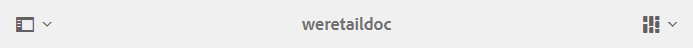
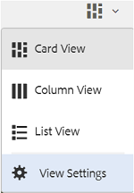
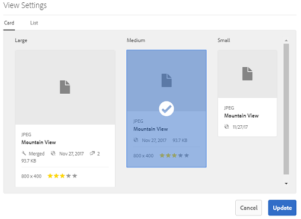
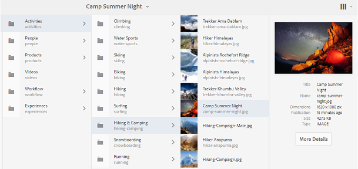
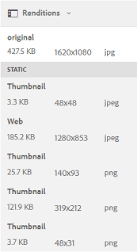

# Browsing assets on Brand Portal{#browsing-assets-on-brand-portal}

AEM Assets Brand Portal provides various capabilities and user interface elements that facilitate browsing through resources, traversing asset hierarchies, and searching assets while using different view options.

AEM logo in the AEM toolbar at the top facilitates admin users to access administrative tools panel.

  

Rail selector at the upper left in Brand Portal drops-down to expose options to navigate into asset hierarchies, streamline your search, and display resources.

You can view, navigate through, and select assets using any of the available views (Card, Column, and List) in the view selector at the upper right in Brand Portal.

## Viewing and Selecting Resources {#viewing-and-selecting-resources}

Viewing, navigating, and selecting are each conceptually the same across all views, but have small variations in handling, depending on the view you are using.

You can view, navigate through, and select (for further action) your resources with any of the available views:

* Column View
* Card View  
* List View

 
Card View

 
 
Card view displays information cards for each item at the current level. These cards provide 
  <g class="gr_ gr_15 gr-alert gr_gramm gr_inline_cards gr_run_anim Grammar only-ins replaceWithoutSep" data-gr-id="15" id="15">
   following
  </g> details:
 
 <ul> 
  <li>A visual representation of the asset/folder.</li> 
  <li>Type </li> 
  <li>Title</li> 
  <li>Name</li> 
  <li>Date and time when 
   <g class="gr_ gr_17 gr-alert gr_gramm gr_inline_cards gr_run_anim Grammar only-ins doubleReplace replaceWithoutSep" data-gr-id="17" id="17">
    asset
   </g> was published to Brand Portal from AEM</li> 
  <li>Size </li> 
  <li>Dimensions</li> 
 </ul> 
 
You can navigate down the hierarchy by tapping/clicking cards (taking care to avoid the quick actions) or up again by using the <a href="https://helpx.adobe.com/experience-manager/6-5/sites/authoring/using/basic-handling.html#TheHeader" target="_blank">breadcrumbs in the header</a>.
 
 
 <h3>Card view for non-admin users</h3>
 
Cards of folders, in Card View, display folder hierarchy information to non-admin users (Editor, Viewer, and Guest User). This functionality lets the users know the location of the folders, they are accessing, with respect to the parent hierarchy.
 
 
Folder hierarchy information is particularly helpful in differentiating the folders having names similar to other folders shared from a different folder hierarchy. If the non-admin users are not aware of the folder structure of the assets shared with them, assets /folders with similar names seem confusing.
 
 <ul> 
  <li>The paths shown on the respective cards are truncated to fit the card sizes. However, users can see the full path as a tool tipon hovering over the truncated path.</li> 
 </ul> 
 
 
<strong>Overview option to view Asset Properties</strong>
 
 
Overview option is available to non-admin users (Editors, Viewers, Guest users) to view Asset Properties of selected assets/folders. The Overview option is visible:
 
 <ol> 
  <li>In the toolbar at the top on selecting an asset/folder.</li> 
  <li>In the drop-down on selecting the Rail Selector.</li> 
 </ol> 
 
On selecting the Overview option while an asset/folder is selected, users can see the title, path, and time of asset creation. Whereas, on asset detail page selecting Overview option lets the users see metadata of the asset.
 
 
 
 <h3>View settings in card view</h3>
 
View Settings dialog opens on selecting View Settings from the view selector. It enables you to resize the asset thumbnails in the Card view. This way, you can personalize your view and control the number of thumbnails that is displayed.
 
 

 
List View

 
 
The list view displays information for each resource at the current level. List view provides the following details:
 
 <ul> 
  <li>Thumbnail image of assets</li> 
  <li>Name</li> 
  <li>Title</li> 
  <li>Locale</li> 
  <li>Type</li> 
  <li>Dimension</li> 
  <li>Size</li> 
  <li>Rating</li> 
  <li>Folder path showing asset hierarchy* </li> 
  <li>Date of publishing the asset on Brand Portal</li> 
 </ul> 
 
* Path column lets you easily identify asset location in the folder hierarchy. You can navigate down the hierarchy by tapping/clicking the resource name, and back up by using the <a href="https://helpx.adobe.com/experience-manager/6-5/sites/authoring/using/basic-handling.html#TheHeader">breadcrumbs in the header</a>.
 
 <draft-comment lastModifiedBy="mgulati" lastModifiedDate="2018-08-17T03:12:05.096-0400" type="annotation">
  Removed:- "Selecting assets in list view To select all items in the list, use the checkbox at the upper left of the list. When all items in the list are selected, this check box appears checked. To deselect all, click or tap the checkbox. When only some items are selected, it appears with a minus sign. To select all, click or tap the checkbox. To deselect all, click or tap the checkbox again. You can change the order of items using the dotted vertical bar at the far right of each item in the list. Tap/click the vertical selection bar and drag the item to a new position in the list."
 </draft-comment>
 <h3>View settings in list view</h3>
 
List view shows asset <strong>Name</strong> as the first column by default. Additional information, such as asset Title, Locale, Type, Dimensions, Size, Rating, Publish status are also shown. However, you can select the columns to be shown using View Settings.
 
 

 
Column View

 
 
Use the column view to navigate a content tree through a series of cascading columns. This view helps you visualize and traverse the asset hierarchy.
 
 
Selecting a resource in the first (leftmost) column displays child resources in the second column to the right. Selecting a resource in the second column displays child resources in the third column to the right, and so on.
 
 
You can navigate up and down in the tree by tapping or clicking the resource name or the chevron to the right of the resource name.
 
 <ul> 
  <li>The resource name and chevron are highlighted when tapped or clicked.</li> 
  <li>Tapping or clicking the thumbnail selects the resource.</li> 
  <li>When selected, a check mark is overlaid on the thumbnail and the resource name is highlighted.</li> 
  <li>The details of the selected resource are shown in the final column.</li> 
 </ul> 
 
When an asset is selected in column view, visual representation of the asset is displayed in the final column along with the following details:
 
 <ul> 
  <li>Title</li> 
  <li>Name</li> 
  <li>Dimensions</li> 
  <li>Date and time when asset was published to Brand Portal from AEM</li> 
  <li>Size</li> 
  <li>Type</li> 
  <li>More Details option, to go on the details page of the asset</li> 
 </ul> 

<!--
Comment Type: draft

<h3>Selecting Resources</h3>
-->

<!--
Comment Type: draft

Selecting a specific resource depends on a combination of the view and the device:

-->

<!--
Comment Type: draft

<table border="1" cellpadding="1" cellspacing="0" width="100%">
<tbody>
<tr>
<td> </td>
<td>Select</td>
<td>Deselect</td>
</tr>
<tr>
<td>Column View  </td>
<td>
<ul>
<li>Desktop:  Mouseover, then use the check mark quick action</li>
<li>Mobile device:  Tap the thumbnail</li>
</ul> </td>
<td>
<ul>
<li>Desktop:  Click the thumbnail</li>
<li>Mobile device:  Tap the thumbnail</li>
</ul> </td>
</tr>
<tr>
<td>Card View  </td>
<td>
<ul>
<li>Desktop:  Mouseover, then use the check mark quick action</li>
<li>Mobile device:  Tap-and-hold the card</li>
</ul> </td>
<td>
<ul>
<li>Desktop:  Click the card</li>
<li>Mobile device:  Tap the card</li>
</ul> </td>
</tr>
<tr>
<td>List View</td>
<td>
<ul>
<li>Desktop:  Mouseover, then use the check mark quick action</li>
<li>Mobile device:  Tap the thumbnail</li>
</ul> </td>
<td>
<ul>
<li>Desktop:  Click the thumbnail</li>
<li>Mobile device:  Tap the thumbnail</li>
</ul> </td>
</tr>
</tbody>
</table>
-->

<!--
Comment Type: draft

<h4>Deselecting All</h4>
-->

<!--
Comment Type: draft

In all cases, as you select items the count of the items selected is displayed at the upper right of the toolbar.

You can deselect all items and exit selection mode by clicking or tapping the X next to the count.

-->

<!--
Comment Type: draft

In all views, all items can be deselected by tapping escape on the keyboard if you are using a desktop device.

-->

## Content Tree {#content-tree}

In addition to these views, use the tree view to drill down the asset hierarchy while you view and select desired assets or folders.

To open the tree view, tap/click the rail selector at upper left and select the **Content tree** from the menu.

From the content hierarchy, navigate to the desired asset.

## Asset Details {#asset-details}

Asset detail page lets you view an asset, download, share asset's link, move it to a collection, or view its properties page. It also allows you to navigate through the details page of other assets of the same folder in succession.

To overview the asset's metadata, or view its various renditions, use the rail selector on asset detail page.

You can view all the available renditions of the asset on asset details page, and select a rendition to preview it.

To open the asset properties page, use *Properties (p) *option on the top bar .

You can also view a list of all its related assets (source or derived assets on AEM) on an asset's properties page, as asset relationship is also published from AEM to Brand Portal.
