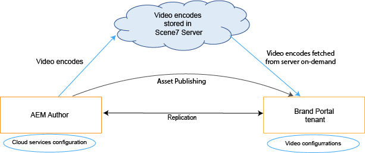
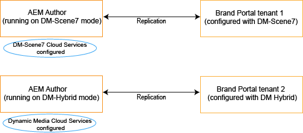
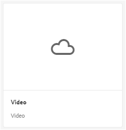
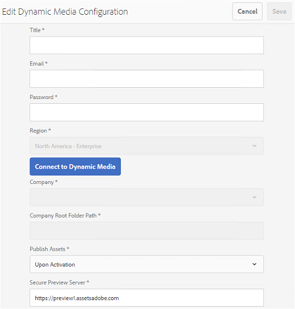

# Dynamic video support on Brand Portal {#dynamic-video-support-on-brand-portal}

Preview and play videos adaptively on Brand Portal with Dynamic Media support. Also download the dynamic renditions from the portal and shared links.
Brand Portal users can:

* Preview videos in Asset Details page, Card View, and link share preview page.
* Play video encodes on Asset Details page.
* View dynamic renditions in Renditions tab on Asset Details page.
* Download video encodes and folders containing videos.

>[!NOTE]
>
>To work with videos and to publish them to Brand Portal, make sure that your AEM Author instance is set up either on Dynamic Media Hybrid mode or Dynamic Media **[!DNL Scene 7]** mode.

To preview, play, and download videos, Brand Portal exposes the following two configurations to administrators:

* [Dynamic Media Hybrid configuration](#configure-dm-hybrid-settings)
If AEM Author instance is running on dynamic media Hybrid mode.
* [Dynamic Media [!DNL Scene 7] configuration](#configure-dm-scene7-settings)
If AEM Author instance is running on dynamic media-**[!DNL Scene 7]** mode.
Set either of these configurations based on the configurations you set in your AEM Author instance with which Brand Portal tenant is replicated.

>[!NOTE]
>
>Dynamic videos are not supported on Brand Portal tenants configured with AEM Author running on **[!UICONTROL Scene7Connect]** runmode.

## How are dynamic videos played? {#how-are-dynamic-videos-played}

If Dynamic Media configurations ([Hybrid](../using/dynamic-video-brand-portal.md#configure-dm-hybrid-settings) or [[!DNL Scene 7]](../using/dynamic-video-brand-portal.md#configure-dm-scene7-settings) configurations) are set up on Brand Portal, the dynamic renditions are fetched from **[!DNL Scene 7]** server. Video encodes are, therefore, previewed and played without delay and distortion in quality.

As video encodes are not stored in Brand Portal repository and are fetched from **[!DNL Scene 7]** server, ensure that the Dynamic Media configurations on AEM Author Instance and Brand Portal are the same.

>[!NOTE]
>
>Video viewers and viewer presets are not supported in Brand Portal. Videos are previewed and played on the default viewers in Brand Portal.

## Prerequisites {#prerequisites}

To work with dynamic videos on Brand Portal, make sure to:

* **Start up AEM Author on DM (Dynamic Media) mode**
Start up the AEM Author instance (with which Brand Portal is configured) either on [Dynamic Media Hybrid mode](https://helpx.adobe.com/experience-manager/6-5/assets/using/config-dynamic.html#EnablingDynamicMedia) or [Dynamic Media [!DNL Scene 7] mode](https://helpx.adobe.com/experience-manager/6-5/assets/using/config-dms7.html#EnablingDynamicMediainScene7mode).
* **Configure Dynamic Media cloud services on AEM Author**
Based on the Dynamic Media mode AEM Author is running on, set either of [Dynamic Media cloud services](https://helpx.adobe.com/experience-manager/6-5/assets/using/config-dynamic.html#ConfiguringDynamicMediaCloudServices) or [[!DNL Scene 7] cloud services](https://helpx.adobe.com/experience-manager/6-5/assets/using/config-dms7.html#ConfiguringDynamicMediaCloudServices) on AEM Author from **Tools** | **Cloud Services** | **Dynamic Media**.  
* **Configure Dynamic Media on Brand Portal**
Based on the Dynamic Media cloud configurations on AEM Author, configure [Dynamic Media settings](#configure-dm-hybrid-settings) or [[!DNL Scene 7] settings](#configure-dm-scene7-settings)  from Brand Portal administrative tools.
Make sure that [separate Brand Portal tenants](#separate-tenants) are used for AEM Author instances configured with Dynamic Media Hybrid and Dynamic Media **[!UICONTROL Scene7]** modes, if you are using functionalities of Dynamic Media Hybrid and Dynamic Media **[!UICONTROL S7]**.
* **Publish folders with video encodes applied to Brand Portal**
Apply [video encodings](https://helpx.adobe.com/experience-manager/6-5/assets/using/video-profiles.html) and publish the folder containing rich media assets from AEM Author instance to Brand Portal.
* **Whitelist Egress IPs in SPS if secure preview enabled**
If using Dynamic Media-**[!DNL Scene 7]** (with [secure preview enabled](https://docs.adobe.com/content/help/en/dynamic-media-classic/using/upload-publish/testing-assets-making-them-public.html) for a company), then it is advised that **[!DNL Scene 7]** company administrator [whitelists the public egress IPs](https://docs.adobe.com/content/help/en/dynamic-media-classic/using/upload-publish/testing-assets-making-them-public.html#testing-the-secure-testing-service) for respective regions using  SPS (**[!UICONTROL Scene 7]** Publishing System) flash UI.
The Egress IPs are as follows:

| **Region**  | **Egress IP** |
|--- |--- |
| NA | 192.243.237.86 |
| EMEA | 185.34.189.4 |
| APAC | 63.140.44.54 |

To whitelist either of these egress IPs, see [prepare your account for secure testing service](https://docs.adobe.com/content/help/en/dynamic-media-classic/using/upload-publish/testing-assets-making-them-public.html#testing-the-secure-testing-service).

## Best Practices

To ensure that your dynamic video assets are successfully previewed, played, and downloaded from Brand Portal (and shared links), follow these practices:

### Separate tenants for Dynamic Media Hybrid and Dynamic Media Scene 7 modes {#separate-tenants}

If you are using both Dynamic Media **[!DNL Scene 7]** and Dynamic Media Hybrid features, it is advised that you use different Brand Portal tenants for AEM Author instances configured with Dynamic Media Hybrid and Dynamic Media **[!DNL Scene 7]** modes. 

### Same configuration details at AEM Author instance and Brand Portal

Ensure that the configuration details–such as **[!UICONTROL Title]**, **[!UICONTROL Registration ID]**, **[!UICONTROL Video Service URL]** (in **[!UICONTROL Dynamic Media Hybrid]**) and **[!UICONTROL Title]**, credentials (**[!UICONTROL Email]** and Password), **[!UICONTROL Region]**, **[!UICONTROL Company]** (in Dynamic Media **[!DNL Scene 7]**)–are the same in Brand Portal and **[!UICONTROL AEM cloud configuration]**.

### Whitelist public egress IPs for Dynamic Media Scene 7 mode

If Dynamic Media **[!UICONTROL Scene 7]**–having [secure preview enabled](https://docs.adobe.com/content/help/en/dynamic-media-classic/using/upload-publish/testing-assets-making-them-public.html)–is used to serve video assets to Brand Portal, then **[!UICONTROL Scene 7]** establishes a dedicated image server for staging environments or internal applications. Any request to this server checks the origin IP address. If the incoming request is not within the approved list of IP addresses, a failure response is returned.
The **[!UICONTROL Scene-7]** Company Administrator, therefore, configures an approved list of IP addresses for their company’s **[!UICONTROL Secure Testing]** environment, through **[!UICONTROL SPS]** (Scene-7 Publishing System) flash UI. Make sure that the egress IP for your respective region (from the following) is added to that approved list.
To whitelist either of these egress IPs, see [prepare your account for secure testing service](https://docs.adobe.com/content/help/en/dynamic-media-classic/using/upload-publish/testing-assets-making-them-public.html#testing-the-secure-testing-service).
The egress IPs are as follows:

| **Region**  | **Egress IP** |
|--- |--- |
| NA | 192.243.237.86 |
| EMEA | 185.34.189.4 |
| APAC | 63.140.44.54 |

## Configure Dynamic Media (Hybrid) settings {#configure-dm-hybrid-settings}

If AEM Author instance is running on dynamic media hybrid mode, then use **[!UICONTROL Video]** tile from administrative tools panel to configure Dynamic Media gateway settings.
>[!NOTE]
>
>The [video encoding profiles](https://helpx.adobe.com/experience-manager/6-5/assets/using/video-profiles.html) are not published to Brand Portal, instead are fetched from the **[!UICONTROL Scene 7]** server. Therefore, for video encodes to be played successfully in Brand Portal, ensure that the configuration details are the same as the [[!UICONTROL Scene7 cloud configuration]](https://helpx.adobe.com/experience-manager/6-5/assets/using/config-dms7.html#ConfiguringDynamicMediaCloudServices) in your AEM Author instance.
To set up Dynamic Media configurations on Brand Portal tenants:

1. Select the AEM logo to access administrative tools from the toolbar at the top, in Brand Portal.

2. From the administrative tools panel, select the **[!UICONTROL Video]** tile. 

**[!UICONTROL Edit Dynamic Media Configuration]** page opens. 

3. Specify **[!UICONTROL Registration ID]** and **[!UICONTROL Video Service URL]** (DM-Gateway URL). Make sure these details are the same as those in **[!UICONTROL Tools > Cloud Services]** in your AEM Author instance.

4. Select **Save** to save the configuration.

## Configure Dynamic Media Scene7 settings {#configure-dm-scene7-settings}

If AEM Author instance is running on Dynamic Media- **[!UICONTROL Scene 7]** mode, then use **[!UICONTROL Dynamic Media Configuration]** tile from administrative tools panel to configure the **[!UICONTROL Scene 7]** server settings.

To set up Dynamic Media **[!UICONTROL Scene 7]** configurations on Brand Portal tenants:

1. Select the AEM logo to access administrative tools from the toolbar at the top, in Brand Portal.

2. From the administrative tools panel, select the **[!UICONTROL Dynamic Media Configuration]** tile. 
![DM [!UICONTROL Scene 7] configuration on Brand Portal](assets/DMS7-Tile.png)
**[!UICONTROL Edit Dynamic Media Configuration]** page opens. 

3. Provide:  
    * **[!UICONTROL Title]**
    * Credentials (**[!UICONTROL Email ID]** and **[!UICONTROL Password]**) to access the Scene 7 server
    * **[!UICONTROL Region]**
Make sure these values are the same as those in your AEM Author instance.

4. Select **[!UICONTROL Connect to Dynamic Media]**.

5. Provide the **[!UICONTROL Company name]**, and **[!UICONTROL Save]** the configuration.
