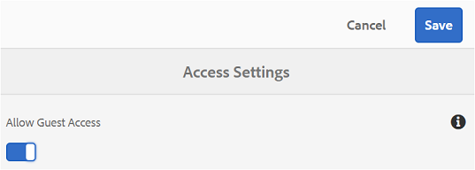
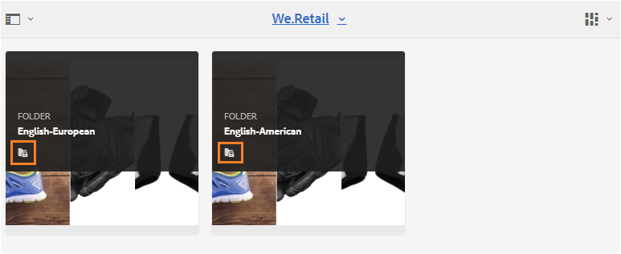
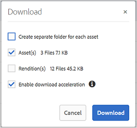

# Guest Access to Brand Portal{#guest-access-to-brand-portal}

AEM Brand portal allows guest access to the portal. A guest user doesn't need credentials to enter the portal and has access to the public assets (and collections) of the portal. Users in the guest session can add assets to their lightbox (private collection) and download the same until their session lasts, which is 2 hours from the beginning of the session unless the guest user chooses to [End Session](/guest-access.md#main-pars_header).

Guest access functionality enables organizations to [quickly share approved assets](/brand-portal-sharing-folders.md#Sharefolders) with the intended audience at scale without having to onboard them. Brand Portal 6.4.2 onwards is equipped to serve multiple concurrent guest users, which is 10% of the total user quota per organization. Allowing guest access saves time to manage and on-board scores of users who need to use limited functionalities on Brand Portal.  
Organizations can enable (or disable) guest access on Brand Portal account of the organization using **Allow Guest Access** option from **Access Settings** in the administrative tools panel.

<!-- 

Comment Type: annotation
Last Modified By: mgulati
Last Modified Date: 2018-08-17T10:42:59.879-0400

Removed the first para: "AEM Assets Brand Portal allows public users to enter the portal anonymously and have restricted access to the allowed public resources as guests. Organization users with guest role need not seek access and authentication from administrators."

 -->

 

## Begin guest session {#begin-guest-session}

To enter Brand Portal anonymously, select **Click here **corresponding to **Guest Access? **on Brand Portal Welcome screen. Users need not seek access and wait for the administrator to authenticate them to grant access to use the Brand Portal.

 

## Guest session duration {#guest-session-duration}

A guest user session remains active for 2 hours. This means that the state of the lightbox is preserved until 1 hour from the session start time, and after 2 hours the current guest session restarts so the lightbox state is lost.  
For example, a guest user logs in to the Brand Portal at 1500 hours and adds assets to lightbox for download at 16:50 hours. If the user doesn't download the lightbox collection (or its assets) before 17:00 hours, the lightbox will become empty as the user will have to restart the session at the end of 1 hour (that is 1700 hours).

## Concurrent guest sessions allowed {#concurrent-guest-sessions-allowed}

The number of concurrent guest sessions is limited to 10% of the total user quota per organization. This means for an organization having user quota of 200, maximum 20 guest users can work at the same time. The 21st user is denied access, and will only be able to access as a guest when the session of any of the 20 active guest users ends.

## Guest user interaction with Brand Portal {#guest-user-interaction-with-brand-portal}

**Guest UI Navigation**

On entering the Brand Portal as the guest, users are able to see all the [assets and folders shared](/brand-portal-sharing-folders.md#Sharefolders) publicly or with guest users exclusively. This view is the content only view, which displays assets in either of the card, list, or column layouts.

However, Guest Users see the folder tree (starting from the root folder) and the shared folders arranged within their respective parent folders on logging in to the Brand Portal, if administrators have enabled [Enable Folder Hierarchy](/brand-portal-general-configuration.md#main-pars_header_1621071021) configuration.

These parent folders are the virtual folders and no actions can be performed on them. You can recognize these virtual folders with a lock icon.

No action tasks are visible on hovering or selecting them in Card View, unlike the shared folders. Overview button is shown on selecting a virtual folder in Column View and List View.

>[!NOTE]
>
>Note that the default thumbnail of the virtual folders is the thumbnail image of the first shared folder.

      

**View Settings** option allows the guest users to adjust card sizes in Card View or columns to display in List View.

The **Content tree **lets you move through assets hierarchy.

Brand Portal provides** Overview** option to Guest users to view Asset Properties of selected assets/folders. The Overview option is visible:

1. In the toolbar at the top on selecting an asset/folder.
1. In the drop-down on selecting the Rail Selector.

On selecting the Overview option while an asset/folder is selected, users can see the title, path, and time of asset creation. Whereas, on asset detail page selecting Overview option lets the users see metadata of the asset.

  

**Navigation** option in the left rail allows navigating from files to collections and back in the guest session so that users can browse through assets in files or collections.

**Filter **option allows guest users to filter asset files and folders using search predicates set by the administrator.

**Guest user capabilities**

Guest users can access public assets on Brand Portal, and also have few restrictions as discussed further.

Guest users can:

* access all the public folders and collections meant for all the Brand Portal users.
* browse members, detail page, and have full asset view of the members of all the public folders and collections.
* search assets across public folders and collections.
* add assets to lightbox collection. These changes to the collection persist during the session.
* download assets directly or through lightbox collection.

Guest users cannot:

* create collections and saved searches, or share them further.
* access folder and collections settings.
* share assets as links.

**Download assets in guest session**

Guest users can directly download assets shared publically or exclusively with guest users on Brand Portal. Guest users can also add assets to Lightbox (public collection), and download the lightbox collection before their session expires.

To download assets and collections, use the download icon from:

* quick action thumbnails, which appear on hovering over the asset/collection
* the toolbar at the top, which appears on selecting the asset/collection

Selecting **Enable download acceleration **on Download dialog lets you [enhance the download performance](/accelerated-download.md#main-pars_header_405749062).

## Exit guest session {#exit-guest-session}

To exit a guest session, use **End Session** from the options available in the header. However, if the browser tab-used for the guest session-is inactive then the session automatically expires after two hours of inactivity.

 

## Monitoring guest user activities {#monitoring-guest-user-activities}

Administrators can monitor guest user interaction with the Brand Portal. Reports generated in Brand Portal can provide key insights into guest user activities. For example, **Download **report can be used to track the count of assets downloaded by the guest user. **User Logins** report can inform when did the guest user last logged in to the portal and frequency of logins in a specified duration.
