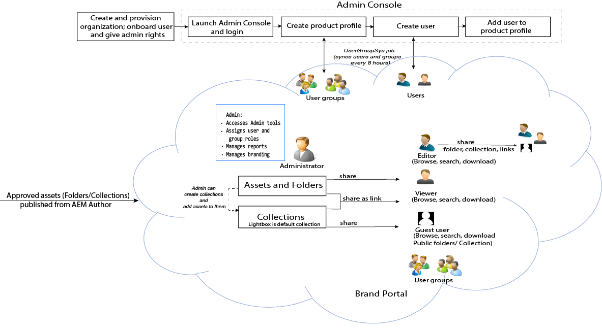

# Adobe Experience Manager Assets Brand Portal Guide {#aem-brand-portal}

**Adobe Experience Manager Assets Brand Portal** aids organizations to meet their marketing needs by securely distributing approved brand and product assets to external agencies, partners, internal teams, and resellers for download.

The lack of a secure asset sharing solution can result in:

* Manual asset sharing through email or cloud
* Brand compliance issues
* Lack of control over asset usage
* Delays in campaigns and product launches
* Duplication of content across geographic locations and organizations
* Unsecured storage of assets before release

With Brand Portal, organizations can ensure brand compliance by enabling marketers to collaborate with channel partners and internal business users to quickly create, manage, and deliver the latest design guidelines, logos, campaign and product assets to the stakeholders.
Brand Portal is a cloud-based SAAS offering. It is available as an add-on to Adobe Experience Manager Assets product (on premise or managed service).

Brand Portal solution workflow is illustrated in the following image.

## Adobe Experience Manager Brand Portal User Guide

This user guide documents insights in to Brand Portal offerings and key workflows. Use the left rail to navigate through various functionalities and drill down to know how different personas interact with the portal.

### See also

| User Guide | Description |
|--- |---|
| [What's new](whats-new.md) | What changed and latest offerings in Brand Portal through previous releases. |
| [Release Notes](brand-portal-release-notes.md) | Enhancements, critical issues fixed, and known issues in the current release. |
| [Configure Experience Manager Assets with Brand Portal](../using/configure-aem-assets-with-brand-portal.md) | How to replicate Brand Portal with Experience Manager Assets to publish assets. |
| [Troubleshoot issues in parallel publishing](troubleshoot-parallel-publishing.md) | Troubleshoot replication between Brand Portal and Experience Manager Assets. |
| [Supported file formats](brand-portal-supported-formats.md) | File formats supported in Brand Portal for preview and download. |
| [Publish Assets to Brand Portal](brand-portal-sharing-folders.md) | How to publish folders, collections, links, presets, schema, facets, and tags to Brand Portal. |
| [Asset Sourcing in Brand Portal](brand-portal-asset-sourcing.md) | How to configure Asset Sourcing in AEM Assets, upload assets in Brand Portal and publish contribution folder back to AEM Assets. |
| [Brand Portal feature videos](https://experienceleague.adobe.com/?lang=en&tag=Brand+Portal#recommended/solutions/experience-manager) | Learn how to use Experience Manager Assets Brand Portal with the help of video tutorials. |

### Helpful resources

* [Understanding Brand Portal with AEM Assets](https://experienceleague.adobe.com/docs/experience-manager-brand-portal/using/home.html)
