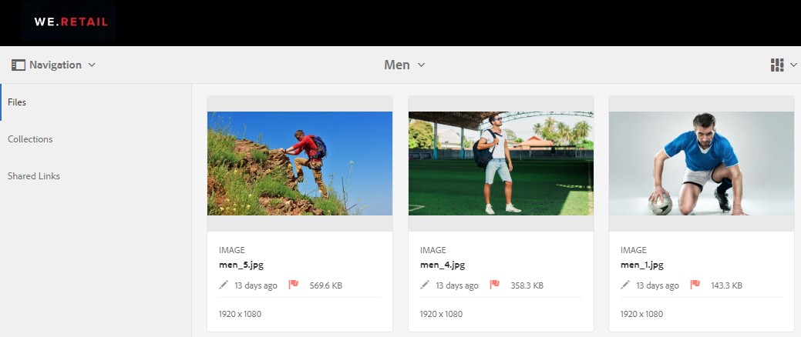
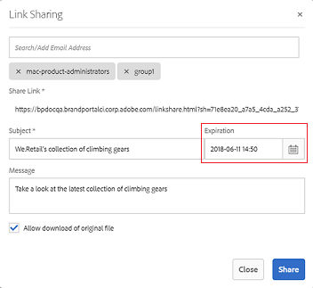
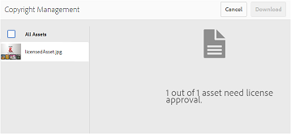

# Manage digital rights of assets{#manage-digital-rights-of-assets}

Ensuring secure distribution and usage of creative assets and the brand material is vital to protect your brand. This can be enforced across the organization and outside by associating an expiration date (and time) with approved assets published from AEM to Brand Portal, or by licensing these assets for conditional use. Also, Brand Portal allows you to specify an expiration date for links to the assets shared from Brand Portal.

Read on to know how the assets are secured on Brand Portal and understand the associated usage permissions.

## Asset expiration {#asset-expiration}

Asset expiration is an effective way of controlling the usage of approved assets on Brand Portal across an organization. All the assets published from AEM Assets to Brand Portal can have an expiration date, which restricts the usage of these assets by different user roles.

**Usage permissions related to expired assets**

In Brand Portal, Administrators can view, download, and add expired assets to collections. Whereas, Editors and Viewers can only view and add expired assets to collections.

Administrators can publish expired assets from AEM Assets to Brand Portal. However, expired assets cannot be shared via ink from Brand Portal. If you select any expired asset from a folder containing both expired and non-expired assets, the **Share Link** action is not available. But, if you select a folder that contains expired and non-expired assets, the **Share** and **Share Link** actions are available.

>[!NOTE]
>
>A folder can still be shared as a link, even if it contains expired assets. In this case, the link does not list expired assets and only the non-expired assets are shared.

The following table displays the usage permissions of expired assets:

|   |**Link share** |**Download** |**Properties** |**Add to collection** |**Delete** |
|---|---|---|---|---|---|
| **Administrator** |Unavailable |Available |Available |Available |Available |
| **Editor** |Unavailable |Unavailable |Available |Available |Unavailable |
| **Viewer** |Unavailable |Unavailable |Available |Available |Unavailable |
| **Guest user** |Unavailable |Unavailable |Available |Available |Unavailable |

>[!NOTE]
>
>If Viewers and Editors download a folder containing expired and non-expired assets, only the non-expired assets are downloaded. If a folder contains only expired assets, an empty folder is downloaded.

### Expiration status of assets {#expiration-status-of-assets}

You can view the expiration status of assets in their Card View. A red flag on the card indicates that the asset has expired.

>[!NOTE]
>
>List and Column views do not display the expiration status of assets.

## Asset Link Expiration {#asset-link-expiration}

While sharing assets through links, Administrators and Editors can set a date and time of expiration using the **Expiration** field in the **Link Sharing** dialog box. The default expiration of link is seven days from the date on which link is shared.

It ensures that assets shared as links expire at the date and time set by Brand Portal Administrators and Editors, and can no longer be viewed and downloaded beyond the expiration date. As the assets shared through links can also be viewed by external users who are not part of the organization, by specifying expiration you can make sure that your approved assets are protected and not exposed to unknown entities beyond a specified time.

For more information about link sharing, refer to [Share assets as a link](/using/brand-portal-link-share.html?cq_ck=1508225709179#Shareassetsasalink).

## Licensed Assets {#licensed-assets}

Licensed assets are subject to the acceptance of a license agreement prior to download from Brand Portal. This agreement for licensed assets comes when you directly download the asset from Brand Portal or via a shared link. Whether expired or not expired, license-protected assets can be viewed by all the users. However, the download and usage of expired licensed assets are limited. To know about the behavior of expired licensed assets and permissible activities based on user roles, refer to [usage permissions of expired assets](../using/manage-digital-rights-of-assets.md#main-pars_text_1982245382).

License-protected assets have [license agreement attached](/content/help/en/experience-manager/6-4/assets/using/drm#main-pars_text) to them, which is done by setting asset's [metadata property](/content/help/en/experience-manager/6-4/assets/using/drm#main-pars_text) in AEM Assets.

If you choose to download license-protected asset(s), you are redirected to **Copyright Management** page.

Here you need to select the asset to download and accept the associated license agreement. If you do not accept the license agreement, the **Download** button is not enabled.

If the selection contains multiple protected assets, select one asset at a time, accept the license agreement, and proceed to download the asset.

## Generate report about expired assets {#generate-report-about-expired-assets}

Administrators can generate and download a report listing all the assets expired within a specific time frame. This report includes detailed information— such as size, type, path specifying asset location in the asset hierarchy, when did the asset expire, and when was the asset published— about the expired assets. Columns of this report can be customized to display more data based on user requirements.

For more information about the reports feature, refer [Work with reports](../using/brand-portal-reports.md#Createandmanageadditionalreports).
