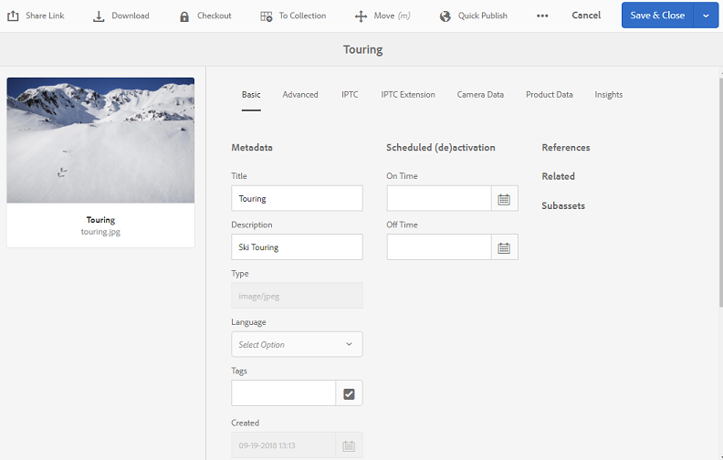
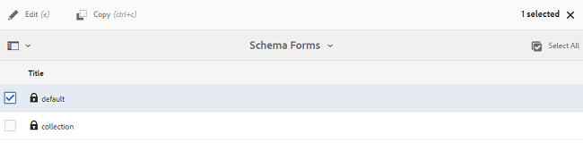
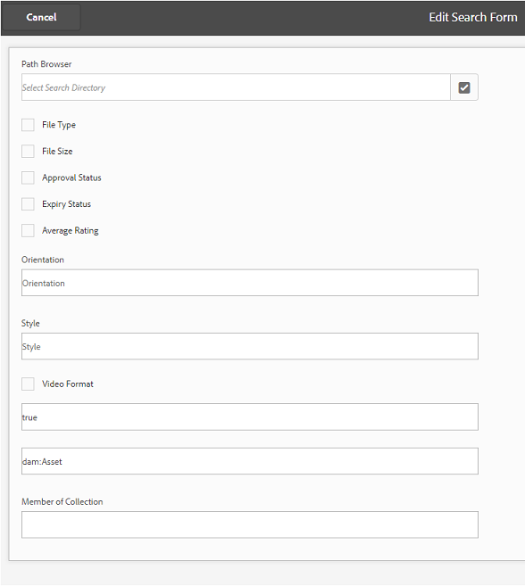

# Publish presets, schema, and facets to Brand Portal {#publish-presets-schema-and-facets-to-brand-portal}

The article delves into publishing image presets, metadata schemas, and custom search facets from AEM Author instance to Brand Portal. Publishing capability enables organizations to reuse the image presets, metadata schemas, and search facets created/modified at AEM Author instance thereby reducing duplicate efforts.

>[!NOTE]
>
>The capability to publish image presets, metadata schema, and search facets from AEM Author instance to Brand Portal is available AEM 6.2 SP1-CFP7 and AEM 6.3 SP 1-CFP 1 (6.3.1.1) onwards.

## Publish image presets to Brand Portal {#publish-image-presets-to-brand-portal}

Image presets are a set of sizing and formatting commands that are applied to the image at the time of image delivery. Image presets can be created and modified at Brand Portal. Alternatively, if AEM Author instance is running in dynamic media mode then users can create presets at the AEM Author and publish them to AEM Assets Brand Portal, and avoid re-creating the same presets at Brand Portal.  
Once the preset is created, it is listed as dynamic rendition on asset detail renditions rail and download dialogue.

>[!NOTE]
>
>If AEM Author instance is not running in [!UICONTROL Dynamic Media Mode] (customer has not purchased Dynamic Media), then the [!UICONTROL Pyramid TIFF]  rendition of the assets are not created at the time of upload. Image presets or dynamic renditions work on [!UICONTROL Pyramid TIFF] of an asset, so if [!UICONTROL Pyramid TIFF] is not available on AEM Author instance then it is not available on Brand Portal as well. As a result of this, no dynamic renditions are present in renditions rail of asset details page and download dialogue.

To publish image presets to Brand Portal:

1. In AEM Author instance, tap/ click the AEM logo to access the global navigation console and tap/ click the Tools icon and navigate to **[!UICONTROL Assets]** &gt; **[!UICONTROL Image Presets]**.
2. Select the image preset or multiple image presets from the list of image presets and click/ tap **[!UICONTROL Publish to Brand Portal]**.

>[!NOTE]
>
>When users click **[!UICONTROL Publish to Brand Portal]** the image presets are queued for publishing. Users are advised to monitor the log of the replication agents to confirm if the publish was successful.

To unpublish an image preset from Brand Portal:

1. In AEM Author instance, tap/ click the AEM logo to access the global navigation console and tap/click the **[!UICONTROL Tools]** icon and navigate to **[!UICONTROL Assets &gt; Image Presets]**.
2. Select an image preset, and select **[!UICONTROL Remove from Brand Portal]** from the options available at the top.

## Publish metadata schema to Brand Portal  {#publish-metadata-schema-to-brand-portal}

Metadata schema describes the layout and properties that are displayed on the properties page of asset/ collections.

 

If users have edited the default schema on AEM Author instance and are willing to use the same schema as default schema on the Brand Portal, they can simply publish the metadata schema forms to Brand Portal. In such a scenario, the default schema at Brand Portal is over-ridden by the default schemas published from AEM Author instance.

If users have created a custom schema on AEM Author instance, they can publish the custom schema to Brand Portal instead of re-creating the same custom schema there. Users can then apply this custom schema to any folder/ collection in Brand Portal.

>[!NOTE]
>
>Default schemas cannot be published to the Brand Portal if they are locked at the AEM instance (that is they are unedited).

>[!NOTE]
>
>If a folder has a schema applied on AEM Author instance, the same schema must also exist on the Brand Portal to maintain the consistency in the asset properties page on AEM Author and Brand Portal.

To publish a metadata schema from AEM Author instance to Brand Portal:

1. In AEM Author instance, tap/ click the AEM logo to access the global navigation console and tap/click the Tools icon and navigate to **[!UICONTROL Assets &gt; Metadata Schemas]**.
2. Select a metadata schema, and select **[!UICONTROL Publish to Brand Portal]** from the options available at the top.

>[!NOTE]
>
>When users click **[!UICONTROL Publish to Brand Portal]**, the metadata schemas are queued for publishing. Users are advised to monitor the log of the replication agents to confirm if the publish was successful.

To unpublish a metadata schema from Brand Portal:

1. In AEM Author instance, tap/ click the AEM logo to access the global navigation console and tap/click the Tools icon and navigate to **[!UICONTROL Assets &gt; Metadata Schemas]**.
2. Select a metadata schema, and select **[!UICONTROL Remove from Brand Portal]** from the options available at the top.

## Publish search facets to Brand Portal {#publish-search-facets-to-brand-portal}

Search forms provide the capability of [faceted search](../using/brand-portal-search-facets.md) to users on Brand Portal. Search facets impart greater granularity to searches on Brand Portal. All the [predicates added](https://helpx.adobe.com/experience-manager/6-5/assets/using/search-facets.html#AddingaPredicate) in the search form are available to users as search facets in search filters.

If you are willing to use custom search form **[!UICONTROL Assets Admin Search Rail]** from AEM Author instance, then instead of re-creating the same form on Brand Portal you can publish the customized search form from AEM Author instance to Brand Portal.

>[!NOTE]
>
>Locked search form **[!UICONTROL Assets Admin Search Rail]** on AEM Assets cannot be published to Brand Portal unless it is edited. Once edited and published to Brand Portal, this search form overrides the search form on Brand Portal.

To publish the edited search facet from AEM Author instance to Brand Portal:

1. Tap/click the AEM logo, and then go to **[!UICONTROL Tools]** &gt; **[!UICONTROL General]** &gt; **[!UICONTROL Search Forms]**.
2. Select the edited search form, and select **[!UICONTROL Publish to Brand Portal]**.

   >[!NOTE]
   >
   >When users click **[!UICONTROL Publish to Brand Portal]**, the search facets are queued for publishing. Users are advised to monitor the log of the replication agents to confirm if the publish was successful.

To unpublish search forms from Brand Portal:

1. In AEM Author instance, tap/ click the AEM logo to access the global navigation console and tap/click the Tools icon and navigate to **[!UICONTROL General &gt; Search Forms]**.
2. Select the search form, and select **[!UICONTROL Remove from Brand Portal]** from the options available at the top.

>[!NOTE]
>
>The **[!UICONTROL Unpublish from Brand Portal]** action leaves the default search form on Brand  Portal,  and does not restore to the last search form used before publishing.

### Limitations {#limitations}

1. Few search predicates are not applicable to search filters on the Brand Portal. When these search predicates are published as part of the search form from AEM Author instance to Brand Portal, they are filtered out. Users, therefore, see less number of predicates in the published form at the Brand Portal. See [search predicates applicable to filters on Brand Portal](../using/brand-portal-search-facets.md#list-of-search-predicates).

2. For [!UICONTROL Options Predicate], if a user is using any custom path to read options at AEM Author instance, it won't work at the Brand Portal. These additional paths and options are not published to Brand Portal with the search form. In this case, users can select the **[!UICONTROL Manual]** option in **[!UICONTROL Add Options]** within **[!UICONTROL Options Predicate]** to add these options manually at Brand Portal.

