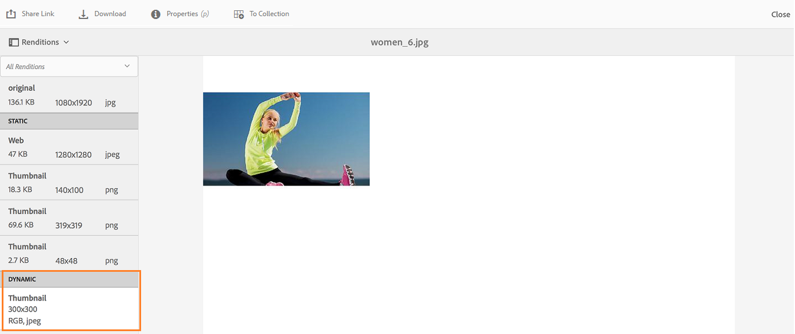

# Usage workflows, troubleshooting, and best practices in Brand Portal{#usage-workflows-troubleshooting-and-best-practices-in-brand-portal}

## How to share collections to a user group? {#how-to-share-collections-to-a-user-group}

You don’t need to add users to the group. Adding users to product configuration and sharing a folder with product configuration should work. (https://jira.corp.adobe.com/browse/CQDOC-10888)

A flow chart relating to steps in https://helpx.adobe.com/experience-manager/brand-portal/using/brand-portal-adding-users.html.

How do I share assets or collections to a group of users?

What we are trying to do is to add external users (from an agency partner) to ABP and grant them access to a collection. Counterintuitively, it appears that the way to do this is to create a Product Profile and add users to that Product Profile, and then the Profile shows up like a Group to which a collection can be shared.

I think we’ve just found that “Groups” themselves don’t really do much for us other than basic user segregation since you cannot share a collection with a Group.

If we have that right, then we will just proceed with adding users to the base profile (to ensure they get the email notifying them of their access - which apparently is only triggered from the default profile) and then to a separate  profile  we’ll use to control access to specific collections of assets.

**Prerequisites:**

**How?  
**

Admin publishes assets/folders/collections from AEM Author to BP (the concept of public folder publish). On BP, Admin can share the assets/folders/collections further to other users (Non-admin users like Editors and Viewers). Editors can publish the assets/folders/collections further to other users like viewers and editors. But the viewer can only view and not share.

>[!NOTE]
>
>User Roles in collection settings: whenever a user shares a collection further, the effective role of the user always applies and not the role you mention while sharing the collection.

>[!NOTE]
>
>Viewer  can create  collection  and hence becomes  owner  of that collection. But since he doesn't have rights to see what other users are there in his organization hence when he tries to share the collection he created he sees only his email and the groups which he belongs to. So he can share  collection  with his groups but not with individual members of the organization.

## Why dynamic renditions are empty even after creating image presets? {#why-dynamic-renditions-are-empty-even-after-creating-image-presets}

Image presets created (on Brand Portal instance) or published from AEM Author instance are visible under **Dynamic **within **Renditions **of an asset on Asset Details page.

While [downloading](../using/brand-portal-download-users.md) an asset, there is an option to download **Dynamic Renditions** on download dialog. Here, you can use the available presets or specify new presets at the run-time.

However, the dynamic renditions are not listed on Asset Details page for the assets whose Pyramid Tiff (PTIFF) is not present on AEM Author instance.

**Prerequisite**

Pyramid Tiff (PTIFF) for assets is created when AEM Author instance is running on Dynamic Media mode.

**Enable the Dynamic Media on AEM Author**

To enable dynamic media mode, choose between the following two options:

1. On the command line, when launching the quickstart, do either of the following:

    * Add **-r  dynamicmedia ** to the end of the command line when starting the jar file.

      java -Xmx2048m -XX:MaxPermSize=512m -jar  cq -quickstart-6.3.0.jar -r  dynamicmedia

    * Insert ** dynamicmedia ** within the name of the quickstart jar, such as  cq -quickstart-  dynamicmedia -6.3.0.jar.  
  
      java -Xmx2048m -XX:MaxPermSize=512m -jar cq-quickstart-dynamicmedia-6.3.0.jar

1. After downloading the quickstart jar file, modify the filename of the jar itself by inserting **dynamicmedia, **before you open the file.

   cq-quickstart-dynamicmedia-6.3.0.jar

## Why don't search suggestions come? {#why-don-t-search-suggestions-come}

How  Search suggestions work ?

Search suggestions for custom properties

Search suggestions work for the asset:

* Title
* Description
* Tags

Search suggestions work if users input a minimum 3 characters of title, description, or tags.

## why do I see 401 unauthorized error while connecting from AEM to BP? {#why-do-i-see-unauthorized-error-while-connecting-from-aem-to-bp}

