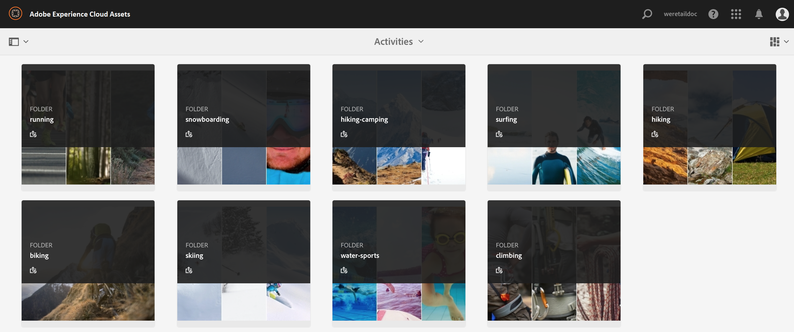
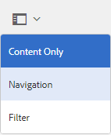
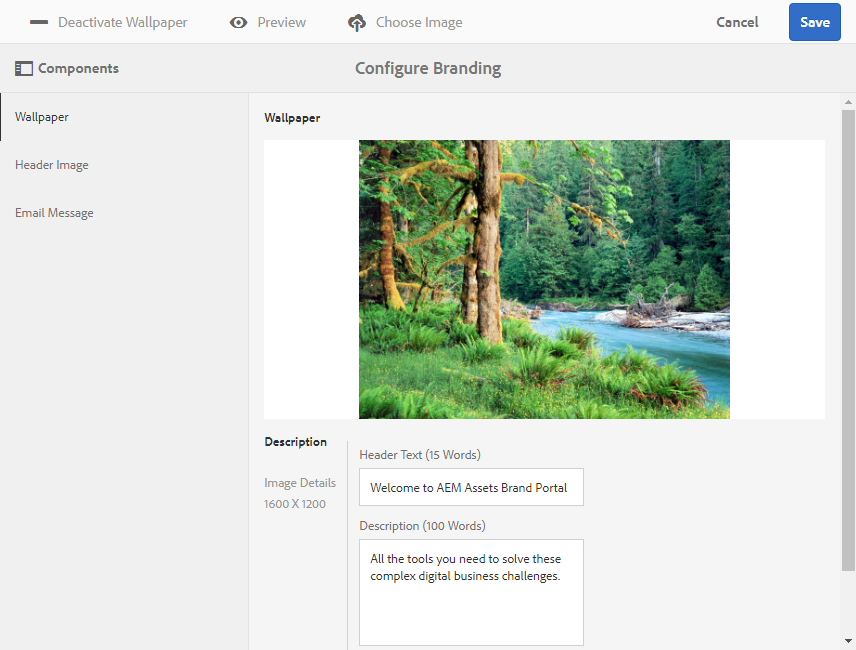

# What's new in AEM Assets Brand Portal{#what-s-new-in-aem-assets-brand-portal}

Take a look at the new features and enhancements for 6.3.1.

Adobe Experience Manager (AEM) Assets Brand Portal helps you easily acquire, control, and securely distribute approved creative assets to external parties and internal business users across devices. It helps improve the efficiency of asset sharing, accelerates the time-to-market for assets, and reduces the risk of non-compliance and unauthorized access. Adobe is working to improve the overall Brand Portal experience. Here is a sneak peek into the new features and enhancements coming this year.

## What's changing {#what-s-changing}

Brand Portal 6.3.1 includes new and enhanced functionality oriented toward aligning Brand Portal with AEM.

### Upgraded user interface {#upgraded-user-interface}

To align Brand Portal user experience with AEM, Adobe is transitioning to Coral 3 user interface. This change enhances the overall usability, including navigation, and look and feel.

#### Enhanced navigational experience {#enhanced-navigational-experience}

* Quick access to administrative tools through the new Adobe logo:

* Product navigation through an overlay:

* Quick navigation to parent folders:

* Quick search and navigation to the required content and tools:

### Enhanced browsing experience {#enhanced-browsing-experience}

* New column view to browse through nested folders:

 

* In the list of assets in a folder, the latest asset uploaded appears at the top.

### Enhanced search experience {#enhanced-search-experience}

* The new Omni search feature facilitates quick access to relevant content, capability, or tags through automatic suggestions as you type search keywords. Omni search is available across all search features.

* You can also add search filters to Omni search to further narrow down and quicken your search.

* The new asset rating-based search lets you search for assets with ratings, if published from AEM Assets.
* The new multi-value search feature accepts multiple keywords with the AND operator to discover assets faster.
* The new search boost capability lets you improve the search relevance so that specific assets appear at the top of the search results.
* The new path-based search feature lets you provide the path to a nested folder to be able to search assets in that folder.

#### New smart tags-based search {#new-smart-tags-based-search}

If images with smart tags are published from AEM Assets to Brand Portal, you can search for these images in Brand Portal using the smart tag names as search keywords. This feature is available only for files.

### Enhanced downloading experience {#enhanced-downloading-experience}

After downloading a nested folder, you can preserve the original folder hierarchy. Assets inside a nested folder are downloadable in a single folder as opposed to separate folders.

### Improved performance {#improved-performance}

Enhancements in the browse, search, and download capabilities significantly improve Brand Portal performance.

### New digital rights management for assets {#new-digital-rights-management-for-assets}

Administrators can set the expiry date and time for assets before sharing them. After an asset expires, it is visible to viewers and editors, but not downloadable. When an asset expires, administrators receive a notification.

### Enhanced asset sorting {#enhanced-asset-sorting}

Asset sorting in a folder in list view is no longer restricted to the number of assets being displayed on the first page. All assets in a folder are sorted, irrespective of whether all are listed on the first page.

### Enhanced reporting capabilities {#enhanced-reporting-capabilities}

Administrators can create and manage three types of reports—assets downloaded, expired, and published. The ability to configure the columns in a report, and export the reports to CSV format is also available.

### Additional metadata {#additional-metadata}

Brand Portal 6.3.1 introduces additional metadata, which is at par with AEM Assets 6.3. You can use the Schema Editor form to control the metadata that should be visible on the Assets Properties page. Asset metadata is not visible to external link share users, who can only preview and download assets using the link share URL. 

### Additional capabilities for administrators {#additional-capabilities-for-administrators}

* Before finalizing customizations to the login screen wallpaper, administrators can preview the changes.

* After an administrator adds new users, they need not accept invitations to get added to Brand Portal, they are added automatically.

### New publishing capabilities in AEM Assets 6.3 {#new-publishing-capabilities-in-aem-assets}

* AEM administrators can publish metadata schema from AEM Assets to Brand Portal using AEM 6.3 SP 1-CFP 1 (6.3.1.1), which will be available in Q4 2017.

* AEM administrators can publish all the tags from AEM Assets to Brand Portal using AEM 6.2 SP1-CFP7 and AEM 6.3 SP 1-CFP 1 (6.3.1.1).

* From AEM Assets, you can publish assets and collections that have tags, including smart tags. You can then search for these assets or collections using these tags as search keywords in Brand Portal.

## Frequently asked questions {#frequently-asked-questions}

All of your existing features and configurations remain intact. Your end users are not impacted, and your content remains intact.

Users move to the new Brand Portal in Q4 2017.

This change is exclusively within Brand Portal, so there is no impact to your end users.

There is no action required by the administrator. Once you get access to the new Brand Portal, refer to the documentation to see all the bells and whistles.

Contact your Adobe Account Manager or Customer Support.
