# What's new in AEM Assets Brand Portal {#what-s-new-in-aem-assets-brand-portal}

Adobe Experience Manager (AEM) Assets Brand Portal helps you easily acquire, control, and securely distribute approved creative assets to external parties and internal business users across devices. It helps improve the efficiency of asset sharing, accelerates the time-to-market for assets, and reduces the risk of non-compliance and unauthorized access. Adobe is working to improve the overall Brand Portal experience. Here is a sneak peek into the new features and enhancements.

## What changed in 6.4.5 {#what-changed-in-645}

Brand Portal 6.4.5 is a feature release that focuses on providing Brand Portal users (external agencies/teams) with the ability to upload content to Brand Portal and publish to AEM Assets, without needing access to the author environment. This feature is called **[Asset Sourcing in Brand Portal](brand-portal-asset-sourcing.md)**, and will improve customer experiences by providing a two-way mechanism for users to both contribute and share assets with other globally distributed Brand Portal users.

### Asset Sourcing in Brand Portal {#asset-sourcing-in-bp}

Asset Sourcing allows AEM users (administrators/non-admin users) to create new folders with an additional **Asset Contribution** property, ensuring the new folder created open to asset submission by Brand Portal users. This automatically triggers a workflow which creates two additional sub folders, called NEW and SHARED, within the newly created **Contribution** folder.

The AEM user then defines the requirement by [uploading a brief](brand-portal-configure-contribution-folder-properties.md) about the types of assets that should be added to the contribution folder, as well as [uploading baseline assets](brand-portal-upload-baseline-assets.md), to the **SHARED** folder to ensure BP users have the reference information they need. The administrator can then grant active Brand Portal users access to the contribution folder before publishing the newly created **Contribution** folder to Brand Portal.

Once the user is finished adding content in the **NEW** folder, they can publish the contribution folder back to the AEM author environment. Please note that it may take a few minutes to complete the import and reflect the newly published content within AEM Assets.

Additionally, all existing functionality remains unchanged. Brand Portal users can view, search, and download assets from the contribution folder as well as from the other permitted folders. And administrators can further share the contribution folder, modify properties and add assets to collections. See latest [Brand Portal Release Notes](brand-portal-release-notes.md).

>[!NOTE]
>

>Asset Sourcing in Brand Portal is supported on AEM 6.5.2.0 and above.
>
>The feature is not supported in the earlier versions - AEM 6.3 and AEM 6.4.

### Upload assets to contribution folder {#upload-assets-in-bp} 

Brand Portal users with appropriate permissions can [download the asset requirements](brand-portal-download-asset-requirements.md) to understand the need of contribution and upload multiple assets or folders containing multiple assets to the contribution folder. However, please note that Brand Portal users are only able to upload assets to the **NEW** subfolder. The **SHARED** folder is meant for the distribution of requirements and baseline assets. See, [Upload assets to contribution folder](brand-portal-upload-assets-to-contribution-folder.md)

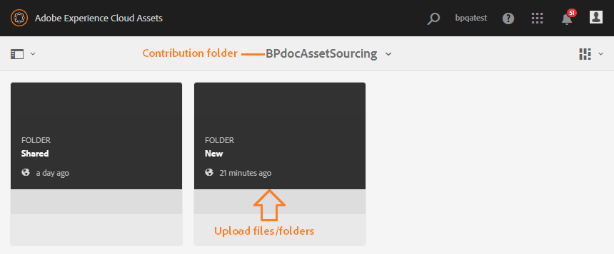

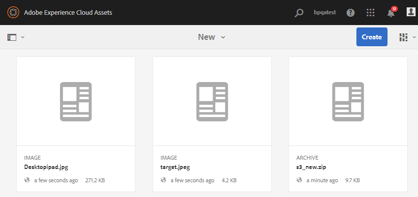

### Publish contribution folder to AEM Assets {#publish-assets-to-aem}

Once upload is complete to the **NEW** folder, Brand Portal users can then publish the contribution folder back to AEM. It may take few minutes to import and reflect the published content/assets in AEM Assets. See, [Publish contribution folder to AEM Assets](brand-portal-publish-contribution-folder-to-aem-assets.md)

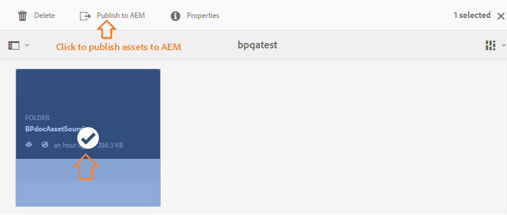

## What changed in 6.4.4 {#what-changed-in-644}

Brand Portal 6.4.4 release focuses on enhancements to text search and top customer requests. See latest [Brand Portal Release Notes](brand-portal-release-notes.md).

### Search enhancements {#search-enhancements}

Brand Portal 6.4.4 onwards supports partial text search on property predicate in filtering pane. To allow partial text search you need to enable **Partial Search** in Property Predicate in the search form.

Read on to know more about partial text search and wildcard search.

#### Partial phrase search {#partial-phrase-search}

You can now search for assets by specifying only a part—that is a word or two—of the searched phrase in filtering pane.

**Use case**
Partial phrase search is helpful when you are unsure of the exact combination of words occurring in the searched phrase.

For example, if your search form in Brand Portal uses Property Predicate for partial search on assets title, then specifying the term **camp** returns all the assets with the word camp in their title phrase.

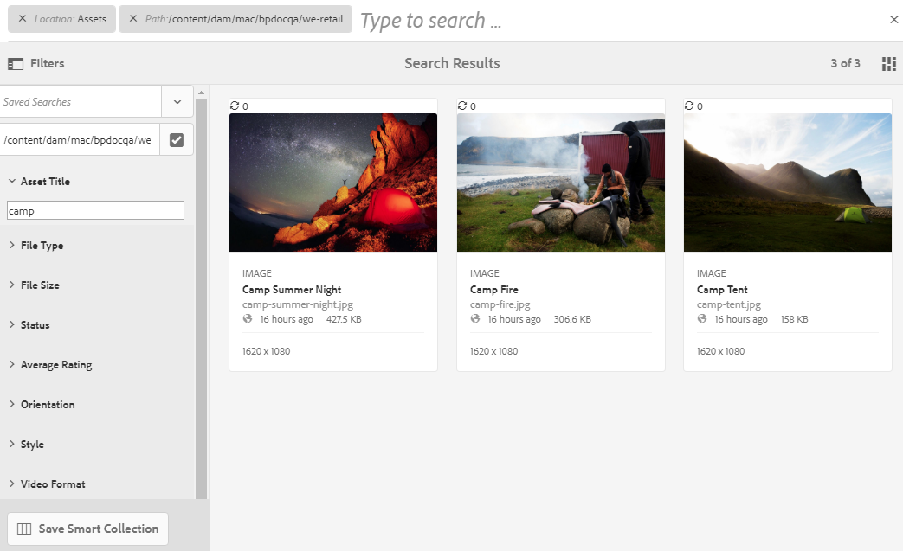

#### Wildcard search {#wildcard-search}

The Brand Portal allows using the asterisk (&#42;) in search query along with a part of the word in your searched phrase.

**Use case**
If you are not sure of the exact words occurring in the searched phrase, you can use a wildcard search to fill the gaps in your search query.

For example, specifying **climb&#42;** returns all the assets having words beginning with the characters **climb** in their title phrase if search form in Brand Portal uses Property Predicate for partial search on assets title.

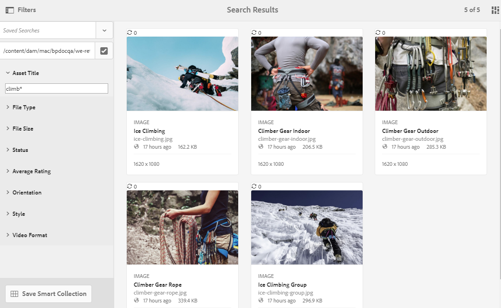

Similarly, specifying:

* **&#42;climb** returns all the assets having words ending with characters **climb** in their title phrase.

* **&#42;climb&#42;** returns all the assets having words comprising the characters **climb** in their title phrase.

>[!NOTE]
>
>On selecting **Partial Search** checkbox, **Ignore Case** is selected by default.

## What changed in 6.4.3 {#what-changed-in}

 Brand Portal 6.4.3 release focuses on — providing organizations with an alternate alias in addition to their tenant ID in Brand Portal access URL, new folder hierarchy configuration, video support enhancements, scheduled publishing from AEM Author instance to Brand Portal, operational enhancements — and cateres to customer requests.

### Folder hierarchy navigation for non-admins

Administrators can now configure how the folders are shown to non-admin users (Editors, Viewers, and Guest Users) on login. [Enable Folder Hierarchy](../using/brand-portal-general-configuration.md) configuration is added in **General Settings**, in the admin tools panel. If the configuration is:

* **enabled**, the folder tree starting from the root folder is visible to non-admin users. Thus, granting them a navigation experience similar to administrators.
* **disabled**, only the shared folders are displayed on the landing page.

 
**The use case**

The [Enable Folder Hierarchy](../using/brand-portal-general-configuration.md) functionality (when enabled) helps you differentiate the folders with the same names shared from different hierarchies. On logging in, non-admin users now see the virtual parent (and ancestor) folders of the shared folders.
 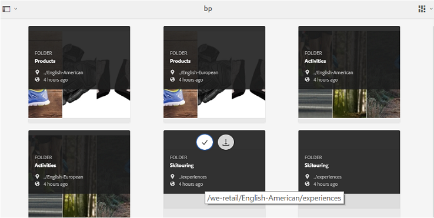 

The shared folders are organized within the respective directories in virtual folders. You can recognize these virtual folders with a lock icon.

Note that the default thumbnail of the virtual folders is the thumbnail image of the first shared folder.

### Search in specific folder hierarchy or path

**Path Browser** predicate is introduced in Search Form to allow searching of assets in a specific directory. The default search path of search predicate for Path Browser is */content/dam/mac/&lt;tenant-id&gt;/*, which can be configured by editing the default search form.

* Admin users can use Path Browser to navigate to any folder directory on Brand Portal.
* Non-admin users can use Path Browser to navigate only to the folders (and navigate back to the parent folders) shared with them.
For example, */content/dam/mac/&lt;tenant-id&gt;/folderA/folderB/folderC* is shared with a non-admin user. The user can search for assets within folderC using Path Browser. This user can also navigate to folderB and folderA (since they are ancestors of the folderC that is shared with the user).

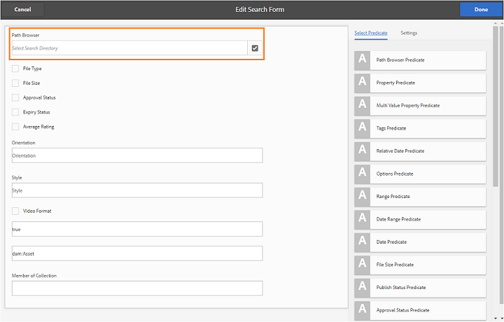

**The use case**

You can now restrict asset search within a specific folder you have browsed to, instead of beginning at the root folder.

Note that searching under these folders returns results only from the assets that have been shared with the user.

 

### Dynamic Media video renditions support

Users whose AEM Author instance is on Dynamic Media hybrid mode can preview and download the dynamic media renditions, in addition to the original video files.

To allow preview and download of dynamic media renditions on specific tenant accounts, administrators need to specify **Dynamic Media Configuration** (video service URL (DM-Gateway URL) and registration ID to fetch the dynamic video) in **Video** configuration from admin tools panel.

**The use case**
Dynamic Media videos can be previewed on:

* Asset details page
* Asset's card view
* Link share preview page

Dynamic Media Video encodes can be downloaded from:

* Brand Portal
* Shared link

### Scheduled publish to Brand Portal

Assets (and folders) publish workflow from [AEM (6.4.2.0)](https://helpx.adobe.com/experience-manager/6-4/release-notes/sp-release-notes.html#main-pars_header_9658011) Author instance to Brand Portal can be scheduled for a later date, time.

Similarly, published assets can be removed from the portal at a later date (time), by scheduling the Unpublish from Brand Portal workflow.

 

### Configurable tenant alias in URL

Organizations can get their portal URL customized, by having an alternate prefix in the URL. To get an alias for tenant name in their existing portal URL, organizations need to contact Adobe support.

Note that only the prefix of the Brand Portal URL can be customized and not the entire URL.  
For example, an organization with existing domain **geomettrix.brand-portal.adobe.com** can get **geomettrixinc.brand-portal.adobe.com** created on request.

However, AEM Author instance can be [configured](https://helpx.adobe.com/experience-manager/6-5/assets/using/brand-portal-configuring-integration.html) only with the tenant id URL and not with tenant alias (alternate) URL.

**The use case**
Organizations can meet their branding needs by getting the portal URL customized, instead of sticking to the URL provided by Adobe.

### Download experience enhancements

The release offers simplified download experience with a reduced number of clicks and warnings, on:

* opting to download only the renditions (and not the original assets).
* downloading the assets when access to the original renditions is restricted.

## What changed in 6.4.2 {#what-changed-in-1}

 Brand Portal 6.4.2 release brings in a range of capabilities to address asset distribution needs of organizations and help them reach out to a large number of users distributed globally through Guest access and optimum experience with accelerated downloads. Brand Portal also provides greater control to organizations through new configurations for administrators, newly added report, and caters to customer requests.

### Guest Access

AEM Brand portal allows guest access to the portal. A guest user doesn't require credentials to enter the portal and can access and download all the public folders and collections. Guest users can add assets to their lightbox (private collection) and download the same. They can also view smart tag search and search predicates set by administrators. The guest session does not allow users to create collections and saved searches or share them further, access folder and collections settings, and share assets as links.

In an organization, multiple concurrent guest sessions are allowed, which is limited to 10% of the total user quota per organization.

A guest session remains active for two hours. Therefore, the state of the lightbox is also preserved until two hours from the session start time. After two hours, the guest session has to restart, so the lightbox state is lost.

### Accelerated downloads

Brand Portal users can leverage IBM Aspera Connect based fast downloads to get speeds up to 25x faster and enjoy a seamless download experience irrespective of their location across the globe. To download the assets faster from Brand Portal or the shared link, users need to select **Enable Download Acceleration** option in download dialog, provided download acceleration is enabled on their organization.

To enable IBM Aspera based accelerated download for the organization, administrators **Enable Download Acceleration** option (which is disabled by default) from [General Settings](brand-portal-general-configuration.md#allow-download-acceleration) in the administrative tools panel. To know more about prerequisites and troubleshooting steps for downloading asset files faster from Brand Portal and shared links, refer [Guide to accelerate downloads from Brand Portal](../using/accelerated-download.md#main-pars-header).

### User Logins Report

A new report, to track user logins, has been introduced. The **User Logins** report can be instrumental in enabling organizations to audit and keep a check on the delegated administrators and other users of Brand Portal.

The report logs display names, email IDs, personas (admin, viewer, editor, guest), groups, last login, activity status, and login count of each user from Brand Portal 6.4.2 deployment until the time of report generation. Administrators can export the report as .csv. Along with other reports, User Logins report enables organizations to more closely monitor user interactions with the approved brand resources, thereby ensuring conformance to corporate compliance offices.

### Access to original renditions

Administrators can restrict user access to original image files (.jpeg, .tiff, .png, .bmp, .gif, .pjpeg, x-portable-anymap, x-portable-bitmap, x-portable-graymap, x-portable-pixmap, x-rgb, x-xbitmap, x-xpixmap, x-icon, image/photoshop, image/x-photoshop, .psd, image/vnd.adobe.photoshop) and give access to low-resolution renditions which they download from Brand Portal or shared link. This access can be controlled at user group level from Groups tab of User Roles page in admin tools panel.

* By default, all the users are able to download original renditions as the Access to Original is enabled for all.
* Administrators need to deselect the respective checkboxes to prevent a group of users from accessing original renditions.
* If a user is the member of multiple groups, but only one of the groups has restrictions, the restrictions apply to that user.
* The restrictions do not apply to administrators, even though they are members of restricted groups.
* Permissions of the user sharing assets as link apply to the users who download assets using shared links.

### Folder hierarchy path on Card and List views

Cards of folders, in Card View, now display folder hierarchy information to non-admin users (Editor, Viewer, and Guest User). This functionality lets the users know the location of the folders, they are accessing, with respect to the parent hierarchy.

Folder hierarchy information is particularly helpful in differentiating the folders having names similar to other folders shared from a different folder hierarchy. If the non-admin users are not aware of the folder structure of the assets shared with them, assets /folders with similar names seem confusing.

* The paths shown on the respective cards are truncated to fit the card sizes. However, users can see the full path as a tool tip on hovering over the truncated path.

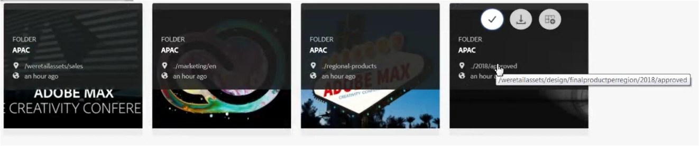

List View shows folder Path of assets in a column to all the users of Brand Portal.

### Overview option to view Asset Properties

Brand Portal provides Overview option to non-admin users (Editors, Viewers, Guest users) to view Asset Properties of selected assets/folders. The Overview option is visible:

1. In the toolbar at the top on selecting an asset/folder.
2. In the drop-down on selecting the Rail Selector.

On selecting the Overview option while an asset/folder is selected, users can see the title, path, and time of asset creation. Whereas, on asset detail page selecting Overview option lets the users see metadata of the asset.

 

## New configurations

Six new configurations are added for administrators to enable/disable following functionalities on specific tenants:

* Allow Guest Access
* Allow users to request access to Brand Portal
* Allow administrators to delete assets from Brand Portal
* Allow creation of public collections
* Allow creation of public smart collections
* Allow Download Acceleration

The above configurations are available under Access and General settings in administrative tools panel.

 
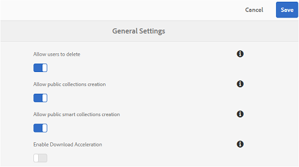

### Adobe.io hosts UI to configure oAuth integrations

Brand Portal 6.4.2 onwards uses Adobe.io [https://legacy-oauth.cloud.adobe.io/](https://legacy-oauth.cloud.adobe.io/) interface to create JWT application, which enables configuring oAuth integrations to allow AEM Assets integration with Brand Portal. Previously, the UI for configuring OAuth integrations was hosted in [https://marketing.adobe.com/developer/](https://marketing.adobe.com/developer/). To know more about integrating AEM Assets with Brand Portal for publishing assets and collections to Brand Portal refer [Configure AEM Assets integration with Brand Portal](https://helpx.adobe.com/in/experience-manager/6-4/assets/using/brand-portal-configuring-integration.html).

## Search Enhancements

Administrators can make the property predicates non-case sensitive by using the updated property predicate, which has a check for Ignore Case. This option is available for property predicate and multi-value property predicate.  
However, the non-case sensitive search is comparatively slower than default search for property predicate. If there are too many non-case sensitive predicates in the search filter, the search can slow down. It is, therefore, advised to use the non-case sensitive search judiciously.

## What changed in 6.4.1 {#what-changed-in-2}

Brand Portal 6.4.1 is a platform upgrade release which brings in several new features and vital enhancements such as browsing, searching, and performance enhancements to deliver fulfilling customer experiences.

### Browse Enhancements

* New Content Tree rail to quickly navigate an asset hierarchy.

* Introduced new keyboard shortcuts, for example _(p)_ for navigation to properties page, _(e)_ for Edit, and _(ctrl+c)_ for copy operations.
* Improved scrolling, lazy loading experience in card and list view for browsing large number of assets.
* Enhanced Card View with support for different-sized cards based on view setting.

* Card view now displays date/time stamp on hovering above the date label.

* Enhanced Column view with **More Details** under the asset snapshot, which lets you navigate to details page of an asset.

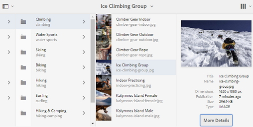

* List view now displays file names of assets in first column by default, in addition to locale, asset type, dimensions, size, rating, and publication information. New **View Settings** can be used to configure the amount of detail to display in List view.

* Improved asset detail experience with ability to navigate back and forth between assets using new navigation buttons, and view asset count.

* New capability to preview audio files, uploaded from AEM, in asset's details page.
* New Related Assets capability provided in Asset properties. Assets that are related with other source/derived assets on AEM and published on Brand Portal now have their relationship intact in Brand Portal, with links to the related assets on properties page.
* New configuration to restrict non-admin users from creating public collections has been introduced. Organizations can work with Adobe Support team to configure this capability on specific accounts.

### Search enhancements

* Capability introduced to come back to the same position in search results, after navigating to a search item, without running the search query again.
* New Search results count to display the number of search results has been provided.
* Improved File Type Search Filter with the ability to filter search results based on fine-grained MIME types such as .jpg, .png, and .psd compared to earlier Images, Documents, Multimedia options.
* Enhanced search filters for collections, with accurate time stamps instead of previous time slider functionality.
* New Access type filters have been introduced to search for the collections that are Public or non-Public.

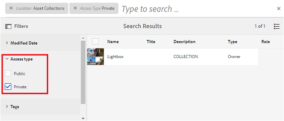

### Download optimizations

* A single large file is directly downloaded, without the creation of zip file, thereby improving the speed and throughput.
* Zip download limit for link share feature has increased to 5GB, from 1GB.

* Users can now choose to download only the custom and original files, and prevent out-of-the-box renditions, while downloading assets from Brand Portal or through the shared links feature.

 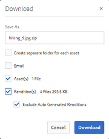

### Performance enhancements

* Up to 100% improvement in assets download speed.
* Up to 40% improvement in search response for assets.
* Up to 40% improvement in browsing performance.

**Note**: Cited improvements are as per the tests conducted in the lab.

### Enhanced reporting capabilities

**Introduced Link Share Report**
A new report, to provide information about shared links, has been introduced. The Link Share report lists all the URLs, to the assets, shared with internal and external users across organization in the specified time frame. It also informs when the link was shared, by whom, and when does it expire.

**Modified the entry point to access Usage report**
Usage report are now consolidated with other reports and can now be viewed from Asset Reports console. To reach Asset Reports console, navigate to **Create/Manage Reports** from administrative tools panel.

**Improved user experience with reporting**
Reporting interface on Brand Portal has become more intuitive and imparts greater control to organizations. Apart from creating various reports, administrators can now revisit the generated reports and download or delete them, as these reports are saved in Brand Portal.

Each of the reports being created can be customized by adding or removing default columns. Moreover, custom columns can be added to Download, Expiration, and Publish reports to control their degree of granularity.

### Improved Admin tools

Improved Property picker in Admin tools for Metadata, Search, and Reports with Type-ahead and browsing capability to simplify admin experience.

### Other enhancements

* Assets published to Brand Portal from AEM 6.3.2.1 and 6.4 can now be made publically available to general users of Brand Portal, by marking the Public Folder Publish check box on AEM Assets Brand Portal Replication dialog.

* Administrators are notified through access request emails, apart from the notifications in Brand Portal notification area, if someone has requested access to the Brand Portal.

## What changed in 6.3.2 {#what-changed-in-3}

Brand Portal 6.3.2 includes new and enhanced functionality oriented toward top customer requests and general performance enhancements.

### Request access to Brand Portal {#request-access-to-brand-portal}

Users can now request access to Brand Portal using the new** **need access capability available on the login screen of Brand Portal. 

Depending on whether users have an Adobe ID or need to create an Adobe ID, users can follow the appropriate workflow to submit a request. Brand Portal product administrators receive such requests in their notification area and grant access through Adobe Admin Console.

For more information, see [Request access to Brand Portal](../using/brand-portal.md#requestaccesstobrandportal).

### Enhancement in the assets downloaded report {#enhancement-in-the-assets-downloaded-report}

The assets downloaded report now includes the asset download count per user within the specified date and time range. Users can download this report in .csv format and compile data such as the total download count for a licensed asset.

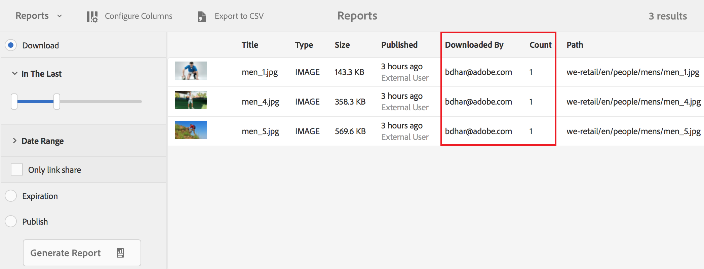

For more information, see Steps 3 and 6 in [Create and manage additional reports](../using/brand-portal-reports.md#createandmanageadditionalreports).

### Brand Portal maintenance notification {#brand-portal-maintenance-notification}

Brand Portal now displays a notification banner a few days before an upcoming maintenance activity. A sample notification:

For more information, see [Brand Portal maintenance notification](https://helpx.adobe.com/experience-manager/brand-portal/using/brand-portal.html#BrandPortalmaintenancenotification).

### Enhancement for licensed assets shared using the link share feature {#enhancement-for-licensed-assets-shared-using-the-link-share-feature}

While downloading licensed assets using the link share feature, you are now prompted to agree to the license agreement for those assets. 

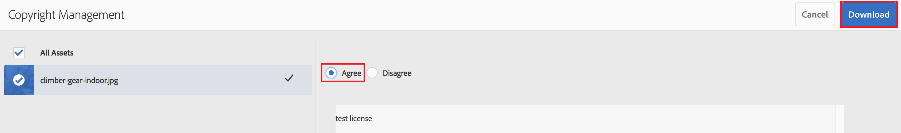

For more information, see Step 12 in [Share assets as a link](../using/brand-portal-link-share.md#shareassetsasalink).

### User picker enhancement {#user-picker-enhancement}

User picker performance is now enhanced to cater to the needs of customers with a large user base.

### Experience cloud branding changes {#experience-cloud-branding-changes}

Brand Portal now conforms to the new Adobe Experience Cloud branding.

 

## What changed in 6.3.1 {#what-changed-in-4}

Brand Portal 6.3.1 includes new and enhanced functionality oriented toward aligning Brand Portal with AEM.

### Upgraded user interface {#upgraded-user-interface}

To align Brand Portal user experience with AEM, Adobe is transitioning to Coral 3 user interface. This change enhances the overall usability, including navigation, and appearance.

#### Enhanced navigational experience {#enhanced-navigational-experience}

* Quick access to administrative tools through the new Adobe logo:

* Product navigation through an overlay:

* Quick navigation to parent folders:

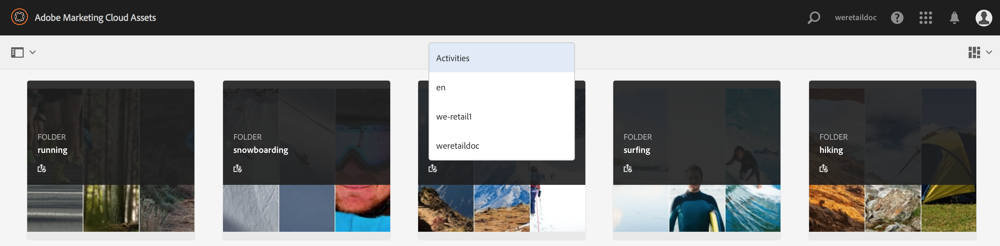

* Quick search and navigation to the required content and tools:

 

### Enhanced browsing experience {#enhanced-browsing-experience}

* New column view to browse through nested folders:

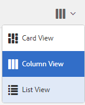 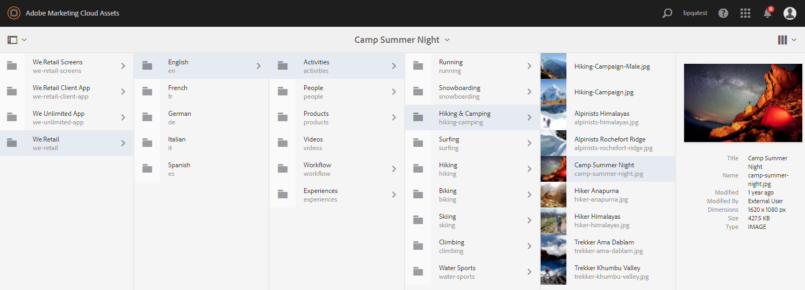

* In the list of assets in a folder, the latest asset uploaded appears at the top.

### Enhanced search experience {#enhanced-search-experience}

* The new Omni search feature facilitates quick access to relevant content, capability, or tags through automatic suggestions as you type search keywords. Omni search is available across all search features.

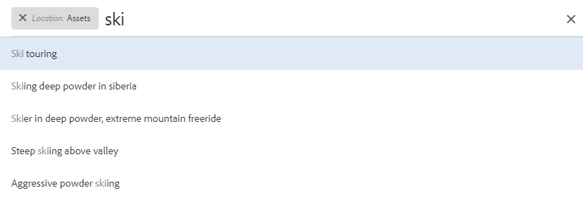

* You can also add search filters to Omni search to further narrow down and quicken your search.

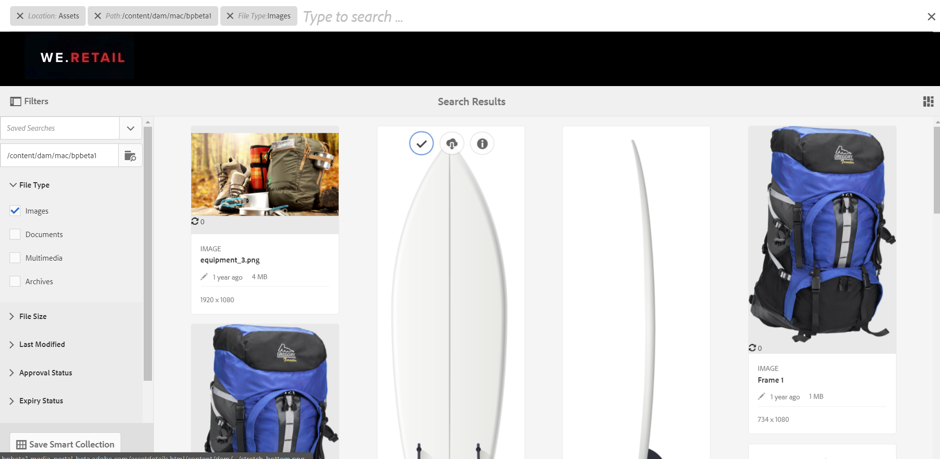

* The new asset rating-based search lets you search for assets with ratings, if published from AEM Assets.
* The new multi-value search feature accepts multiple keywords with the AND operator to discover assets faster.
* The new search boost capability lets you improve the search relevance so that specific assets appear at the top of the search results.
* The new path-based search feature lets you provide the path to a nested folder to be able to search assets in that folder.

#### New smart tags-based search {#new-smart-tags-based-search}

If images with smart tags are published from AEM Assets to Brand Portal, you can search for these images in Brand Portal using the smart tag names as search keywords. This feature is available only for files.

### Enhanced downloading experience {#enhanced-downloading-experience}

After downloading a nested folder, you can preserve the original folder hierarchy. Assets inside a nested folder are downloadable in a single folder as opposed to separate folders.

### Improved performance {#improved-performance}

Enhancements in the browse, search, and download capabilities significantly improve Brand Portal performance.

### New digital rights management for assets {#new-digital-rights-management-for-assets}

Administrators can set the expiry date and time for assets before sharing them. After an asset expires, it is visible to viewers and editors, but not downloadable. When an asset expires, administrators receive a notification.

### Enhanced asset sorting {#enhanced-asset-sorting}

Asset sorting in a folder in list view is no longer restricted to the number of assets being displayed on the first page. All assets in a folder are sorted, irrespective of whether all are listed on the first page.

### Enhanced reporting {#reporting-capabilities}

Administrators can create and manage three types of reports—assets downloaded, expired, and published. The ability to configure the columns in a report, and export the reports to CSV format is also available.

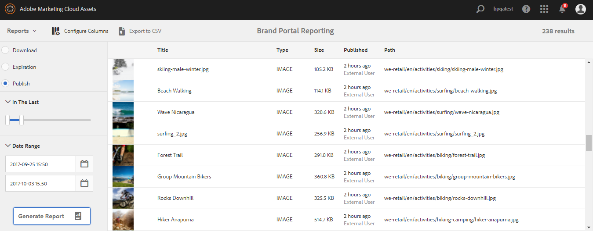 

### Additional metadata {#additional-metadata}

Brand Portal 6.3.1 introduces additional metadata, which is at par with AEM Assets 6.3. You can use the Schema Editor form to control the metadata that should be visible on the Assets Properties page. Asset metadata is not visible to external link share users, who can only preview and download assets using the link share URL. 

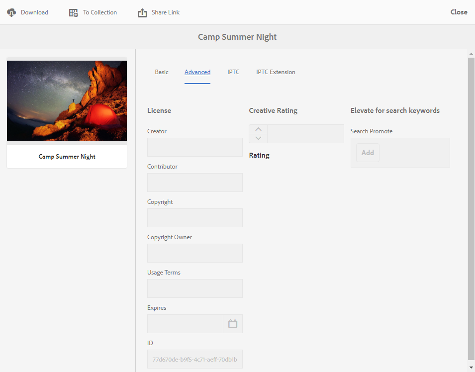 

### Additional capabilities for administrators {#additional-capabilities-for-administrators}

* Before finalizing customizations to the login screen wallpaper, administrators can preview the changes.

* After an administrator adds new users, they need not accept invitations to get added to Brand Portal, they are added automatically.

### New publishing capabilities in AEM Assets 6.3 {#new-publishing-capabilities-in-aem-assets}

* AEM administrators can publish metadata schema from AEM Assets to Brand Portal using AEM 6.3 SP 1-CFP 1 (6.3.1.1), which will be available in Q4 2017.

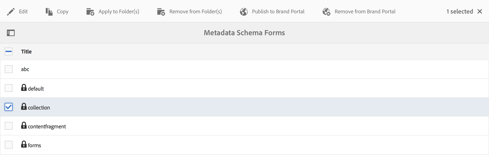

* AEM administrators can publish all the tags from AEM Assets to Brand Portal using AEM 6.2 SP1-CFP7 and AEM 6.3 SP 1-CFP 1 (6.3.1.1).

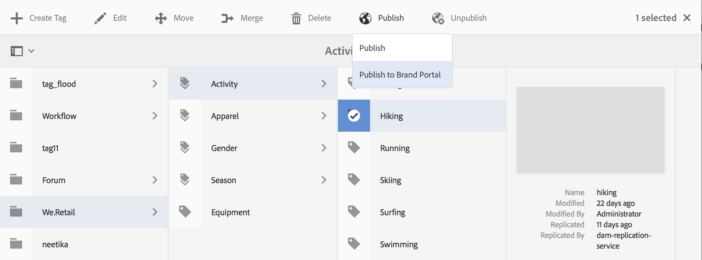

* From AEM Assets, you can publish assets and collections that have tags, including smart tags. You can then search for these assets or collections using these tags as search keywords in Brand Portal.

## Frequently asked questions {#frequently-asked-questions}

**Ques. Will I lose access to any existing assets, features, or configurations I have created?**
**Ans.** All of your existing features and configurations remain intact. Your end users are not impacted, and your content remains intact.

**Ques. When am I moving to the new version of Brand Portal?**
**Ans.** Brand Portal 6.4.4 was released to production in February 2019. Next Brand Portal version is expected to be released in Q3 2019.

>[!NOTE]
>
>Release schedule is tentative and subject to change. Contact your Adobe Account Manager or Customer Support to get the updated release schedule.

**Ques. Will my users be impacted?**
**Ans.** This change is exclusively within Brand Portal, so there is no impact to your end users.

**Ques. Is there any action required on my part?**
**Ans.** There is no action required by the administrator. Once you get access to the new Brand Portal, refer to the documentation to see all the bells and whistles.

**Ques. Who do I contact with questions?**
**Ans.** Contact your Adobe Account Manager or Customer Support.